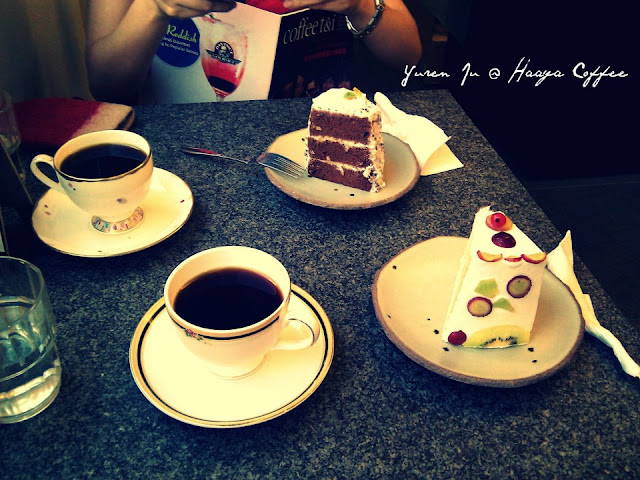

過了四月中以後，所有結婚相關的事情終於底定，我們才從結婚的繁瑣事物中脫困。前鎮子有朋友提到說我應該要把結婚的一些過程寫下來作個紀念，所以我就慢慢寫啦... 只是不知道會不會全部都寫完 XD  
  
首先要說的就是求婚。有的人會先跟另一半先討論結婚的事情，等兩個人都有了規劃後才結婚，所以求婚這個步驟有時後會有點沒驚喜感。不過我自己覺得一定要有驚喜感！所以我在事前並沒有跟 Chialin 說太多要結婚的事情，只是旁敲側擊的先了解一下成功的機率。話說事後我覺得如果我沒有求婚的話，我們能結婚的機率應該是非常低的。所以如果求婚沒有弄好的話基本上就是毀了一半了，哈。所以我就衝了！  
  
第一件事情是要有求婚基本的輪廓。這方面現在很方便，Youtube 上面有不少的求婚片段可以參考。我看到有一個在電影院求婚的覺得非常酷。  
  
  
  
但是這個難度太高了只好放棄。不過基本的概念就是要作個影片，接下來只要想辦法引導她看影片還有求婚的戲碼完成即可。所以我就開始想影片的事情  

影片
--

影片也是個難題，但是現在網路實在太方便了，隨便 Google 一下就可以找到很多別人作過的東西。後來我決定概要是要找很多 Chialin 跟我認識的朋友，請他們幫我說出朋友之間相處的片段，以及最後的『嫁給小朱吧』片段，最後讓我去剪輯。

  

我的朋友當然就是我自己去找，至於 Chialin 南部的朋友就比較難聯絡。後來我就聯絡了她最好的朋友兔兔，請她幫忙邀請以及蒐集台南朋友的影片片段。至於我們傳送影片的方式是用 Dropbox 開一個分享目錄來傳送影片。不過期間還是遇到一些困難，才覺得 Dropbox 對一般民眾來說還是太難了。

  

當然我還找了我跟 Chialin 常常一起出去鬼混的朋友，還有她比較要好的前同事（這邊也是請一個主要的朋友幫忙蒐集，不然他的前同事我並沒有認識太多）。最後我拿到了大概有十幾個的影片片段，這樣就足夠作為我剪輯的素材了。  
  
至於我挑的歌是 Train 的 Marry Me。

  

  
  
我剪輯的工具則是用 Apple 的 iMovie。  
  

  
  
後來我結婚的時候的影片片段就是用 Microsoft 的 Windows Live Movie Maker 剪輯的了，基本上我覺得這兩套剪輯軟體用起來差不多，只是 iMovie UI 做的比較精美，讓你會覺得比較好用，但其實差不多。  
  
  
首先要作的是把中文字幕加進去。後來考慮到分鏡跟剪輯的難度，所以我決定用 MV 的畫面跟我蒐集到的片段混和在一起剪輯，這樣就可以減低一些難度，畢竟 MV 架構已經很不錯了，我抽掉一些畫面再把我的畫面剪進去感覺應該還不錯。  

  

最後出來的成果是這樣～

  

  

還不錯！  
  

地點
--

接下來就是地點的問題了。話說地點的事情發生了一件趣事。在我決定求婚之後，我就在 Facebook 寫下『執子之手，與子偕老』，但是是擋掉 Chialin 的。結果後來有天我跟 Chialin 去我們非常常去的[哈亞咖啡館](http://www.haaya.com.tw/)的時候店長海牛就問我『耶～你們要結婚了嗎，看到你在 FB 寫下的訊息』之類之類的，差點嚇倒撒尿，還好沒有被戳破 XD。後來我又找時間自己去喝咖啡，就先跟店長說這件事情，以免之後漏餡。這個時候我就先跟店長說到時後有可能要請他們幫忙，要在哈亞咖啡求婚。  
  

  
  
為什麼會想選在哈亞咖啡館呢？  
  
其實是因為我跟 Chialin 真的很常來這間咖啡館，喝到從老闆、老闆娘、店長跟店員都認識了，是間我們非常熟悉，也非常喜歡的咖啡館。當想到要找求婚地點的時候，就非常直覺的想到這間咖啡館了。更何況跟店長真的還蠻熟的，不論是當天的配合或者是默契上因為比較熟，事情上也會比較順利。  
  
所以到最後就選定哈亞咖啡館了！  
  

戲碼
--

這又是另外一件難題。跟 Chialin 的好朋友康姐討論數次之後，我們決定要讓 Chialin 以為他要幫朋友慶祝生日，給壽星一個驚喜的方式，然後事實上其實是緊接著她給別人生日驚喜後，我再給她求婚驚喜，雙重包裝的戲碼 XD  
  
但是這個有點困難就是要聚集她台南好友們到台北來玩，然後又要讓 Chialin 把生日驚喜的場地訂在哈亞咖啡館 -- 這真的很困難，我們花了很多時間明示暗示，他到最後才終於決定要在哈亞慶祝（主要的原因是因為大家在台北沒有交通工具，要進在天母的哈亞稍微有點麻煩），不過終於還是把她拐到哈亞去了。這個時候我在說我要幫她訂哈亞裡面的包廂，但事實上我是把整間哈亞都包下來了，只是當天會偽裝成只有訂包廂就是。  
  
當天的戲碼是這樣：Chialin 跟台南朋友們先到淡水玩，晚上的時候他們在石牌吃飯，最後大家坐公車（或計程車）到哈亞咖啡去慶祝壽星生日，最後假裝說要播放沒有來的朋友準備的生日祝福片段（但其實是求婚影片），當影片結束的時候我再拿著花束進去，用飛天鯊魚來傳遞戒指，完成求婚。最後走出包廂，這個時候我邀集了 Chialin 的朋友們，所以外面會聚集了超級多的人來助陣，他們最後會拉炮來 Ending 整個求婚。  
  
雖然是這麼安排，但是實際上要作的事情很多。  
  
從下午開始我們就到花店去拿預定的玫瑰花跟氣球裝飾，然後拜託以海綿大仙為首的朋友群們在哈亞咖啡裡面佈置，並且請 Taiten 幫忙聯絡當天所有要來的朋友們，也請 Merck 負責錄影，Znikang 負責攝影等等。然後還要拿蛋糕阿，還要衝去跟 Chialin 的台南朋友們吃飯等等等。一整個很忙。  
  

最後
--

整個求婚的事情我前前後後大概弄了三個月，到最後面終於完成了，感覺非常的開心。其實我算是有點龜毛的人，所以當然希望自己這麼重要的時刻可以酷一點。感謝大家的幫忙，到最後面 Chialin 答應了求婚，我也覺得整個事件弄得很棒。哈亞咖啡提供的場地、咖啡與食物都無懈可擊，真是太棒了。  
  
果然是個讓我永生難忘的求婚阿。