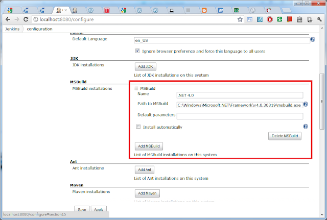
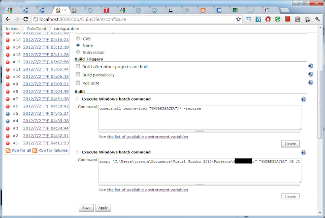
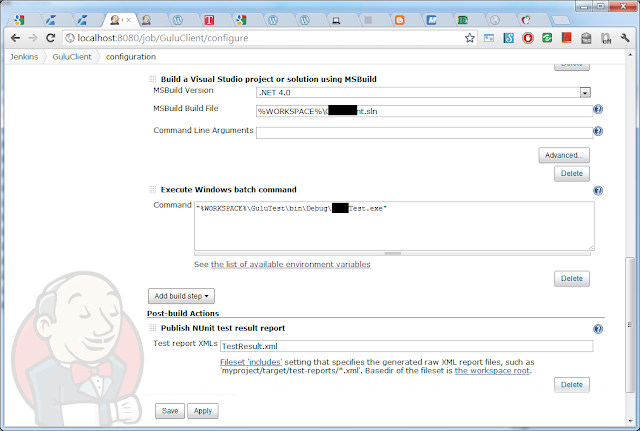

好吧你沒看錯主題，我要講的真的是 Visual C# 2012 express。  
  
當要開始開發程式的時候，最重要的就是基礎架構先弄好之後開始，在 Windows application development 也一樣，但是跟其他平台開發有個不太小的不同，Windows 的開發軟體都是要錢的，所以你想要的功能基本上獨立開發者是無法負擔的。你還在想念 Android, Java, Linux, Mac app 開發一些基礎的東西嗎？像是 Code Coverage, Source Control (TFS), Lint (Static Code Analysis)在 Visual Studio 都是要錢的。  
  
當然我們這種從 Android/Linux development 轉過來的人，當然是希望用 Open Source 的 solution。首先就從最基本的 Continues Integration 跟 unit test 講起。  
  
請先安裝好 Visual C# 2010 express，Jenkins, Java runtime。  
  
CI 當然就是選 jenkins 了，至於要搭配的東西就比較麻煩。在這邊我們採用 msbuild 建構專案，使用 NUnit 作 unit test。因為我們要在 Windows 上 build，所以 Jenkins 也要安裝在 Windows 上面。基本上就是從 jenkins 上面抓下來，找個風水好地放著，執行 java -jar jenkins.war 就行了。  
  
接下來安裝 msbuild, nunit 這兩個 plugins。接下來就到 jenkins → Manage Jenkins → MSBuild 裡面填寫 MSBuild 正確的位置。  
  

  
第二個是建立 NUnit 專案，你可以在 VC# 裡面 Tools → Extension Manager → Online Gallery → NUnit Test Application 安裝 NUnit 的 project template，怎麼寫 test case 就上網找一下吧。  
  
當你建立專案的時候，他會很佛心的幫你建一個執行檔組態。執行他就可以獲得 NUnit Test report。  
  
最後是 Jenkins job 的設定。在我們還沒有使用任何 Version Control 的時候，我們可以先從 VS project 裡面複製出專案的方式先代替 Clone project。  
  

  
首先需要先清除 workspace 裡面遺留下來上次 build 過的東西。因為 Windows 刪除檔案跟目錄太囉嗦了，我這邊用 PowerShell 的指令代替。第二行則是用 xcopy 用複製的方式先把專案複製到定位。  
  

  
  
第一個動作是用 MSBuild 去 build solution，這個 solution 包含了兩個 project，一個是主要的專案，另外一個是用來測試的專案。第二個動作則是跑由 NUnit project template 幫我們產生的 Test 執行檔，執行後就可以產生 TestResult.xml，第三個步驟就是引用這個檔案，讓 Jenkins 產生正確的報告在 Jenkins 的頁面上。  
  
這樣就基本的把 Jenkins 設定好了。