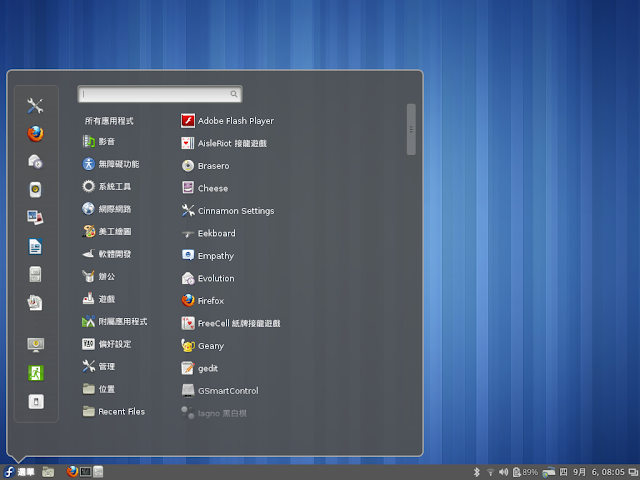
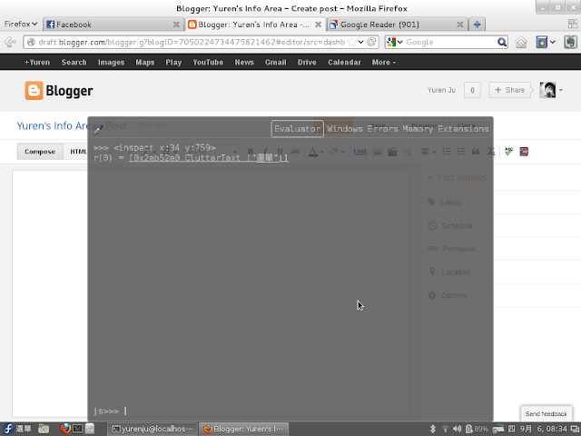

  
看了 小 Q 的 Facebook 之後，我也裝了 cinnamon 來用用。我之前一直推想 cinnamon 應該是把 GNOME3 裡面的 gnome-shell 的高度客製化，這次裝起來果然是這樣。一個很簡單的確定方式就是按 alt + F2 輸入 lg，就會從下面拉起一個 javascript console, debugger 跟 inspector 合一的開發工具 LookingGlass。  
  

  
如果去查看 cinnamon 的套件檔案列表，也包含相當多的 Javascript。  
  
因為很多人不知道，所以我再強調一次，**整個 gnome-shell 都是 Javascript 寫的，所以 cinnamon 也都是整個用 Javascript 寫的。**  
  
比起 Ubuntu 整個砍掉重練用 compiz 重寫一個 unity 桌面環境，我覺得 cinnamon 用 GNOME3 既有的成果開發桌面環境是比較好的選擇，畢竟 Javascript 一來是比較多人會用的程式語言，另外在需要擴充功能的時候，Javascript 也可以很快的就寫好擴充。  
  
更何況 cinnamon 就算是高度客製化他還是 GNOME3，很多資源都是可以共享的，而 unity 就等於完全新開一個獨立的分歧，恐怕濃厚的 Ubuntu 色彩會讓其他 distribution 不太願意使用。（不過 Fedora 18 似乎要把 unity 加入 repository 裡面 ）