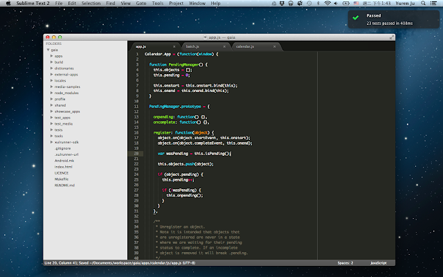

今天在謀智台客發表了篇文章，主要是講 Firefox OS 在 unit testing 有個不錯的機制，就是設定妥當後，當你在任何編輯器或 IDE 按下儲存後，unit testing 就會自動開始測試跟你剛剛儲存的那個 javascript 相關的測項，最後用 Mac 的 notification center 或是 Linux 的 libnotify 告訴你測試結果，像下面這樣：  
  

  
  
可以讓你隨時都知道自己有沒有把任何東西搞爆了。  
  
有興趣的可以看一下  
  
[缺它不可！靈活運用 Firefox OS Gaia 的單元測試](http://tech.mozilla.com.tw/posts/1470)