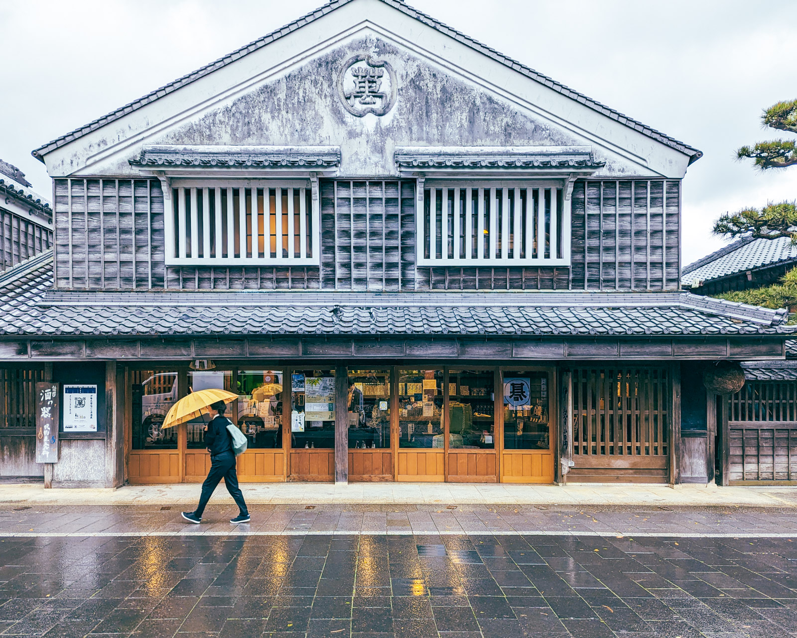

最近把剛買的 GR3x 賣掉了，但是賣掉之後選了幾張想發布的照片又發現都是當初用它拍的。自己的相機從單眼相機慢慢的換成小相機，原本下定決心一台足夠小台但是畫質又好的相機如果可以輕鬆的放到包包裡面，那我應該可以更經常的拿出來拍照吧？

我錯了。

去熊野古道的旅程幾乎沒有幾次拿出來拍照，從小小的預覽螢幕又經常感到不滿意，但是賣掉之後又感到後悔。攝影的意義到底是什麼呢？我原本以為是回憶的輪廓，讓我看到照片的時候可以拉回那個當下，感受到那個時候的脈絡，像是下雨時溼氣混合泥土的味道或是咖啡館旁的河川潺潺流動的聲音。

但我發現我更在乎自己的觀點。除了紀實以外，在拍攝的當下我看到了什麼？我在乎什麼？照片長寬比例的框框裡面該容納與不該容納什麼？

或許時間的流動與加諸限制的構圖框框才是我真正想捕捉的事情。

在持續的時間流動下，那邊有個我最想要保留下來、理想的時光切片。有的時候我會錯失最好的那刻，有時候我可以從照片裡面聞到雨後新泥的味道與撐傘走過的腳步聲。按下快門後，把它加固在數位相片的框框裡面，保留下從我的角度觀察的那一刻。
