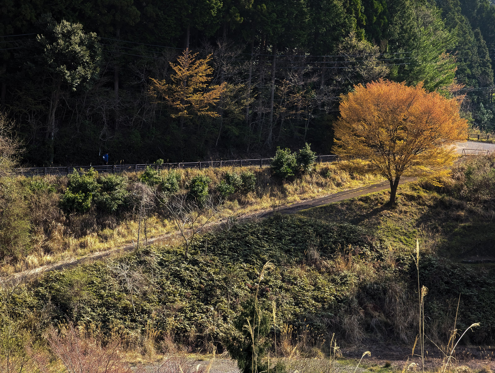

經過了幾周來來回回的修整，總算弄的差不多了，接下來 Blog 就會遷移到 https://yurenju.blog/ 了。

會想要搬到一個新的地方，主要是這幾年在不同的平台如 Blogger 以及 Medium 發表文章，總是覺得遷就著平台的需求，而他們做的那些改動，不總是我需要的功能。再加上之前我的 Facebook 帳號被標示成有問題的帳號，最後的結果是直接被刪除，上面所有的資料都消失了。

這也讓我意識到在這些平台上面的資料其實不屬於我的。不論是 Google, Medium 或是 Facebook 都擁有過於龐大的權力，決定我們能閱讀什麼以及什麼事情不能作。而當你覺得他們的決定或是改動不對時，他們會搪塞的用「我們要服務的人太多了，沒辦法照顧到你的想法」，那些被強迫決定的變動，你沒有資格說不。

這也是我為什麼遷移到一個自己掌握程度比較高的平台。當然**擁有權**也是個光譜，在這個新平台我也不是真的擁有了什麼，但至少擁有了一份可靠的備份，讓我在數位遊牧時能夠更快的找到另外一片還有牧草的草原。

在 https://yurenju.blog/ 裡面，各類技術文章、日常旅遊分享甚至短文照片都會在這邊發表，所有的內容會被分成三類：

- 短文與照片：社群網站短文或照片的備份
- 生活：旅行或是一些心情的雜記
- 科技：科技文章

如果想在新文章發布的時候收到通知，請參考《[訂閱](https://yurenju.blog/pages/subscription/)》一文用 RSS 閱讀器訂閱，同時也支援訂閱單獨的類別，可以只訂閱科技文章。

最後，如果你對這些文章有什麼想跟我分享的，你可以在 [twitter](https://twitter.com/yurenju) 上面找到我，也可以透過 kind.oil9063@fastmail.com 聯繫我（這是隱私信箱，會轉寄到我真正的電子郵件）。
