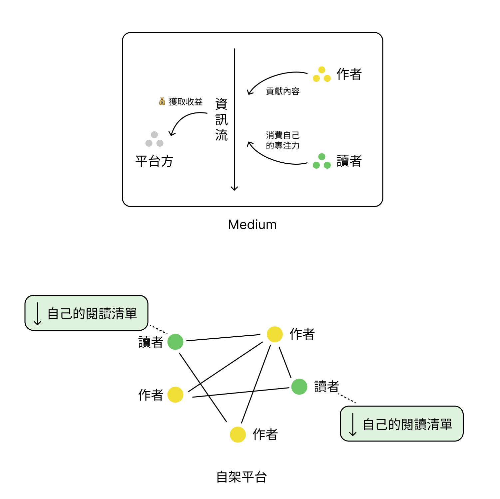
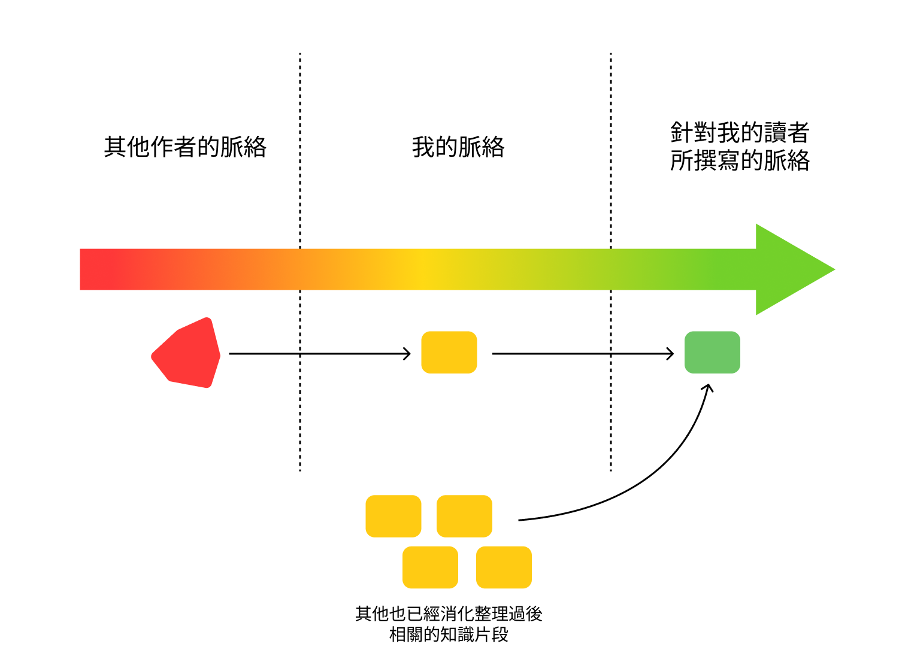

你也想要從 Medium 離開，自行架設網誌嗎？

Blogger, Medium 甚至 Facebook 可以說是一個**意見與想法的託管平台**，它們提供了良好的介面以及大量的功能，讓作者與讀者可以輕鬆的在這個託管平台發表以及閱讀各種資訊與意見。之所以黏著的最大原因，除了那是朋友與社群所在地的網路效應外，主要就是他們提供了許多方便的功能讓作者發表文章的阻力可以降得很低，比如說貼文會自動出現在其他人的首頁上面，或是讀者評論留言功能與點讚、良好的發文介面等等。

這些都是吸引作者在託管平台發表文章的理由。

而提供豐富功能的背後，平台方希望的是更多人**消費自己的注意力**在他們的平台，並且透過注意力來產生收益，比如說 Facebook 靠廣告，而 Medium 則靠付費牆背後的文章。

當決定要離開託管平台，到一個自己更能夠掌控的自行管理平台時，這些託管平台好處就再也享受不到了。在取得更多權力的同時，也會流失掉許多自己早就已經習慣到沒感覺的優良功能。

你準備好要接受這些你將會失去的東西了嗎？

本篇文章會分享自己從 Medium 遷移到 Hugo 這樣的靜態網站解決方案的一些思路，提供給想要搬離託管平台的讀者一個參考。當然每個人都有自己的理由，不管是待在哪裡，能了解自己的需求才是最重要的。如果看完文章你反而覺得 Medium 是一個讓你感到舒適的平台，那也是個很不錯的收穫。

## 引子
對於從 Medium 搬家已經是我思考很久的事情了，時不時也會跟朋友提起這件事情。還記得 [timdream](https://blog.timdream.org/) 曾建議我考慮用 Wordpress 的付費方案來節省一點力氣。會一直有搬家的念頭，主要還是 Medium 的利益開始跟身為作者的我越來越不一致開始。

對我來說 Medium 想方設法營利的「付費」功能反而是我最想離開的主因。一開始的一切都很美好，Medium 針對閱讀與撰寫上做了很多最佳化，所以整體閱讀體驗一直很棒，而平台上面也有許多優質的文章。身為平台的一員，在上面撰寫是一件很享受的事情。

不過從付費牆開始實施後一切都變得不太一樣了，Medium 開始用一段誘人的序文來引導讀者想要繼續閱讀，而接下來則是一道龐大的付費牆擋在前面，這樣資訊探索的斷裂讓我感到厭煩。那樣的屏蔽就像是情緒勒索一樣的讓人不舒服。我買過一些付費課程，也曾經是科技島讀的讀者，那些付費所得到的知識總是令人感到珍惜。但 Medium 的這種作法特別令人不悅，有種來自道德制高點的勒索感。

如果你是一個特定作者或是媒體的忠實讀者，優良的付費閱讀通常都是一件令人心服口服又滿載收穫的體驗。而從搜尋網站上面找到一篇看似可以解決你問題的文章，讀了一段之後就要求你付錢的體驗就不太好。在跟作者還沒有建立信賴關係以前，這樣的付費機制讓我沒辦法提起勁掏出錢來。

從我的角度來說，我更喜歡透過我的文章幫助到一些人，而這些被建立起來的信賴感讓我自己在專業工作中可以獲益，這樣非直接的受益方式更適合我，甚至是一個付費專欄作者也是不錯的選項，但 Medium 的付費體驗就不適合我。當自己總是被平台惹怒，而這個功能完全沒帶給我任何好處時，這就變成累積著離開的導火線了。

## 認真思考搬家的可能
但是認真思考之後就會開始被自己勸退。為什麼用 Medium 是有原因的。平台有基礎的流量分析工具，有良好的撰寫介面，同時有各種互動留言功能，當自己要自己管理這個平台時，這樣的功能就需要花費一些功夫才可以做到。

採用 Wordpress 可以解決上述的一些問題，因為他是一個有後台機制的撰寫平台，流量分析、留言等等都可以輕鬆的處理。但經過嘗試之後發現不太適合我，他強大的功能反而讓我有點難以進入。跟遠古時代的 Wordpress 不同，現在的 Wordpress 有超多功能，而這些功能都不是我會用到的。而他的撰寫介面使用起來也有諸多格格不入。

所以遷移到 Wordpress 的念頭就慢慢的打消了，但如果要採用靜態網站產生器，就會帶來許多好處 —— 與問題。

## 靜態網站產生器 (Static Website Generator)
這是一個非常古老的技術。相對於 Wordpress 這樣動態產生內容的網站，靜態網站產生器在每次文章有更新的時候，重新建構（或是快取）所有靜態內容如 HTML, Javascript 以及圖片等資源來構築成一個網站。

這跟託管平台是南轅北轍的概念，託管平台提供了許多功能與社群，希望使用者盡可能的花更多時間在平台上面，讓他們可以銷售廣告給廣告主來營利。而靜態網站則是每個人都有自己獨立的網站，內容與內容之間的串連則靠更開放通用的協定（比如說，超連結 😎）。

靜態網站的好處跟壞處都是同一個，就是「靜態」。

靜態網站的好處是會擁有一個原始的文章來源格式，對我來說就是 Markdown 格式的文章，靜態網站產生器會將這些 markdown 格式的文章在更新的時候全部產生成靜態網站的內容並且佈署到指定的網域，讀取速度快，結構簡單。

壞處是，他是**靜態**的。凡舉需要一些互動的地方，比如說讀者留言，靜態網站因為沒有背後動態管理內容的能力，會需要透過一些擴充套件的方式來達成，一個常見的服務是 [Disqus](https://blog.disqus.com/)。

發表文章的流程也會變得很不一樣，不像是 Medium 或是 Wordpress 這樣的動態管理系統會有一個可以發表文章、插入圖片的介面，靜態網站會需要直接撰寫 Markdown 檔案，管理要附加的圖片等等，發表文章的流程相對於原本的發表形式會有許多不一樣的地方。

但是這個需要用開放文件格式撰寫的壞處反而成為我最後選擇靜態網站產生器的原因。

## 文章發布流程
對我來說發表文章是一種知識的熟成過程。剛開始會是別人脈絡底下的知識，作者講解給如我這樣的讀者聽，從他的角度出發這個知識片段的樣子。當我閱讀並且理解後，它會變成屬於我自己理解的知識片段。

最後當相關知識匯集到足夠發表成一篇文章後，我把這個知識片段與其他相關知識組合在一起，形成了一篇在讀者脈絡下專門給他們閱讀的文章。到這邊我會覺得這樣的一個知識片段已經在我腦袋已經足夠成熟了。

而這樣的流程藉由這陣子更積極的撰寫筆記來理解各種知識，在我自己規劃的知識整理流程下，開始在筆記軟體 Obsidian 逐漸累積了許多各式各樣的筆記。在發表文章時，其實我會在 Obsidian 裡面先用 Markdown 寫好要發表的文章內容，再貼到 Medium 的發表文章介面。

所以對我來說發表文章到 Medium 還是會需要經過一次的轉換程序，把 Markdown 格式的文章貼到 Medium 去。如果發表平台也是 Markdown 格式，反而可以減低我發表文章的阻力。

這也是為什麼對我來說是個好時機轉換到一個以 Markdown 文件格式為主的靜態網站平台，這樣一來串接這些脈絡的就都是 Markdown 這樣的通用文件格式了。

## Hexo, Docusaurus and Hugo 要怎麼選擇？
要用哪種靜態網站產生器是個滿困擾的問題，有太多選擇反而不太容易抉擇。我覺得可以看自己熟悉什麼程式語言來決定會比較容易。我自己是熟悉 JavaScript，所以 Hexo 或是 Docusaurus 會是比較容易的選擇。

Hexo 比較嚴重的問題是他的官方網站充斥著廣告，讓我感到沒有安全感，充斥著廣告的頁面實在很難讓人安心使用。而 Docusaurus 我自己的使用經驗是想要客製化時並不是那麼容易，Docusaurus 所架設的網站通常會有非常相近的風格，我自己的修改經驗確實覺得也不是很容易修改，所以也沒有選擇使用 Docusaurus。

Hugo 從我的角度來看是生態系比較健全的平台，對我來說的缺點是自己對於 golang template 掌握度沒有很高，但是看到採用 Hugo 的網站有很多不同的樣態也讓我覺得他的客製化應該是相對容易進行的，同時建構速度也很快。

開始架設後，確實 golang template 帶給我一些痛苦沒錯。不過寫了幾次 template 之後也比較搞清楚要怎麼用了，如果要進行一些簡單的版面調整也都不是問題，一些 RSS 的問題也參考其他人的分享改好了。

另外 [Jekyll](https://jekyllrb.com/) 的使用者也非常多，如果本身是使用 Ruby 語言的人也可以選擇這套，但因為語言熟悉程度的關係我就沒有選它了。

## 雜項工具
如果你也決定從 medium 搬家，可以使用 [bgadrian/medium-to-hugo](https://github.com/bgadrian/medium-to-hugo) 一次性的把所有文章都匯出成適合 Hugo 的 Markdown 格式與目錄結構。

不過就我自己的經驗是還需要再額外調整一下格式，不過資料上如果都轉移好了，其實打開 vscode 很快的就可以把需要調整的地方調整完畢。

如果你是從 blogger 搬家，我有寫了一個簡單的腳本來把所有文章跟圖片都搬成 hugo 的形式，這個腳本如果要改成通用版本還會需要花點時間，所以我就不修改了。有需要的話可以從[這邊](https://gist.github.com/yurenju/5c7ff1d9bd090ec6fecf9575d9d05181)看一下怎麼寫的，然後改成你自己需要的樣子。

另外因為可以客製化佈景主題的關係，有些佈景主題不見得會好好利用 Hugo 已經寫好的內建功能，或是有些功能 Hugo 內建的運作方式不太合自己的使用，所以有時候會需要修改一下。比如說最近把 RSS 全文顯示的功能加上去，其實就是[修改內建的 RSS 樣板](https://github.com/yurenju/blog/commit/7936dda4a4415288e63b36bd682c3703f100efd0)，我有三個專欄的需求，所以也自己[修改了佈景主題](https://github.com/yurenju/blog/commit/0ef1d7171b63a754ed47874d3f4fb99134a5031d)來達成。

## 最重要的問題：你需要什麼回饋？
在任何長期習慣的培養，有適當的回饋可以更容易讓一件事情持之以恆的前進。寫文章也一樣，如果寫文章可以獲得一些回饋，不論是自己寫完文章心中的滿足感，或是讀者來信講述這些知識真的對他產生幫助，這些回饋都可以支撐著自己繼續保持相同的步調繼續往前。

當自己架設了靜態網站的網誌後，你就像是網際網路上面的獨立個體了，Facebook 或Medium 沒有理由幫你推廣你的內容。

那你寫文章需要怎樣的回饋呢？發表文章的滿足感可以驅動你前行嗎？那些原本從網路效應來的流量如果是你珍惜的回饋之一，自架平台後你該如何獲得足夠的動力呢？

這是個很重要也很容易被忽略的問題。最好的情況是寫文章與發布本身就帶給你足夠的滿足感，你就可以直接在這樣的成果之中享受到這樣的回饋。

如果不是的話，請好好的思考你所需要的回饋，並且在你自建的這個網誌平台之中，設法撒下這些回饋的種子，並取得你最需要的那種正向回饋感 🔄 。
