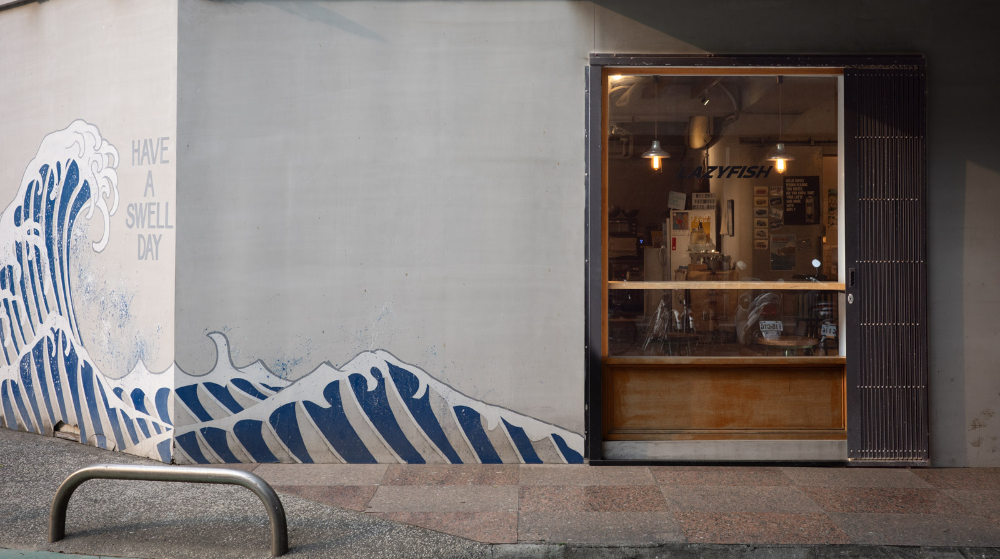

我很喜歡 [SWELL CO. CAFE](https://goo.gl/maps/E5ie16GGuUXAEw4H9) 外面的這面牆。因為在附近的眼科診所作近視雷射手術的關係，之前每隔幾周就會回診檢查眼睛，這也給了我機會探索附近的咖啡館。令人意外的是附近優質的咖啡館不少，不管是 [Kopi Ibrik](https://goo.gl/maps/Q8sngcwEf74DNscE7)、[Kafemera](https://goo.gl/maps/KVnW3FRbVLGC1eoN9)、[looproom](https://goo.gl/maps/7F64tSwDuiW1sueKA) 都是有趣的選擇。

不過 Swell co. 的咖啡館氛圍我真的很喜歡。圍繞著衝浪主題，店內店外都保持著一致的風格。我還記得第一次去時正在下著大雨，那個時候我還在一間作向量繪圖軟體的公司工作，正好約在附近開會。需要補充咖啡因的我就是真的是在 Google Maps 上衝浪找到這間咖啡館，從傾盆大雨的天氣到走進咖啡館就突然好像來到的夏威夷（雖然我沒去過），店內輕鬆並且充滿著熱帶夏天的氣氛與音樂真的讓人印象深刻。

最近一次經過的時候剛好是夕陽的時候，那時候的氣溫還相當宜人，經過這間咖啡館的時候又想起了當初感受到的夏威夷氛圍，而日式風格的海浪搭配上 "Have a swell day" 字樣與夕陽的側邊光線造成的垂直折線陰影，真的是讓人覺得度過了美好的一天。
