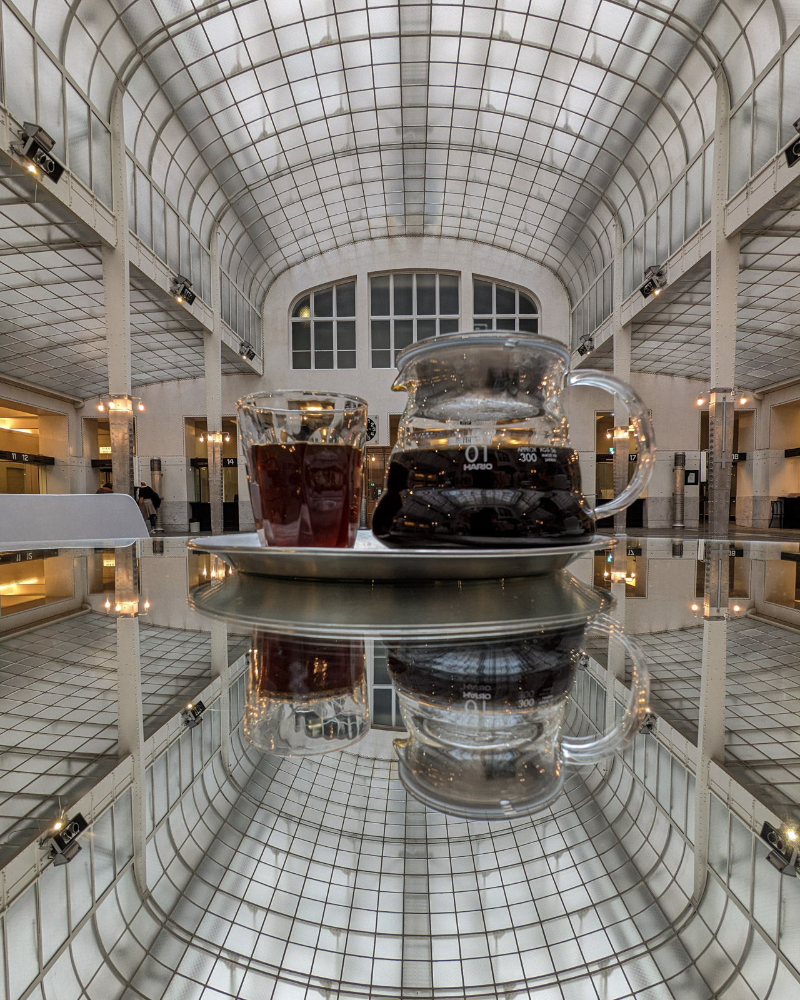

在維也納的時候，我們漫步到多瑙河畔，發現城市裡的多瑙河並不是那麼吸引人時啞然失笑。隨即決定臨時附近找一間咖啡館待著。就這樣我們到了也是景點的奧地利郵政儲蓄銀行裡面的咖啡館 AGGYS third wave coffee。

咖啡不好不壞，但是拍了一張有趣的照片。

在城市裡面探索咖啡館總是我會做的一件事情，很難說到底可不可以遇到好的咖啡館，但這件事情成了一件探索城市的契機。當我們為了尋找咖啡館而踏上旅程時，那些陌生又新鮮的城市景致總是很迷人。

為了這口啜飲而生的旅程，同時都成了緣由、目的以及小小的冒險歷程。
