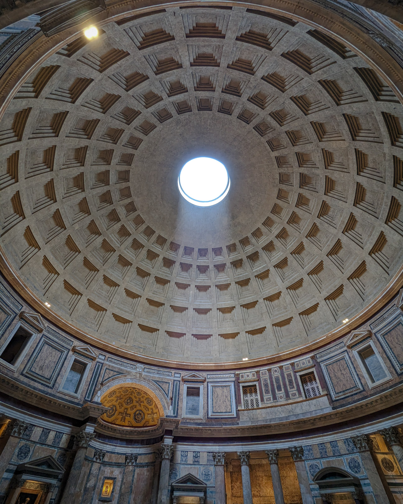

「即使在下雨的時候，萬神殿的諸神也會讓雨水不會從洞口淋入室內」。

諷刺的是在導覽聽到這樣的解釋的時候，當天正在下雨，中間的地板完全是濕的，而地板上還做了非常隱蔽的排水口。人類也是挺有趣的，如果諸神不會讓雨水淋入室內，為什麼還要作排水口呢？

導覽接著說其實是因為以前都是用為數眾多的蠟燭來照明，所以當時確實熱上升氣流可以讓小雨不致於淋入室內。但科技發達至今改用燈泡照明之後，神蹟就消失了。

這邊有幾個讓我覺得有意思的細節。首先上面的開口叫做 "Oculus"，是拉丁文的眼睛的意思，Oculus VR 裝置應該也是用同一種命名思路。另外上面一格格的方框支撐結構會讓我想到《冰與火之歌：權力的遊戲》裡面千面之神建築的場景，但他們應該不是參考萬神殿，單純只是我腦內的奇幻聯想。
