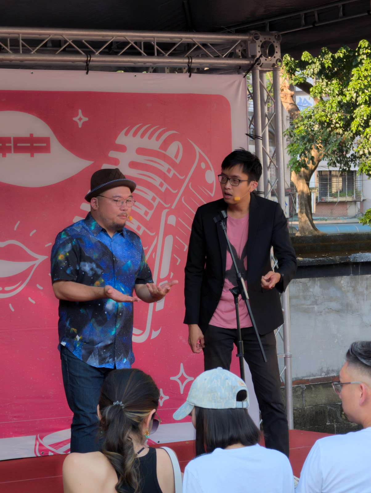

最近在看張維中的《[東京模樣](https://www.kobo.com/tw/zh/ebook/XGEKhgnVFDWMaznmnJwiOw)》散文集，發現他很擅長講一個短篇的故事，然後在故事的尾端前後呼應的銜接到開頭，觸發的情緒有時是感動有時是搞笑，看了幾篇之後就覺得他很擅長這樣的撰寫方式，讀起來沒什麼負擔也很有趣。

比如說提到馬桶的時候他有這麼一段：

> 也許我們這一代，恐怕在現在的日本小學生眼中算是廁所裡的忍者呢。畢竟我們可是擁有著，能夠在蹲式馬桶上廁所的高超技藝。雖然我承認，坐式馬桶確實比蹲式來得舒服多了，而且年紀愈大愈是回不去，但在蹲式馬桶面前呆住的畫面，怎麼想還是覺得不可思議。
>
> 然而，「不可思議」這四個字，其實就是這樣一刀刀的，在許多生活的小細節中，不知不覺地切開了每一個世代與時代。

前面還在覺得搞笑的時候，突然點出了一個世代隔閡的話題。後來覺得這跟喜劇的 punchline 其實是一樣的道理，一些意想不到的想像及關聯總是可以讓人錯愕、爆笑。只是在散文裡面還會多了惆悵或孤獨，但相同的這些都是透過反差、聯想觸發的情緒。

今天在林家花園的喜劇表演《林來CHILL》也是這樣。除了場地與喜劇充滿反差以外，相對比起售票入場的喜劇表演場地，這邊更多的是不同族群的觀眾，而充滿反差的還有這邊有許多帶著小朋友來的家長，這麼迥異的組合真的考驗各種不同族群對於新事物的接納與感染能力。

今天聽到壽壽壽 Soul Soul Soul 漫才對於馬桶的生活觀察後，回來才想到張維中也曾經講過馬桶的話題。覺得喜劇演員在生活中觀察、紀錄自己遇到的有趣生活細節，轉化成為一個個在台上賣力演出的搞笑段子，其實跟散文作家對於生活的觀察也沒那麼不一樣，他們都用著自己擅長的載體與反差而天外一筆的聯想來傳達自己情緒給觀眾。

只是壽壽壽 Soul Soul Soul 漫才講到免治馬桶的賞花大會話題真的有點毋湯，希望隔壁帶著小孩來的父母們還招架的住 🌼
