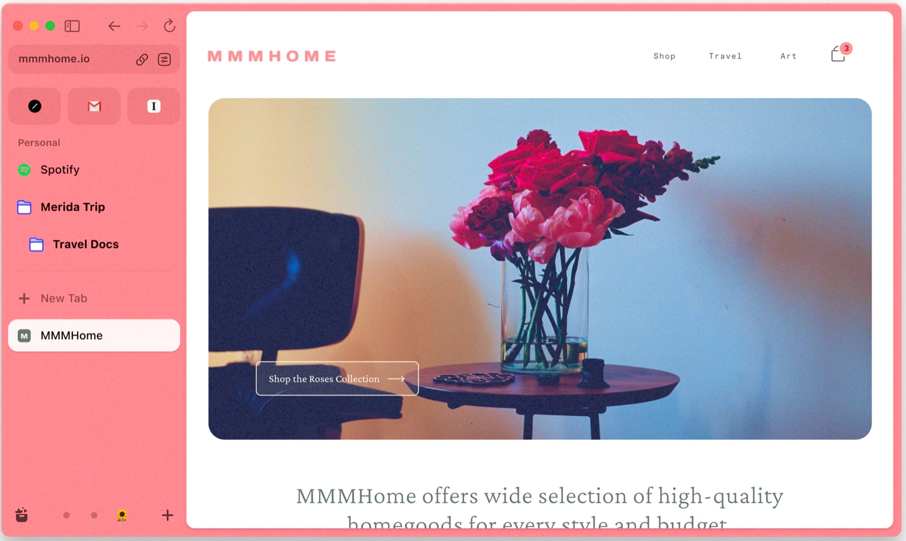

我也算是 Arc 瀏覽器的粉絲了。

我很喜歡他們在 Youtube 頻道上面說故事的方式。其他的瀏覽器宣傳時總是更著重他們實作了什麼功能，效能提高了多少，而 Arc 的 Youtube 頻道則不是這樣。例如最近發布的影片講解了一個功能是怎麼樣從探索階段到實際釋出。他們更重視誰是主角，他做了什麼，他們怎麼串起這些點子，那些經歷了無數推翻的功能之一，最終是怎麼浮現在使用者眼前。



他們想要跟使用者分享一個功能的脈絡，而不只是它能作什麼而已，還有那些對使用者的情緒的微妙影響，不管是引導你進入全神貫注的心理狀態或是使用一個旋鈕調整顏色來提高使用者的玩味興致，這些情緒起伏是很重要的。

以前我會覺得理性、邏輯才是最重要的，情緒起伏是一種會干擾工作以及生活的事物，但我現在不這麼看了。現在我覺得情緒是人的快速反應捷徑，發生的時候代表你的心理認知對當下發生的事情快速的產生了一個即時回饋，比直覺、思考要更快。正面回饋的話就是開心或喜悅，負面的話就是難過或憤怒等。

而反覆檢視這些情緒能夠探究自己內心深處被瞬間觸發的源頭是什麼。那很有可能是你深藏的價值觀、令人開心或難過的回憶或是長久以來認知缺陷或錯誤。當你抽絲剝繭的理解了自己內心之後，察覺自己深處的盼望，讓自己有機會重新詮釋自己。

扯得有點遠，而 Arc 瀏覽器比起其他瀏覽器，與其重視功能，Arc 更在乎情緒、感知與脈絡。同樣都是可以修改瀏覽器佈景主題或是網站修改樣式，它更重視的是這些功能對你心理的影響是什麼，它重視你在瀏覽的時刻不僅僅只是一位讀者，還可以參與和貢獻不同閱讀情境。使用瀏覽器在網際網路上面衝浪時，你還是站在浪板上的衝浪者，根據風、浪與海洋的細微變化，共同決策了衝浪的方向。

你可以有自己的觀點、喜愛的顏色與漸層，你可以根據自己的感知喜好，參與這個上網體驗的塑造，你不只是個讀者，還是個創作與貢獻者。

不管是自動關閉頁籤或是自訂樣式，這些功能其他的瀏覽器都已經實作過，或是透過擴充套件達成過。但是不同的思考脈絡與觀點就會帶來不一樣的產品。這些脈絡帶給它的是更重視感知的實作方式，調整顏色的旋鈕、發布 boost 的簽名，甚至到 Youtube 發布的影片等等，都帶來更多感知上的細微影響。

我也很喜歡下面這個介紹 Boost 的影片。



情緒不是會干擾你的東西，而是你深層感知的反射。

如果你也在乎這些微小情緒變化，我推薦你試試 Arc 瀏覽器。相信你不管是喜歡它或討厭它，都可以有些收穫。

https://arc.net/

