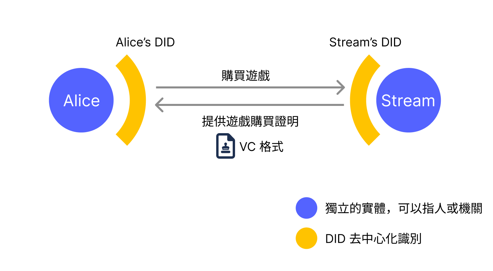
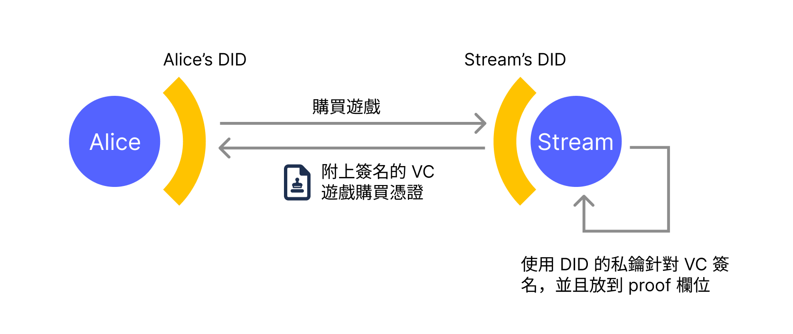
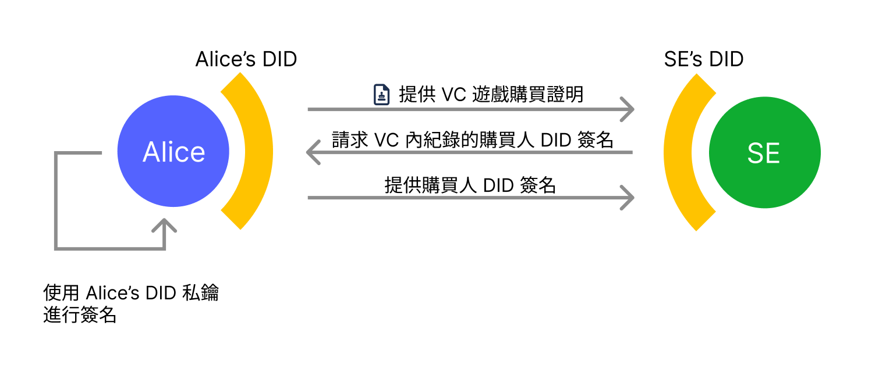

In the previous related article *[Examining Digital Identity Issues and DID Solutions Through Facebook's Unjust Account Suspension](https://yurenju.blog/posts/2023-08-21_fb-ban-and-did-solution/)*, I revisited the current state of digital identity through my own tragedy of being suspended by Facebook without cause, and briefly mentioned [W3C DIDs](https://w3c.github.io/did-core/), a standard attempting to disrupt this status quo. Now I want to explore more deeply how the W3C DIDs mechanism can transform the current landscape.

Readers who haven't read the [previous article](https://yurenju.blog/posts/2023-08-21_fb-ban-and-did-solution/) may want to revisit it first 😎

## Current State

From my perspective, current digital identity services have several issues:

### Autonomy

Current digital identities are not owned by users but by large corporations, which **allow** you to use those digital identities—just like how my Facebook account was permanently deleted without requiring my consent.

### Privacy

Identity providers (i.e., companies like Google and Facebook) can track users' login behavior, and users' digital footprints serve as their monetization tools. Through users' digital footprints, they can fuel their advertising and generate substantial profits. Combined with other services owned by these companies, such as Google's search engine, Facebook's social network, and the Facebook comment functionality embedded in websites, they can piece together a complete picture of users and serve them advertisements they'd like—or even [scam ads they're more likely to fall for](https://www.youtube.com/watch?v=PAr1F5keUGw).

But how do DIDs solve these problems? First, let's gain a deeper understanding of DIDs.

## W3C DIDs

W3C Decentralized Identifiers (DIDs) is a standard for **decentralized identity**, allowing users to perform identity verification using cryptography-based digital identities. In practice, when using W3C DIDs, it's often necessary to combine them with another standard: **W3C Verifiable Credentials (VCs)**. These two standards handle different functions:

- DIDs standard: How to verify a DID identity
- VCs standard: The credential issued when one DID endorses a claim about another DID

For example, when Alice purchases a game called *First Fantasy*, developed by game developer "SE", on a gaming purchase platform (let's call it Stream), Stream will issue Alice a proof of game purchase.



In this scenario, Stream as the platform will have a DID identity, and Alice will also have a personal DID identity. Before Alice purchases the game, Stream will first find verification information from Alice's DID identity and verify this Alice DID identity. The DID standard specifies what this verification information should be.

After Alice passes DID verification and purchases the game, Stream will issue Alice a game purchase proof in VC standard format, where Stream's DID serves as the issuer, certifying that Alice purchased the game *First Fantasy* on Stream. This is a credential generated to endorse a specific claim. Systems that receive this credential can verify whether the information recorded in the VC is correct based on the information contained within. This is the functionality provided by the VC standard.

A DID identity looks like this:


A DID identity consists of three fields separated by colons. The first field is always the string `did`, the second field is the DID Method. Since there are many different types and platforms for cryptography-based digital identities—including blockchain platforms, non-blockchain platforms, public key information placed on users' own websites, and even locally generated public keys—the access methods for these different DID types are called DID Methods, and the second field indicates which DID Method this DID identity uses. The third field is an identifier string specific to the particular DID Method.

For example, the following DID identity: `did:ethr:0xb9c5714089478a327f09197987f16f9e5d936e8a` means:
1. `did`: This is a DID identity
2. `ethr`: This DID identity uses the `ethr` DID Method
3. `0xb9c5...6e8a`: The user uses this string to represent a specific identity in this DID Method (think of it as an ID number)

This DID identity string, when parsed through an appropriate library, can reveal how to interact with this DID—for example, how to verify identity or verify credentials. This interaction information is a JSON file called a DID Document.

Here are a few different DID Methods:
- `did:key`: Users directly provide the public key in the DID identity string, without placing public key information elsewhere
- `did:web`: Users place public key information on their own website
- `did:ethr`: Users specify their account address on the Ethereum blockchain as the DID identity

Besides these three, there are many more DID Methods. For more types, please refer to [DID Specification Registries](https://www.w3.org/TR/did-spec-registries/).

### did:key

`did:key` means the DID identity string itself contains public key information, so no blockchain or other place to store the public key is needed. For example, in the DID identity `did:key:z6MkhaXgBZDvotDkL5257faiztiGiC2QtKLGpbnnEGta2doK`, the third part `z6Mk...2doK` is the public key of an algorithm, and this information is sufficient to verify this DID identity. To determine which encryption algorithm, you can judge from the beginning of the third field, for example:

- `z6Mk`: Ed25519 algorithm
- `zQ3s`: Secp256k1 algorithm
- `zDn`: P-256 algorithm

So the above example `z6Mk...2doK` can be identified as requiring the Ed25519 algorithm to verify messages.

The advantage of `did:key` is that it's very simple and managed by users themselves. If packaged as an app, it can even use biometric devices like TouchID to securely store the private key, making it a very convenient choice. The disadvantage is less flexibility—for example, if you want several different devices like phones and computers to manage one DID identity, there isn't a secure management method.

Another disadvantage is that the current format of `did:key` doesn't support the [WebAuthn](https://webauthn.io/) format, so you can't use biometric devices directly on web pages to manage `did:key`—it must be packaged as a mobile app.

**2024-02-05 Update**: I recently saw [ceramicnetwork/js-did/key-webauthn](https://github.com/ceramicnetwork/js-did/tree/main/packages/key-webauthn), which looks like it might be possible to generate and verify `did:key` using WebAuthn.

### did:web

`did:web` is a method where users provide DID interaction information by uploading a JSON to a specific URL. For example, the DID identity `did:web:mattr.global` actually obtains DID identity information from the URL https://mattr.global/.well-known/did.json. The owner of this DID can adjust their identity verification requirements by changing this JSON file placed on the website—for example, they can have different cryptographic keys on multiple devices, allowing them to log in on phones, computers, and tablets, or they can regularly update and replace keys to maintain security.

The advantage of `did:web` is also its simplicity, and updating is very convenient. I think because people feel they **own** that URL, they feel it's quite secure. The disadvantage is that it's not particularly convenient for ordinary people. A simple method might be to upload a file to Github pages—easy for engineers but somewhat difficult for average users.

However, from a **decentralization** perspective, `did:web` has some drawbacks. For example, if it's on Github Pages, when you have a conflict of interest with Github and the company decides to remove your website, your digital identity is taken away. Not to mention that domain names, even when registered, have time limits, and you might also have conflicts of interest with domain registrars that could cause the domain to become invalid.

Of course, from most people's perspective, this method already has sufficient autonomy. But if you're concerned, you can use the slightly less flexible `did:key`, or consider the next solution, `did:ethr`.

### did:ethr

`did:ethr` is a DID Method that places DID identity interaction information on Ethereum or compatible blockchains. For example, in the DID identity `did:ethr:0xf3beac30c498d9e26865f34fcaa57dbb935b0d74`, the third part is the account address, and users can use the private key controlling this account to verify this DID identity. The default verification method is signing a message, which is something Ethereum blockchain users do frequently and is quite intuitive.

Besides being ready to use out of the box, it can also be advanced configured through a [smart contract](https://etherscan.io/address/0xdca7ef03e98e0dc2b855be647c39abe984fcf21b), allowing for multi-device/private key management of the same DID identity and advanced features like key updates and rotation.

The advantage of `did:ethr` is that, like `did:web`, it has more options to adjust DID identity while being sufficiently **decentralized**, guaranteeing that as long as you possess the corresponding private key, you have complete control over the DID identity. There are no intermediaries like cloud server providers or domain registrars who might have conflicts of interest with users and take away your digital identity.

But the disadvantages are also obvious. Since `did:ethr` uses blockchain technology, users who haven't been exposed to blockchain will find the barrier too high and difficult to use.

## Verifiable Data (VC)

VCs, like DID Documents, are JSON files. As previously stated, a VC is a credential issued by one DID to another DID to endorse a specific claim. Using the same example of the game purchase platform Stream, Stream's DID might be `did:web:streamgame.com`, and if Alice chooses to use her Ethereum blockchain account to represent her identity, her DID would be something like `did:ethr:0xf3beac30c498d9e26865f34fcaa57dbb935b0d74`.

Here we can also observe that the **issuer** and **holder** in a VC can use different DID Methods, so an issuer who stores their public key on a website can also issue a VC credential to a user who uses an Ethereum account address as their DID identity.

When Alice purchases a game, Stream's system will issue a VC game purchase credential to Alice, as shown in this example:

```javascript
{
  "@context": ["https://www.w3.org/2018/credentials/v1"],
  "issuer": {
    "id": "did:web:streamgame.com"
  },
  "credentialSubject": {
    "id": "did:ethr:0xf3beac30c498d9e26865f34fcaa57dbb935b0d74",
    "purchaseId": "123456789",
    "gameTitle": "First Fantasy",
    "purchaseDate": "2023-12-31T15:00:00Z",
    "paymentAmount": 59.99,
    "currency": "USD",
    "platform": "PC"
  },
  "type": ["VerifiableCredential"],
  "issuanceDate": "2023-10-30T07:57:06.000Z",
  "proof": {
    "type": "JwtProof2020",
    "jwt": "eyJhbGci...2rzP0K5wow"
  }
}
```

This example describes that the issuer is `did:web:streamgame.com`, the person who purchased the game is Alice's DID `did:ethr:0xf3beac30c498d9e26865f34fcaa57dbb935b0d74`, and the `credentialSubject` field contains game purchase information.

What's important here is that the `proof` field contains the issuer's signature information for this VC. Anyone who obtains this file can verify whether it was indeed signed and issued by Steam. After Alice obtains this credential, she can present it to others or companies to prove she owns this game.



For example, the game company "SE" that developed *First Fantasy*, the game she purchased, has released the next generation game *Middle Fantasy*, and the new version isn't sold on Stream but instead available for digital purchase on "SE"'s official website. However, buyers can enjoy a 40% discount on *Middle Fantasy* by providing proof of purchasing *First Fantasy*.

Additionally, since the `id` attribute in `credentialSubject` records Alice's DID identity, when "SE"'s official website confirms that the user is the purchaser recorded in the VC, they can also request the user's DID signature to ensure they are indeed the purchaser of this purchase proof, not someone who stole it.



Next, let's use this same example to examine the differences between current identity verification mechanisms and DID-based identity verification mechanisms.

## Example: Differences Between Current Identity Verification and DIDs

In the above example, Alice purchased *First Fantasy* from the game purchase platform Stream, and the new version *Middle Fantasy* is sold digitally on "SE"'s official website, where anyone who previously purchased the previous version *First Fantasy* on Stream can buy *Middle Fantasy* at a 40% discount.

### Current Identity Verification Mechanism

With current identity verification mechanisms, the Stream game purchase platform would provide a function to log into the Stream platform, typically using a standard like OpenID Connect (OIDC). After connecting to Stream through OIDC on the game's official website, user purchase information is obtained through Stream's APIs.

Let's examine what problems this method has in terms of autonomy and privacy:

#### Autonomy

If Stream removes *First Fantasy* due to its age, or if there's a conflict of interest between Alice and Stream (for example, Alice advertises for rival platform Epico) and Stream claims Alice "violated platform regulations" and suspends her account, "SE"'s official website cannot obtain Alice's data on Stream through other means.

This situation is just like when Facebook permanently suspended my account completely without reason—I don't truly **own** my digital identity on Facebook.

#### Privacy

When the game's official website needs to log in through Stream APIs and query purchase records for the *Middle Fantasy* discount sale, Stream will learn about Alice's digital footprint on "SE"'s official website store. If Stream is also a gaming platform that monetizes user digital footprints (for example, if they provide game advertising), they have a strong incentive to record users' digital footprints.

Next, let's see what the situation would be if W3C DIDs were adopted.

### W3C DIDs Identity Verification Mechanism

When implementing a purchase proof mechanism using W3C DIDs, when Alice purchases the game *First Fantasy*, a game purchase proof in Verifiable Credential format will be issued to Alice based on Alice's DID identity. This purchase proof will include Stream issuer's signature, purchaser information, and game information.

When Alice wants to purchase the new version *Middle Fantasy* from "SE"'s official game platform and needs to verify purchase eligibility on the Stream platform, she only needs to provide that game purchase credential VC to "SE"'s official website. At that time, "SE"'s official website will verify whether the credential was issued by Stream, whether it's a correct game purchase credential, and verify through the purchaser's signature whether Alice possesses the specific DID identity used during the purchase.

After verifying the VC-format purchase proof, "SE"'s game official website can provide the discount to Alice. Let's again examine autonomy and privacy.

#### Autonomy

After Stream provides the VC purchase credential to Alice, it will have Stream issuer's signature on it. This signature is non-repudiable, proving that the Stream issuer definitely signed it.

The W3C DIDs standard actually provides a revocation mechanism, but this revocation mechanism only allows the issuer to mark this credential as **revoked** through a **revocation list**. The signature previously attached to the VC remains non-repudiable.

Even if Stream marks Alice's purchase proof as revoked, the purchase information credential that Alice previously saved can still prove that she once purchased this game on Stream, because all the necessary information is in the credential. Although the revocation mechanism will mark this credential as **revoked**, it cannot deny that the Stream issuer previously signed this credential, so the issuer's signature on the credential remains valid—it just has an additional **revoked** mark.

This way, "SE"'s official website selling *Middle Fantasy* can decide for itself whether to accept such credentials, rather than having all power concentrated with the issuer.

#### Privacy

When Alice provides credentials to the game's official platform, if Stream chooses to place the issuer's public key information on the website, at most they can know that someone downloaded the public key information—they won't know which user is trying to verify which game. If it's placed on the Ethereum blockchain, Stream won't even know that someone downloaded the public key information. In terms of privacy protection, this is better than current implementation methods.

The differences between these two characteristics in traditional verification mechanisms versus DID verification mechanisms are as follows:

| Characteristic | Traditional Identity Verification | W3C DIDs Identity Verification |
|------|-------------------|-----------------------|
| Autonomy | Platform has the authority to revoke users' credentials or identities and refuse any data access | Platform can only mark credentials as revoked but cannot deny credentials it has previously signed |
| Privacy | When logging in or querying data through APIs, the platform can obtain users' digital footprints | Platform cannot track users' digital footprints through login behavior |

## Conclusion: Privacy and Autonomy Are Guaranteed, But What's Still Missing?

As stated above, the W3C DIDs and Verifiable Credentials standards do indeed enhance users' autonomy and privacy regarding identity verification. If this mechanism is so good, we should immediately implement DIDs—what are we waiting for?

DIDs is a recently formed standard protocol, and there are still many shortcomings. First, if we need better support for DIDs and VCs, we'll need an app that can store various VC credentials and allow users to select which credential to use through this app when needed. This app will also need to manage users' private keys. In essence, this app would be very similar to Apple Wallet or Google Wallet—apps used to store tickets and membership cards—but would additionally need to implement functionality for managing internal or external private keys.

In reality, there isn't a mature, easy-to-use app to do this. Moreover, since DIDs are still in their early stages, whether to have a VC Wallet first or support DIDs first becomes a chicken-and-egg problem.

The next issue is **motivation**. As described above, after adopting DIDs, the power of identity providers and credential issuers will be greatly reduced, and it will be more difficult to track users' digital footprints. Let's think from their perspective: if Google or Facebook implementing a new identity verification protocol would significantly reduce advertising precision, thereby decreasing profits from their main revenue source, while also losing more control over users—what motivation would they have to switch to DIDs?

A better entry point might be from a regulatory perspective, with regulatory authorities like the EU requiring giant corporations to reduce their control over the digital world, or even having governments first adopt the DID standard for official credentials like ID cards or driver's licenses. I believe this is a better approach.

Looking back, DIDs is still very early stage, and there are indeed many shortcomings to face. But conversely, it's also a place full of hope. This standard reflects on the enormous control giant corporations currently have over the digital world and paints a blueprint for a more autonomous and privacy-respecting future, allowing us to consider whether there's an opportunity to reclaim some power that rightfully belongs to users through standards.

Of course, our imagination for the future doesn't have to stop here. We can push further: if we want even better privacy, what solutions are currently available? For example, when verifying whether a user has purchased *First Fantasy* on Stream, could we prove that the user indeed purchased the game without even revealing their DID identity?

The next article will explain how [Semaphore](https://semaphore.appliedzkp.org/), a zero-knowledge proof framework, achieves more advanced privacy applications. Stay tuned!

## Additional Information

### The Problem of Seamless Key Rotation in did:web

Luoh Ren-Shan pointed out in a [Facebook comment](https://www.facebook.com/yurenju/posts/pfbid0916c4YdTULXymUW68pE32nuNTYVHAXcpkV4NZEuM7ZodGBHz1NEKpaBgrmLLG6VEl?comment_id=881600443684722) that if the issuer Stream adopts `did:web` as its DID, the issuer could seamlessly change their key information to invalidate the credential in Alice's hands.

This is indeed a problem, but when updating key information this way, other credentials issued by Stream using the original key will also become invalid—it cannot be limited to just Alice's credential. This would create a crisis of trust for the Stream issuer. As an issuer using `did:web`, they would need to weigh the pros and cons before deciding whether to do this. Of course, when a major issue occurs, the issuer might still use this tactic to aggressively handle thorny problems, but compared to traditional methods where results can be easily manipulated, using `did:web` is still more trustworthy, though not perfect.

Looking back, if using `did:ethr`, when the DID owner updates key information, a historical record is left, and previous versions of the DID document can be retrieved through [parameter queries](https://github.com/decentralized-identity/ethr-did-resolver/blob/master/doc/did-method-spec.md#versionid-query-string-parameter), making it even more trustworthy than `did:web`.
