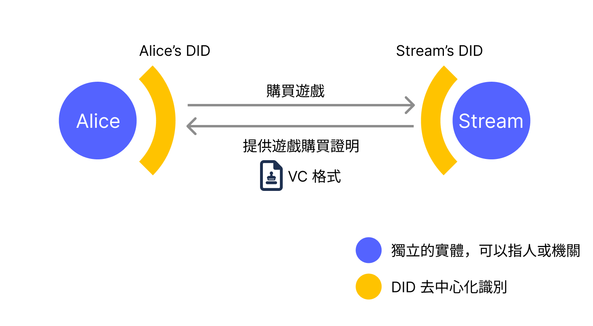
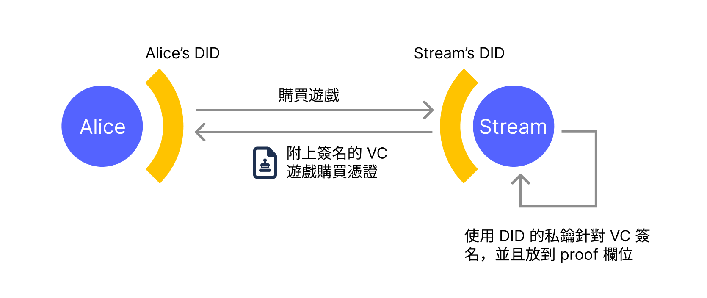
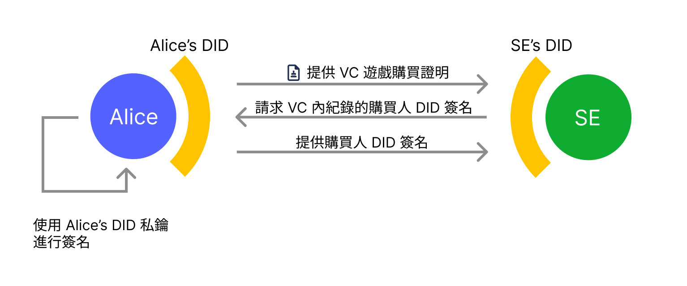

前回の関連記事『[Facebook による理不尽なアカウント凍結から見るデジタルアイデンティティの問題と DID ソリューション](https://yurenju.blog/posts/2023-08-21_fb-ban-and-did-solution/)』では、私が Facebook に理不尽に凍結された悲劇からデジタルアイデンティティの現状を再検討し、この現状を打破しようとする標準である [W3C DIDs](https://w3c.github.io/did-core/) について簡単に触れました。今回は、W3C DIDs のメカニズムがどのように現状を変えるのか、より深く掘り下げて探っていきたいと思います。

[前回の記事](https://yurenju.blog/posts/2023-08-21_fb-ban-and-did-solution/)をまだ読んでいない読者は、まず振り返ってみてください 😎

## 現状

私の観点から見ると、現在のデジタルアイデンティティサービスにはいくつかの問題があります:

### 自律性

現在のデジタルアイデンティティはユーザーが所有しているのではなく、大企業が所有しており、企業がそのデジタルアイデンティティの使用を**許可**しているに過ぎません。私の Facebook アカウントが私の同意なく永久削除されたケースのように。

### プライバシー

アイデンティティプロバイダー(つまり Google や Facebook などの企業)は、ユーザーのログイン行動を追跡でき、ユーザーのデジタルフットプリントは彼らの収益ツールとなっています。ユーザーのデジタルフットプリントを通じて広告の糧となり、豊富な利益を得ることができます。企業が所有する Google 検索エンジンや Facebook ソーシャルネットワークなどの他のサービスと、ウェブサイトに埋め込まれた Facebook コメント機能を組み合わせれば、ユーザーの姿を十分に組み立て、あなたが好む広告を提供し、さらには[騙されやすい詐欺広告](https://www.youtube.com/watch?v=PAr1F5keUGw)まで提供することができます。

しかし、DIDs はどのようにしてこれらの問題を解決するのでしょうか?まず、DIDs についてさらに詳しく理解しましょう。

## W3C DIDs

W3C 分散型識別子(Decentralized Identifiers, DIDs)は、**分散型アイデンティティ識別**の標準であり、ユーザーは暗号学に基づくデジタルアイデンティティを使用して本人確認を行うことができます。実際に W3C DIDs を使用する場合、しばしば別の標準である **W3C 検証可能クレデンシャル**(Verifiable Credentials, VCs)と併用する必要があります。2つの標準はそれぞれ異なる機能を担当しています:

- DIDs 標準:DID アイデンティティ識別をどのように検証するか
- VCs 標準:ある DID が別の DID の主張を裏書きする際に発行される証明書

例えば、Alice がゲーム購入プラットフォーム(このプラットフォームを Stream と呼びましょう)で、ゲーム開発会社 "SE" が開発したゲーム『ファースト・ファンタジー』を購入する場合、Stream は Alice にゲーム購入証明を発行します。



この状況下で、プラットフォームとしての Stream は DID アイデンティティ識別を持ち、Alice も個人として DID アイデンティティ識別を持ちます。Stream は Alice がゲームを購入する前に、まず Alice の DID 識別から検証方法の情報を見つけ、この Alice DID 識別を検証します。DID 標準はこれらの検証情報の仕様を定めています。

Alice が DID 検証を通過してゲームを購入すると、Stream は Alice に VC 標準形式のゲーム購入証明を発行します。その中で Stream の DID が発行者(Issuer)として、Alice が Stream でゲーム『ファースト・ファンタジー』を購入したことを証明します。これは特定の主張を裏書きするために生成される証明書です。この証明書を受け取ったシステムは、その中の情報に基づいて VC に記載された情報が正確であるかを検証できます。これが VC 標準が提供する機能です。

DID 識別は次のような形式です:


DID 識別は3つのフィールドで構成され、コロンでフィールドを区切ります。最初のフィールドは固定の文字列 `did`、2番目のフィールドは DID Method です。暗号学に基づくデジタルアイデンティティには非常に多くの異なる種類とプラットフォームがあり、ブロックチェーンプラットフォーム、非ブロックチェーンプラットフォーム、ユーザーが自分のウェブサイトに配置した公開鍵情報、さらにはローカルで生成された公開鍵もサポートされています。これらの異なる DID タイプのアクセス方法を DID Method と呼び、2番目のフィールドはこの DID 識別がどの DID Method を使用しているかを示します。3番目のフィールドは特定の DID Method に対する識別文字列です。

例えば、次の DID 識別:`did:ethr:0xb9c5714089478a327f09197987f16f9e5d936e8a` が意味するのは:
1. `did`:これは DID 識別である
2. `ethr`:この DID 識別が採用する識別方式は `ethr` という DID Method
3. `0xb9c5...6e8a`:ユーザーがこの DID Method でこの文字列を使用して特定のアイデンティティ識別を表す(身分証番号のようなもの)

この DID 識別文字列を適切なライブラリで解析すると、この DID とどのように相互作用するか、例えばアイデンティティの検証方法や証明書の検証方法などの相互作用情報が得られます。これらの相互作用情報は JSON ファイルであり、DID Document と呼ばれます。

ここでいくつかの異なる DID Method を紹介します:
- `did:key`:ユーザーが DID 識別文字列内に直接公開鍵を提供し、公開鍵情報を他の場所に配置しない
- `did:web`:ユーザーが公開鍵情報を自分のウェブサイトに配置
- `did:ethr`:ユーザーが Ethereum ブロックチェーン上の自分のアカウントアドレスを DID 識別として指定

上記3つ以外にも DID Method は非常に多く存在します。より多くの種類については [DID Specification Registries](https://www.w3.org/TR/did-spec-registries/) を参照してください。

### did:key

`did:key` は、DID 識別の文字列自体に公開鍵情報が含まれているため、ブロックチェーンや他の公開鍵を保存する場所が不要です。例えば、DID 識別 `did:key:z6MkhaXgBZDvotDkL5257faiztiGiC2QtKLGpbnnEGta2doK` の3番目の部分 `z6Mk...2doK` はあるアルゴリズムの公開鍵であり、この情報だけでこの DID 識別を検証するのに十分です。どの暗号アルゴリズムかを判断するには、3番目のフィールドの先頭から判断できます。例えば:

- `z6Mk`: Ed25519 アルゴリズム
- `zQ3s`: Secp256k1 アルゴリズム
- `zDn`: P-256 アルゴリズム

したがって、上記の例 `z6Mk...2doK` は Ed25519 アルゴリズムを採用してメッセージを検証する必要があることが識別できます。

`did:key` の利点は非常にシンプルで、ユーザーが自分で管理できることです。アプリとしてパッケージ化すれば、TouchID などの生体認証デバイスを使用して秘密鍵を安全に保存することもでき、非常に便利な選択肢です。欠点は柔軟性がやや低いことです。例えば、複数の異なるデバイス(スマートフォン、コンピュータなど)で1つの DID アイデンティティを管理したい場合、安全な管理方法がありません。

もう1つの欠点は、`did:key` の現在の形式が [WebAuthn](https://webauthn.io/) の形式をサポートしていないため、ウェブページ上で直接生体認証デバイスを使用して `did:key` を管理できず、モバイルアプリとしてパッケージ化する必要があることです。

**2024-02-05 更新**:最近 [ceramicnetwork/js-did/key-webauthn](https://github.com/ceramicnetwork/js-did/tree/main/packages/key-webauthn) を見つけました。WebAuthn を使用して `did:key` を生成・検証できる可能性があるようです。

### did:web

`did:web` は、ユーザーが特定の URL に JSON をアップロードすることで DID 相互作用情報を提供する方法です。例えば、DID 識別 `did:web:mattr.global` は実際には URL https://mattr.global/.well-known/did.json から DID 識別情報を取得します。この DID の所有者は、ウェブサイトに配置されたこの JSON ファイルを変更することで、アイデンティティ検証の要件を調整できます。例えば、複数のデバイスでそれぞれ異なる暗号鍵を持つことで、スマートフォン、コンピュータ、タブレット上でログインできるようにしたり、定期的に鍵を更新してセキュリティを維持したりすることもできます。

`did:web` の利点も非常にシンプルで、更新も非常に便利です。おそらく、人々は自分がその URL を**所有**していると感じるため、かなり安全だと感じるでしょう。欠点は、一般の人にとっては特に便利とは言えないことです。簡単な方法としては Github pages にファイルをアップロードすることが考えられますが、エンジニアにとっては簡単でも、一般ユーザーにとってはやや難易度が高いでしょう。

しかし、**分散化**の観点から見ると、`did:web` にはいくつかの欠点があります。例えば、Github Pages に配置している場合、あなたと Github との間に利益相反が生じ、公式があなたのウェブサイトを削除すると、あなたのデジタルアイデンティティも奪われてしまいます。ドメイン名も登録しても期間制限があり、同様にドメイン業者と利益相反が生じてドメインが無効になる可能性もあります。

もちろん、ほとんどの人の観点から見れば、この方法はすでに十分な自律性を持っています。しかし、心配な場合は、やや柔軟性のない `did:key` を使用するか、次のソリューション `did:ethr` を検討してください。

### did:ethr

`did:ethr` は、DID 識別の相互作用情報を Ethereum または互換性のあるブロックチェーン上に配置する DID Method です。例えば、DID 識別 `did:ethr:0xf3beac30c498d9e26865f34fcaa57dbb935b0d74` では、3番目の部分がアカウントアドレスであり、ユーザーはこのアカウントを制御する秘密鍵を使用してこの DID 識別を検証できます。デフォルトの検証方法はメッセージに対する署名であり、これは Ethereum ブロックチェーンユーザーが頻繁に行う操作で、直感的です。

すぐに使用できるだけでなく、[スマートコントラクト](https://etherscan.io/address/0xdca7ef03e98e0dc2b855be647c39abe984fcf21b)を通じてこの DID の詳細設定も可能で、複数デバイス/秘密鍵で同じ DID 識別を管理したり、鍵の更新や交換などの高度な機能も実現できます。

`did:ethr` の利点は、`did:web` と同様に DID 識別を調整するためのより多くのオプションがあり、同時に十分に**分散化**されており、対応する秘密鍵を所有していれば DID 識別を完全に制御できることが保証されています。クラウドサーバープロバイダーやドメイン業者などの仲介者がユーザーと利益相反を起こしてデジタルアイデンティティを奪うことはありません。

しかし、欠点も明白です。`did:ethr` はブロックチェーン技術を採用しているため、ブロックチェーンに触れたことのないユーザーにとってはハードルが高く、使いにくいでしょう。

## Verifiable Data (VC)

VC は DID Document と同様に JSON ファイルであり、前述のように VC はある DID が別の DID に発行する証明書で、特定の主張を裏書きするものです。同じくゲーム購入プラットフォーム Stream の例で見ると、Stream の DID は `did:web:streamgame.com` である可能性があり、Alice が自分の Ethereum ブロックチェーンアカウントを自分のアイデンティティとして選択する場合、DID は `did:ethr:0xf3beac30c498d9e26865f34fcaa57dbb935b0d74` のようになります。

ここで、VC 内の**発行者**と**授与者**は異なる DID Method を使用できることも観察できます。したがって、公開鍵をウェブサイトに保存している発行者も、Ethereum アカウントアドレスを DID 識別として使用しているユーザーに VC 証明書を発行できます。

Alice がゲームを購入すると、Stream のシステムは Alice に VC ゲーム購入証明書を発行します。例は次のとおりです:

```javascript
{
  "@context": ["https://www.w3.org/2018/credentials/v1"],
  "issuer": {
    "id": "did:web:streamgame.com"
  },
  "credentialSubject": {
    "id": "did:ethr:0xf3beac30c498d9e26865f34fcaa57dbb935b0d74",
    "purchaseId": "123456789",
    "gameTitle": "First Fantasy",
    "purchaseDate": "2023-12-31T15:00:00Z",
    "paymentAmount": 59.99,
    "currency": "USD",
    "platform": "PC"
  },
  "type": ["VerifiableCredential"],
  "issuanceDate": "2023-10-30T07:57:06.000Z",
  "proof": {
    "type": "JwtProof2020",
    "jwt": "eyJhbGci...2rzP0K5wow"
  }
}
```

この例では、発行者(Issuer)が `did:web:streamgame.com` であり、ゲームを購入した人は Alice の DID `did:ethr:0xf3beac30c498d9e26865f34fcaa57dbb935b0d74` であり、`credentialSubject` フィールドにゲーム購入情報があることが記述されています。

ここで重要なのは、`proof` フィールド内に発行者によるこの VC の署名情報があることです。このファイルを入手した誰もが、このファイルが確実に Steam によって署名・発行されたものであるかを検証できます。Alice はこの証明書を取得した後、他の人や企業に提示してこのゲームを所有していることを証明できます。



例えば、彼女が購入したゲーム『ファースト・ファンタジー』のゲーム会社 "SE" が次世代のゲーム『ミドル・ファンタジー』を発売し、新バージョンは Stream では販売されず、"SE" の公式ウェブサイトでデジタル版を購入できるようになりました。しかし、購入者は『ファースト・ファンタジー』の購入証明を通じて『ミドル・ファンタジー』を40%オフで購入できます。

また、`credentialSubject` の `id` 属性に Alice の DID 識別が記録されているため、"SE" 公式ウェブサイトは VC に記録された購入者であることを確認する際、ユーザーの DID の署名を要求することもでき、その人が盗まれた購入証明ではなく、この購入証明の購入者本人であることを確認できます。



次に、同じ例を使用して、現行のアイデンティティ検証メカニズムと DID アイデンティティ検証メカニズムを採用した場合の違いを検討します。

## 例:現行のアイデンティティ検証と DID の違い

上記の例では、Alice がゲーム購入プラットフォーム Stream から『ファースト・ファンタジー』を購入し、新バージョンのゲーム『ミドル・ファンタジー』は "SE" 公式サイトでデジタル版を販売しており、以前 Stream で前バージョン『ファースト・ファンタジー』を購入していれば40%オフで『ミドル・ファンタジー』を購入できます。

### 現行のアイデンティティ検証メカニズム

現行のアイデンティティ検証メカニズムでは、Stream ゲーム購入プラットフォームは Stream プラットフォームへのログイン機能を提供し、通常は OpenID Connect (OIDC) のような標準を採用してこの機能を提供します。ゲーム公式ウェブサイトで OIDC を通じて Stream に接続した後、Stream の API を通じてユーザーの購入情報を取得します。

次に、この方法が自律性とプライバシーの面でどのような問題があるかを検討しましょう:

#### 自律性

Stream が古すぎるという理由で『ファースト・ファンタジー』を削除した場合、または Alice と Stream の間に利益相反が生じた場合(例えば、Alice が競合プラットフォーム Epico の広告を手伝った)、Stream が Alice が「プラットフォーム規約に違反した」と主張してアカウントを凍結した場合、"SE" 公式ウェブサイトは他の方法で Stream 上の Alice のデータを取得することはできません。

この状況は、Facebook が完全に理由なく私のアカウントを永久凍結したのと同じです。私は Facebook 上のデジタルアイデンティティを本当に**所有**しているわけではありません。

#### プライバシー

ゲーム公式ウェブサイトが『ミドル・ファンタジー』の割引販売のために Stream API を通じてログインし、購入記録を照会する必要がある場合、Stream は Alice が "SE" 公式ウェブサイトショップでのデジタルフットプリントを知ることになります。Stream もユーザーのデジタルフットプリントで収益を上げるゲームプラットフォームである場合(例えば、ゲーム広告を提供している)、ユーザーのデジタルフットプリントを記録する強い動機があります。

次に、W3C DIDs を採用した場合がどのような状況になるかを見てみましょう。

### W3C DIDs アイデンティティ検証メカニズム

W3C DIDs を使用して購入証明メカニズムを実装する場合、Alice がゲーム『ファースト・ファンタジー』を購入すると、Alice の DID 識別に基づいて Verifiable Credential 形式のゲーム購入証明が Alice に発行されます。この購入証明には Stream 発行者の署名、購入者情報、ゲーム情報が含まれます。

Alice が "SE" 公式ゲームプラットフォームから新バージョンの『ミドル・ファンタジー』を購入する際、Stream プラットフォームでの購入資格を確認する必要がある場合、そのゲーム購入証明書 VC を "SE" 公式ウェブサイトに提供するだけで済みます。この時、"SE" 公式ウェブサイトはその証明書が Stream によって発行されたものか、正しいゲーム購入証明書か、そして購入者の署名検証を通じて Alice が購入時に使用した特定の DID 識別を所有しているかを検証します。

VC 形式の購入証明を検証した後、"SE" ゲーム公式ウェブサイトは Alice に割引を提供できます。次に、同様に自律性とプライバシーを検討してみましょう。

#### 自律性

Stream が VC 購入証明書を Alice に提供した後、その上には Stream 発行者の署名が付いており、この署名は否認できません。Stream 発行者が確実に署名したことを証明します。

W3C DIDs 標準には実際に取り消しメカニズムが用意されていますが、この取り消しメカニズムは**取り消しリスト**を通じて発行者がこの証明書を**取り消し状態**としてマークするだけで、以前 VC に付けられた署名は依然として否認できません。

Stream が Alice の購入証明が取り消されたとマークしても、以前 Alice が保存していた購入情報証明書は、彼女が以前 Stream でこのゲームを購入したことを証明できます。なぜなら、必要な情報はすべて証明書の中にあるからです。取り消しメカニズムはこの証明書を**取り消し済み**とマークしますが、Stream 発行者が以前この証明書に署名したことを否認することはできないため、証明書の発行者署名は依然として有効であり、ただ**取り消し済み**のマークが追加されるだけです。

これにより、『ミドル・ファンタジー』を販売する "SE" 公式ウェブサイトは、このような証明書を受け入れるかどうかを自分で決定でき、権力がすべて発行者に集中することはありません。

#### プライバシー

Alice が証明書をゲーム公式プラットフォームに提供する際、Stream が発行者の公開鍵情報をウェブサイトに配置することを選択した場合、せいぜい誰かが公開鍵情報をダウンロードしたことがわかる程度で、どのユーザーがどのゲームを検証しようとしているかはわかりません。Ethereum ブロックチェーンに配置した場合、Stream は誰かが公開鍵情報をダウンロードしたことすら知りません。プライバシー保護の面では、現行の実装方法よりも優れています。

これら2つの特性における従来の検証メカニズムと DID 検証メカニズムの違いは次のとおりです:

| 特性 | 従来のアイデンティティ検証メカニズム | W3C DIDs アイデンティティ検証メカニズム |
|------|-------------------|-----------------------|
| 自律性 | プラットフォームはユーザーの証明書やアイデンティティを取り消し、すべてのデータアクセスを拒否する権限を持つ | プラットフォームは証明書を取り消し済みとマークできるが、以前署名した証明書を否認することはできない |
| プライバシー | API を通じてログインやデータ照会を行う際、プラットフォームはユーザーのデジタルフットプリントを取得できる | プラットフォームはログイン行動を通じてユーザーのデジタルフットプリントを追跡できない |

## 結論:プライバシーと自律性は保証されたが、まだ何が足りない?

上述のように、W3C DIDs および Verifiable Credentials 標準は確実にユーザーのアイデンティティ検証における自律性とプライバシーを向上させます。このメカニズムがこれほど優れているのであれば、今すぐ DID を導入すべきであり、私たちは何を待っているのでしょうか?

DIDs はまだ形成されて間もない標準プロトコルであり、実際にはまだ多くの不足している部分があります。まず、DID と VC をより良くサポートするには、さまざまな VC 証明書を収納できるアプリが必要であり、使用する必要がある時にこのアプリを通じて今回使用する証明書を選択できるようにする必要があります。このアプリはユーザーの秘密鍵を管理する機能も必要です。このアプリの本質は Apple Wallet や Google Wallet のようなチケットや会員カードを収納するウォレットに非常に似ていますが、内部または外部の秘密鍵を管理する機能の実装も必要になります。

現実には、これを行うための成熟した使いやすいアプリはありません。さらに、DID はまだ初期段階にあるため、VC Wallet を先に用意するべきか、DID を先にサポートするべきかという、鶏が先か卵が先かという問題になります。

次の問題は**動機**です。上記の説明のように、DID を採用すると、アイデンティティプロバイダーや証明書発行者の権力は大幅に縮小され、ユーザーのデジタルフットプリントを追跡することも困難になります。ここで立場を変えて考えてみましょう。Google や Facebook が新しいアイデンティティ検証プロトコルを実装すると広告の精度が大幅に低下し、主要な収益源である利益が減少し、同時にユーザーに対するさらなる制御権を失うとしたら、彼らが DIDs に切り替える動機は何でしょうか?

より良い切り口は規制の観点からかもしれません。例えば、EU のような監督機関が巨大企業にデジタル世界に対する支配力を縮小するよう規制したり、政府が公式証明書(身分証や運転免許証など)について DID 標準を率先して採用したりすることが、より良いアプローチだと考えます。

振り返ってみると、DIDs はまだ非常に初期段階にあり、直面する欠点は実に多いです。しかし、逆に見れば希望に満ちた場所でもあります。この標準は、現在の巨大企業がデジタル世界に対して持つ巨大な支配力について再考し、より自律的でプライバシーに配慮した青写真を描いており、標準を通じて本来ユーザーに属すべき権力を取り戻す機会があるかどうかを考えさせてくれます。

もちろん、未来に対する想像力はこれだけに留まる必要はありません。さらに一歩進めて考えてみましょう:もっと良いプライバシーが欲しい場合、現在どのようなソリューションが達成できるでしょうか?例えば、ユーザーが以前 Stream で『ファースト・ファンタジー』を購入したかどうかを検証する際、自分の DID 識別すら開示せずに、ユーザーが確実にそのゲームを購入したことを証明できないでしょうか?

次の記事では、ゼロ知識証明のフレームワークである [Semaphore](https://semaphore.appliedzkp.org/) がどのようにさらに進んだプライバシーアプリケーションを実現するかを解説します。次回をお楽しみに!

## 補足情報

### did:web における鍵の無痕跡交換の問題

Luoh Ren-Shan が [Facebook のコメント](https://www.facebook.com/yurenju/posts/pfbid0916c4YdTULXymUW68pE32nuNTYVHAXcpkV4NZEuM7ZodGBHz1NEKpaBgrmLLG6VEl?comment_id=881600443684722)で、発行者 Stream が `did:web` を DID として採用した場合、発行者は無痕跡で自分の鍵情報を変更して、Alice の手元の証明書を無効にできると指摘しています。

これは確かに問題ですが、このように鍵情報を更新すると、Stream が元の鍵で発行した他の証明書もすべて無効になり、Alice の証明書だけに限定することはできません。これは Stream 発行者に対する信頼危機を生じさせることになり、`did:web` を使用する発行者としては、良し悪しのトレードオフでそうするかどうかを考慮する必要があります。もちろん、大きな問題が発生した場合、発行者はこの手段を使って厄介な問題を積極的に処理する可能性がありますが、従来の方法で簡単に結果を操作できるのと比較すれば、`did:web` を使用する方がまだ信頼に値しますが、完璧ではありません。

振り返って、`did:ethr` を使用している場合、DID 所有者が鍵情報を更新すると履歴記録が残り、[パラメータクエリ](https://github.com/decentralized-identity/ethr-did-resolver/blob/master/doc/did-method-spec.md#versionid-query-string-parameter)を通じて以前のバージョンの DID ドキュメントを取得できるため、`did:web` よりもさらに信頼できます。
