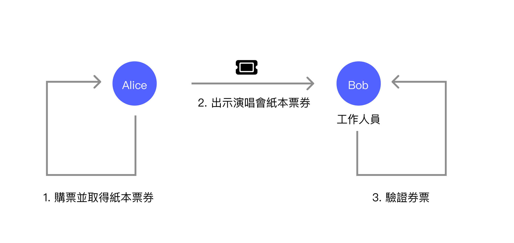
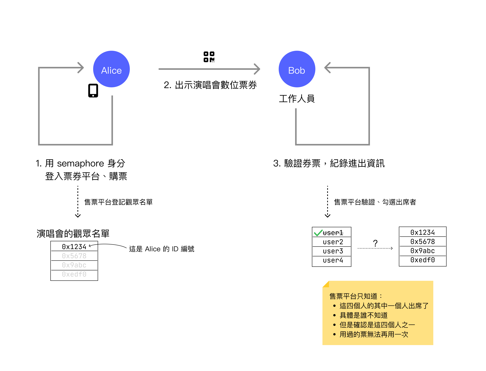
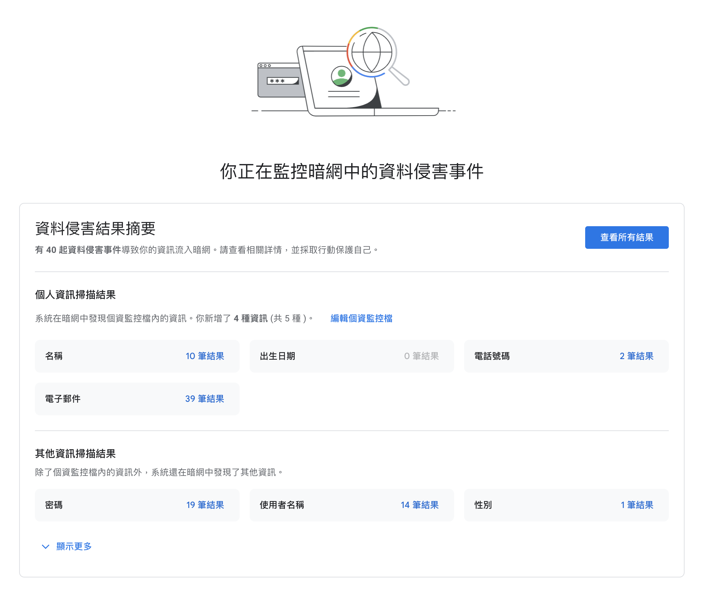

When attending a concert, you simply need to present a paper ticket to enter the venue. Occasionally, for events requiring real-name registration, you may need to show identification. With paper tickets, staff can verify your identity without your movements being tracked.

However, in digital life, it's a different story.

In digital life, when you need to prove your identity for verification, your authentication action is almost invariably recorded. Taking the same example, if you present an electronic ticket to enter a concert venue, there's a high probability that your entry information will be logged.

Often, these records serve meaningful purposes that users can understand and accept. For instance, entry and exit records are indeed necessary to prevent a single ticket from being used multiple times. However, the **easy-to-track** nature of digital footprints has gone too far, resulting in many troublesome phenomena. The most common is that after browsing websites, Facebook and Google become flooded with related advertisements. It's as if someone is following you down the street with a notebook, recording your every move—the magazines you flipped through at the convenience store, the drinks you like. Then repeatedly posting advertisements they think you'll buy on the routes you take.

In the past, implementations of identity login and verification never considered making this difficult to track, because effectiveness, ease of evaluation, and trackability are the strengths of digital records. But when people began to recognize the importance of digital footprints to privacy, they looked back to discover that the digital technologies we commonly use today don't have that **difficult-to-track** characteristic.

And [Semaphore](https://semaphore.pse.dev/) is a mechanism born from this need.

Semaphore is an identity verification mechanism implemented through Zero Knowledge Proof (ZKP) in cryptography. Traditional digital identity verification requires explicit input of your identification information. For example, when logging into a Google account, you need to enter your account name and password, and the account name itself is your identification information.

In Semaphore's usage scenarios, you don't need to input information like **account name**. Instead, it only verifies your **qualification**, not the user's specific corresponding digital identity. Let's use the same ticketing platform scenario, but with three different technical implementations to explain this concept.

## Example Scenario
### Paper Tickets

When using paper tickets, Alice obtains a paper ticket after purchasing it from the ticketing website. At the event venue, she presents the ticket to staff member Bob, who checks whether the ticket is valid. If correct, Bob allows Alice to attend the event.

Paper tickets have some inherent drawbacks. For instance, they require additional anti-counterfeiting measures to prevent others from forging tickets. Additionally, such scenarios can typically use electronic checking methods, such as QR code scanning verification to prevent a single ticket from being used twice. However, when adopting electronic checking mechanisms, they generally also record the user's footprints.

### Digital Tickets

When using digital tickets, Alice must first log in to the ticketing platform with an account and purchase a ticket. After successful purchase, Alice is added to the audience list. Upon arrival at the event venue, she presents a QR code on her phone screen for entry. Bob verifies the ticket correctness through the QR code and then allows Alice to enter, with the system marking Alice's ticket as having entered.

The advantage of digital tickets is more convenient verification. Although there are technical issues to overcome, during entry, the backend database can quickly confirm whether the audience member is an attendee, and it can detect if multiple people use the same ticket for entry.

The disadvantage is the digital footprint problem. It's fine when used reasonably, but the current situation is far too abusive, especially with advertising.

### Semaphore Identity Authentication

Semaphore is a development kit to help developers create an **anonymous yet verifiable** login mechanism. First, you still need to log in to the ticketing platform and purchase a ticket, but here the ticketing platform has users register their Semaphore Identity. If a name is entered, the ticketing platform will still know the user's name and corresponding ID number. For example, after Alice registers, her ID number `0x1234` will still correspond to her name Alice.

On the event day when Alice enters, she similarly presents a QR code for entry. At this time, staff member Bob also scans the ticket, but this QR code doesn't contain the user's explicit identity verification information (such as account name or email). Instead, it allows the verifier to present a cryptographic challenge, and the user replies with a challenge solution without revealing their identity. This solution can only be answered by one of the attendees, thus proving they are an attendee without revealing who they actually are.

This means that during ticket verification, the attendance list only shows information like `user1`, `user2`, `user3`, `user4`, which represent four attendees respectively, but the platform cannot know the correspondence between `userN` and the actual attendee's ID number.

When Alice successfully verifies, the platform only knows that among these four attendees eligible to enter, one person has entered and three people have not yet entered. As for who exactly entered, the verifier has no way of knowing, and this ticket will be marked as used, preventing others from entering with the same ticket.

All these functions are implemented based on zero-knowledge proof technology in cryptography, using cryptography to guarantee that the user's qualifications can be verified without revealing their exact identity.

This offers even stronger privacy protection compared to the W3C DIDs/VC mechanism. During VC verification, the user's public key is unavoidably revealed, whereas Semaphore doesn't reveal any user identification information.

# Reasons and Scenarios for Using Semaphore

As mentioned earlier, the digital identity verification technologies commonly used today unavoidably disclose user identity. When these records are linked together, the resulting digital footprints pose a major threat to personal privacy. Shadow-like, inescapable advertisements aren't annoying enough—even when users switch between two completely different account platforms, such as social networking sites and blog sites with no common account, advertisements can still follow everywhere. These things are extremely annoying.

Another more worrying concern is website intrusion incidents. When hackers break into a website and users have a lot of data and footprints on that website, these things become materials for fraud or the next intrusion, spread across the boundless internet. For instance, I myself am relatively careful and cautious when using the internet, but Google One's dark web monitoring function still shows that my data has been leaked in large quantities, and most of these leaks come from websites being compromised and sold on the dark web.

When more websites use technologies like Semaphore, the data stored on websites is minimized. In situations where even the website itself cannot identify users' digital footprints, even if data is stolen, it becomes useless.

Of course, such anonymous yet verifiable technology cannot be applied to all scenarios. Besides ticketing, here are some examples where Semaphore can be used for authentication. However, Semaphore can only solve privacy issues, and typically the examples involve many complex situations that need handling, but we'll focus only on privacy issues here.
### Online Alcohol Purchase
Generally, when buying alcohol online, you don't want your personal privacy identity information to be known, but age information needs to be verified. If after verifying identity with a specific service, people with adult qualifications can all obtain a Semaphore-compliant qualification certificate, then in the future when buying alcohol online, they just need to present this certificate without being tracked through specific identity identification to their digital footprints.

When verifying age here, since you can only know whether qualifications are met but not the exact identity, retailers also won't store any privacy data. Of course, the service providing identity verification still has privacy data, but the attack surface is much smaller.
### Whistleblower Platforms
Whether for sexual harassment or various whistleblower platforms, there's usually a need to verify that the user has the qualification to report specific incidents while maintaining anonymity. Imagine if when a company registers on a platform, it needs to register employees through semaphore identity into the system. When reporting is needed, Semaphore identity verification can serve as an identity verification method that can verify while maintaining anonymity.

For example, on sexual harassment prevention platforms during reporting, it can be confirmed that the reporter actually worked at that company while maintaining anonymity.
### Medication or Poverty Assistance
Some medication assistance and poverty assistance can also be solved using similar methods when there are long-term stigmatization issues in society. For instance, assistance qualification lists can be established through Semaphore, but when receiving assistance, there's no need to actually present identity, yet it can confirm they have the qualification to receive assistance.
### Opinion Surveys
Opinion surveys (or electronic voting) are also scenarios that frequently need to verify identity while maintaining anonymity when expressing opinions. However, opinion surveys still have many problems to solve, with privacy being just one major issue among many more that need resolution. On this topic, I recommend watching Tom Scott's YouTube video "[Why Electronic Voting Is Still A Bad Idea](https://www.youtube.com/watch?v=LkH2r-sNjQs)."

The above are some examples I thought of, but generally speaking, any scenario that is **anonymous but requires qualification verification** can adopt Semaphore as a development kit.

## Conclusion
Semaphore, as a development kit built using zero-knowledge proof, can actually have many different applications in privacy. Of course, with improved privacy, this also means restricting the power of platforms.

In the feedback from the previous article "[W3C DIDs: Redefining Identity Authority](https://yurenju.blog/posts/2024-01-01_w3c-dids-redefining-identity-authority/)," there was one response that left a deep impression. It mentioned that such utopian mechanisms are beautiful but won't be used by anyone. I actually partially agree with this view, because such mechanisms indeed require participation and investment from giant enterprises to succeed easily, and why would giant enterprises want to restrict their already powerful authority?

However, since digital footprints and personal privacy issues deeply affect everyone, they have gradually attracted attention from various sides. For instance, the EU's GDPR (General Data Protection Regulation) has begun to more strictly restrict the use of privacy data, and even the recent [European Digital Identity Wallet (EUDIW)](https://github.com/eu-digital-identity-wallet/eudi-doc-architecture-and-reference-framework?tab=readme-ov-file) will also adopt the W3C Verifiable Credentials 1.1 standard, further strengthening privacy protection from the perspective of cross-national regulations and supervision.

Meanwhile, Apple, which relies relatively less on profiting from privacy, has also introduced App Tracking Transparency in recent years, allowing users to decide for themselves whether to disclose their digital footprints to apps. These are all signs of gradually repairing digital footprint issues.

I'm a relatively pessimistic person, and I also agree that these privacy-related developments won't change the world very quickly. But seeing these developments still brings a bit of hope—we can't just pessimistically tell the teacher that they don't understand the bully just because the bully always picks on the victim. Changing people's views or habits is very difficult, but I also hope to provide some assistance within my capabilities.

Coming back to the topic, Semaphore, as a development kit, has the function of enabling developers to develop identity verification mechanisms that better conform to privacy principles. However, it's not a standard like W3C DIDs but a more foundational development kit, so developers still need to build more complete privacy-first identity verification mechanisms.

Now some projects are gradually introducing Semaphore's identity verification mechanism.

For example, [zuzalu passport (zupass)](https://github.com/proofcarryingdata/zupass), as a conference/event identity verification platform, adopts Semaphore as the foundational infrastructure for zupass identity verification and released the Proof-Carrying Data (PCD) SDK as a credential solution. Zupass is like a lightweight DID solution but doesn't deliberately comply with W3C DIDs/VC standards.

Additionally, [UniRep](https://developer.unirep.io/), as an anonymous reputation system that can receive and grant reputation, also adopts Semaphore as the underlying identity identification solution.

Overall, Semaphore is still a very novel solution, and while from a developer's perspective, Semaphore has already packaged the zero-knowledge proof framework for identity verification in a very easy-to-use manner, these cryptographic technologies are still a cutting-edge field. Developers still need to understand the concepts of the entire technology and also need to carefully evaluate various aspects of the development kit through experimental attempts.

Therefore, Semaphore still has a way to go before large-scale application, but as more people pay attention to such privacy-focused technologies, I believe there will be opportunities to improve privacy issues on the internet.

### To Be Continued...
As for why I'm introducing Semaphore in the W3C DIDs series of articles? Mainly because in the second half of last year, I worked on a project that integrated Taiwan's Ministry of the Interior's Mobile Natural Person Certificate, W3C DIDs, and the Semaphore zero-knowledge proof framework, experimentally verifying the possibility of integrating these different technologies while evaluating various pros and cons.

This actually stacks the privacy protection of W3C DIDs and VC with Semaphore, pushing privacy protection further forward to more cutting-edge and unknown edges. In such a state, we can more easily observe various aspects of these technologies.

However, whether it's W3C DIDs/VC, Semaphore, or even **decentralized identity** itself, they are all very difficult to explain clearly at once. That's why this series of articles was created to lay out all the knowledge. The next article will be the last in the series. I hope to have the opportunity to finish writing and publish it this month. Stay tuned!
