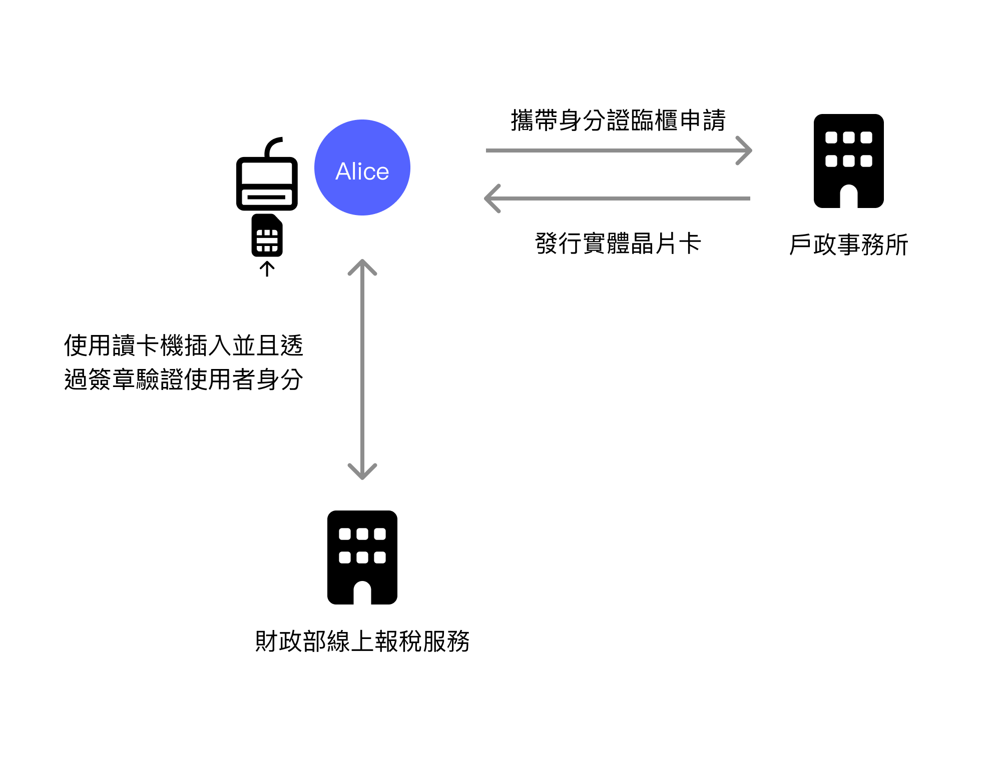
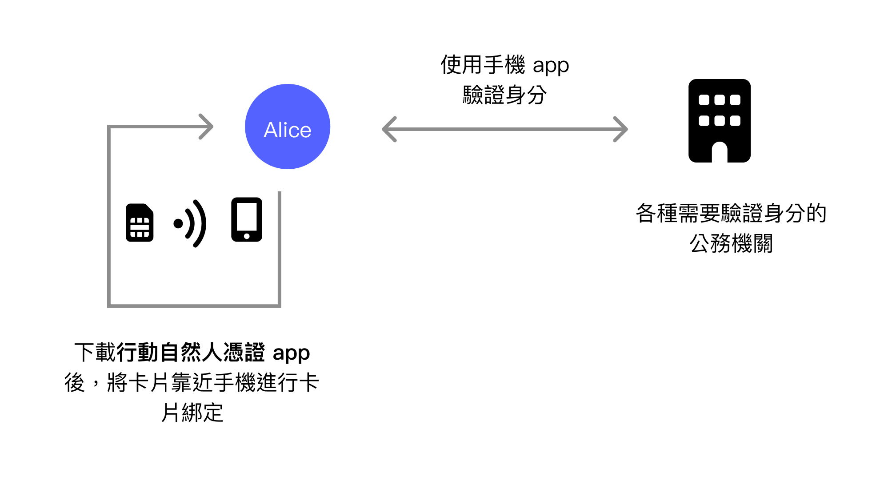
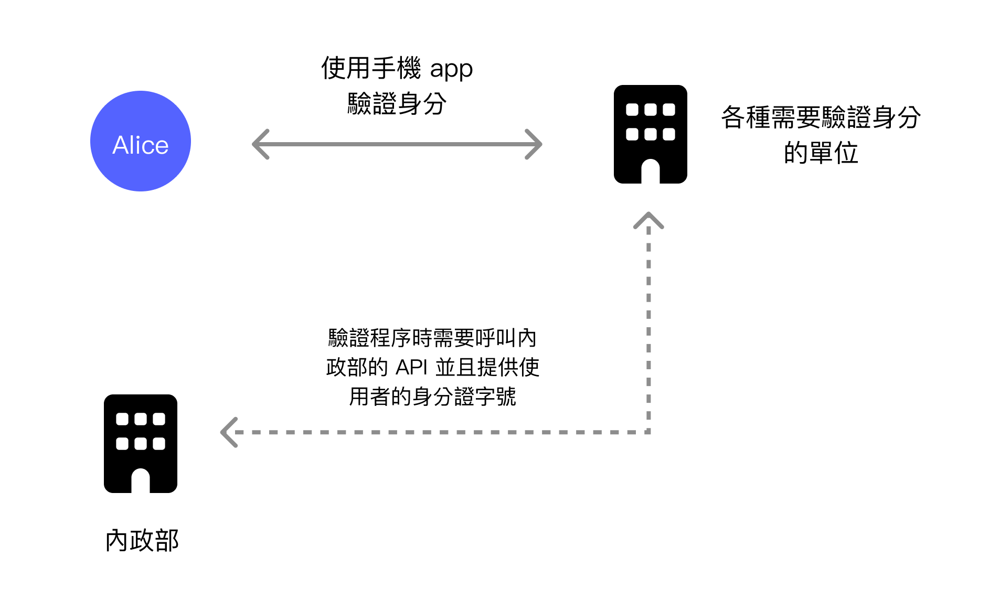
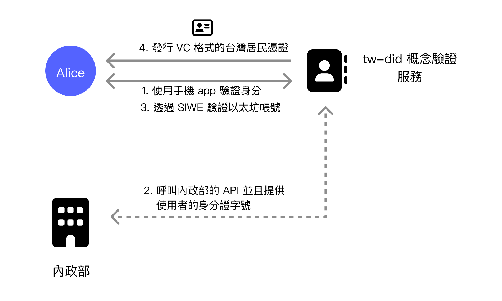
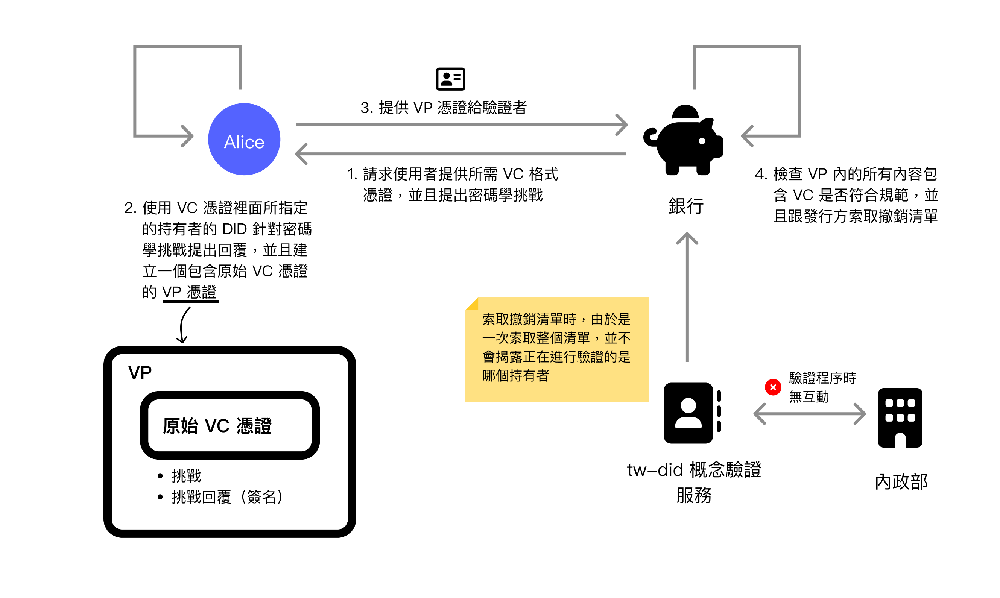
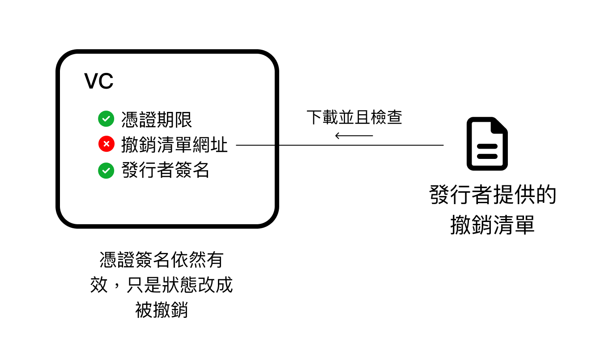
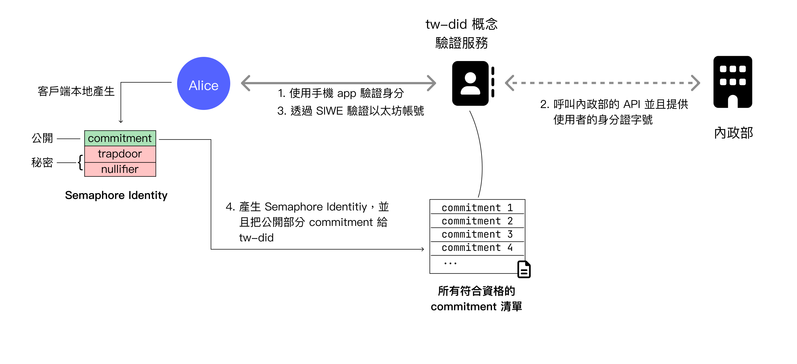
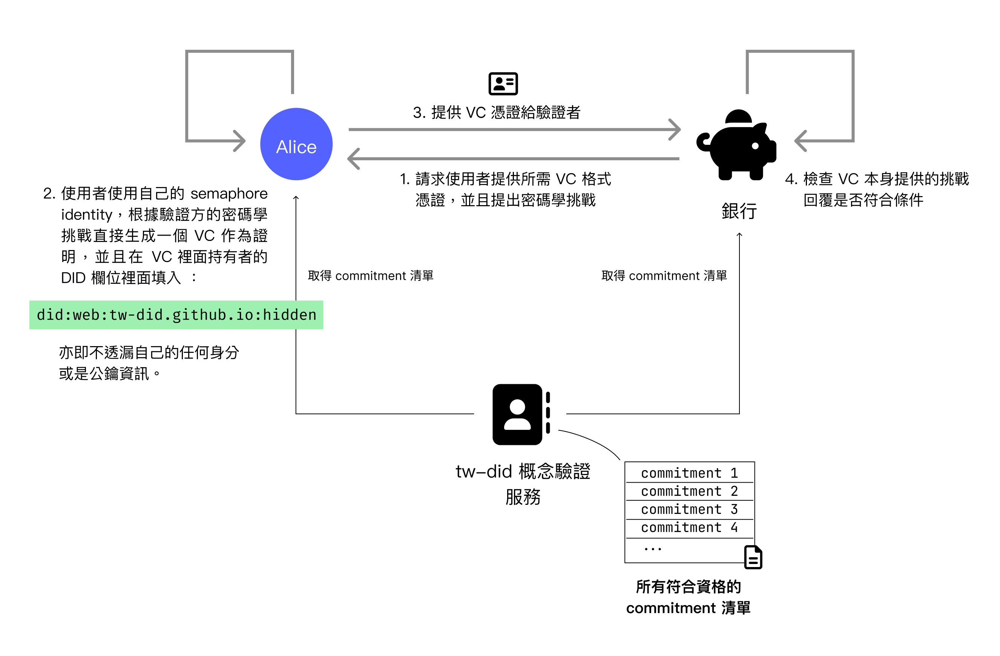
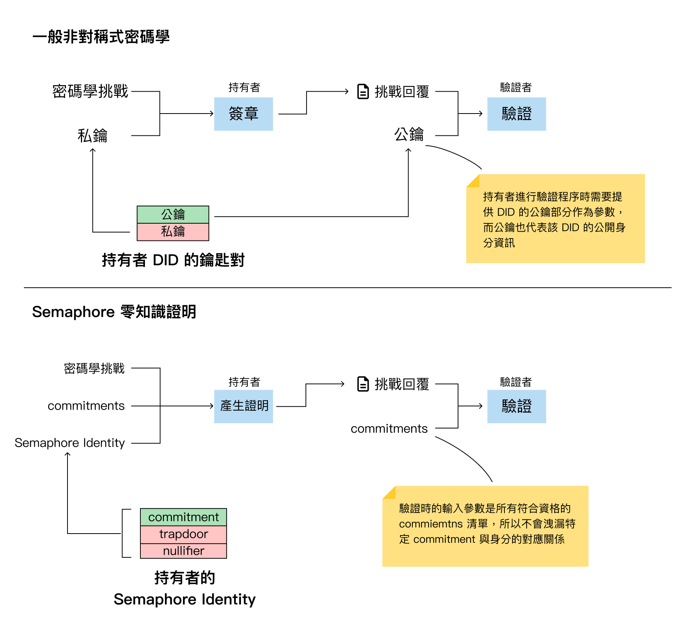

In the W3C DIDs series of articles, starting with "[Digital Identity Issues from Facebook Account Bans and the DID Solution](https://yurenju.blog/posts/2023-08-21_fb-ban-and-did-solution/)," I pointed out that current digital identities are controlled by large corporations like Google or Facebook, who can delete your digital identity without your permission or consent. The second article, "[W3C DIDs: A Digital Identity Standard That Dismantles Power Structures](https://yurenju.blog/posts/2024-01-01_w3c-dids-redefining-identity-authority/)," explored in depth how the DIDs and VC standards can solve issues of digital identity autonomy and privacy. The third article, "[Semaphore: A Privacy-Enhanced Identity Solution](https://yurenju.blog/posts/2024-02-02_semaphore/)," provided a deeper understanding of how cutting-edge technologies like Semaphore offer **anonymous yet verifiable** development kits.

This article will integrate the above information to explain the project I developed in the second half of last year.

Thanks to Phini from the Ethereum Foundation for the invitation. In the second half of 2023, I received funding from the Foundation's Grant Program to participate in a multi-party collaborative project and develop an experimental project called [tw-did](https://github.com/moda-gov-tw/tw-did), which integrates Taiwan's Mobile Natural Person Certificate, W3C DIDs/VC, and the Semaphore zero-knowledge proof framework to improve the autonomy and privacy issues present in centralized digital identity solutions.

This project has now been transferred to the Ministry of Digital Affairs (MODA). The collaboration structure of this project is somewhat complex, and I will supplement the details in a subsequent [short article](https://yurenju.blog/posts/2024-02-08_tw-did-additional-info/).

First, let me introduce the **Mobile Natural Person Certificate**, which hasn't been mentioned before.

## Mobile Natural Person Certificate

When filing taxes in Taiwan, the most convenient method is to use online tax filing directly. One of the identity verification methods is the **Natural Person Certificate**. The Natural Person Certificate is a chip card with a private key stored in a secure chip. It can be used for signing and verification through a card reader, serving as a digital certificate for Taiwan residents.

Residents who don't yet have a card need to apply in person at a household registration office. After the office issues the physical card, this chip card can be used at other government agencies, such as for online tax filing services.

While the Natural Person Certificate is secure, the disadvantage of the physical card is that it requires a chip card reader to use. Even though this chip card also supports NFC contactless reading, in most cases, an insertion-type card reader is needed. In addition to requiring an additional card reader for computer use, it's also difficult to use on smartphones.

The **Mobile Natural Person Certificate** was developed to solve this inconvenience problem. The **Mobile Natural Person Certificate** is an extended solution to the **Natural Person Certificate**. After downloading the Mobile Natural Person Certificate app, Android devices can use NFC to read information from the Natural Person Certificate card and bind this physical card to the smartphone. In the future, users can directly use the smartphone app as a Natural Person Certificate card.

During verification, it is protected by biometric authentication such as fingerprint or face recognition. After unlocking, the private key in the secure hardware is used for signing and identity verification.

The Mobile Natural Person Certificate solves the inconvenience of the physical chip card, allowing identity verification as a Taiwan resident through a smartphone. If the goal is convenience, it indeed solves a major problem. Additionally, it uses biometric verification devices, requires no password memorization, and stores the private key in the phone's secure area, providing adequate security. Combined with fingerprint or facial recognition data that never leaves the phone, it's an overall well-rounded solution.

Of course, the Mobile Natural Person Certificate is still a centralized identity verification solution. We can examine this solution through the two main issues of current identity verification solutions mentioned in previous articles: **autonomy** and **privacy**.

Before that, it should be explained that when a user uses the Mobile Natural Person Certificate at an organization to verify their Taiwan resident identity, the Ministry of the Interior's API will be used for the verification process.

### Autonomy

Although the Mobile Natural Person Certificate uses asymmetric cryptography for identity verification, the service issuer also participates in the verification process. This means that if the government wants to block a specific Taiwan resident, it can refuse to provide verification services through a blacklist when the verification process calls the API.

To give an extreme example, suppose a foreign credit card company supports Taiwan residents applying for credit cards and integrates the Mobile Natural Person Certificate as a verification method. If Taiwan becomes an authoritarian state in the future and revokes all previously issued Taiwan resident certificates, even if this foreign credit card company is willing to accept applications from former Taiwan residents, the government can still easily use a blacklist to prevent anyone the government dislikes from passing verification.

### Privacy

This has the same root as the autonomy issue. Because the issuer participates in the verification process, it means the government knows every time a user performs verification. This wasn't a big problem before, because the Mobile Natural Person Certificate was only open to government agencies for verification procedures, and the public could accept the government tracking login behavior to other government agencies.

However, after the second half of 2023, according to an [announcement](https://fido.moi.gov.tw/pt/main/news_detail/16), the scope of application for the Mobile Natural Person Certificate has been expanded to **non-governmental organizations**. At this point, privacy issues need more careful consideration. Imagine if a service like online banking requires using the Mobile Natural Person Certificate service to verify identity when logging in - the government can record every user's digital footprint during login behavior, thus extending digital footprint collection to private enterprises.

The above argument may seem to portray the government negatively, but that's not actually the case. In [one episode of the Blocktrend podcast featuring an interview between Hsu Ming-En and DouNi](https://blocktrend.substack.com/p/ep235), it was mentioned that if new technologies are not properly guided, technology may not necessarily move toward universally accepted values, because governments possess great power. If technology's direction is not appropriately guided, it can easily go astray.

If we have the opportunity to establish mechanisms and frameworks, we should design technology frameworks to move in a good direction as early as possible. Since we can design with **autonomy and privacy first**, we should move in that direction.

## TW-DID Experimental Project

After explaining the Mobile Natural Person Certificate, I can finally introduce this project. [tw-did](https://github.com/moda-gov-tw/tw-did) is an experimental project that integrates the Mobile Natural Person Certificate, W3C DIDs/VC standards, and the Semaphore zero-knowledge proof framework, using the project's output to glimpse the future and examine current shortcomings.

Regarding the autonomy and privacy issues that still exist in the aforementioned Mobile Natural Person Certificate, tw-did can solve these two problems by integrating the Mobile Natural Person Certificate to interface with and convert Taiwan resident qualification certificates into W3C VC format certificates. Furthermore, through Semaphore, privacy is pushed even further, making it completely unnecessary to disclose digital identity during the verification process.

Next, we will explain in two parts: **W3C DIDs/VC Integration** and **Semaphore Integration**.

### W3C DIDs/VC Integration

tw-did provides a web service. This service first uses the Mobile Natural Person Certificate to log in and verify the user's Taiwan resident identity, then verifies the user's DID identity. After both pieces of information are successfully verified, a **Verifiable Credential** (VC) format certificate is issued to the user, allowing the user to use this certificate on other websites where they need to prove they are a Taiwan resident.

As introduced in "[W3C DIDs: A Digital Identity Standard That Dismantles Power Structures](https://yurenju.blog/posts/2024-01-01_w3c-dids-redefining-identity-authority/)," both the **issuer** and the **holder** can adopt different DID Methods. However, to keep the experimental environment simple, the tw-did project uniformly adopts the Ethereum blockchain's DID Method `did:ethr` and Ethereum accounts as DID identifiers. When verifying DID identity, the common Ethereum verification method Sign-In with Ethereum (SIWE) is used to verify through MetaMask message signing that the user actually owns that account, thus proving they own the private key of that DID.

After confirming through the Mobile Natural Person service that the holder is a Taiwan resident and owns that DID identifier, tw-did as the issuer can issue a VC format certificate to the user. When issuing, tw-did will use the issuer DID to sign the certificate and provide it to the holder for download and storage. The overall issuance flow is as follows:

Step 2 of the issuance flow still calls the Ministry of the Interior API and provides the user's national ID number, but this is the only API call that discloses the holder's identity. In the verification flow, which holder is performing verification is not disclosed.

Assuming a bank now supports the W3C DIDs/VC standard verification flow, users can present this certificate to prove they are indeed Taiwan citizens. The flow diagram is as follows:

When a verification organization like a bank requests a user to provide a specific VC format certificate, it will also issue a cryptographic challenge. When the user receives this request, they will use the private key corresponding to their DID to respond to the cryptographic challenge, and package the original VC certificate, challenge, and challenge response (i.e., signature) together into a **Verifiable Presentation** (VP) document to reply to the bank.

The bank will then check whether the various contents of the VP format certificate are correct, and will additionally request the revocation list from the issuer. Because it does not query via API whether a **specific certificate** has been revoked, but instead obtains the entire revocation list at once, allowing the verifier to find the revocation information for that certificate in the list themselves. This way, the issuer can remain unaware of which holder is currently performing verification, but can still determine whether it has been revoked.

Finally, the Ministry of the Interior's API will not be called. This also means the Ministry of the Interior does not participate in the verification flow.

When verification succeeds and the bank confirms the user is a Taiwan resident, they can begin using the bank's services. Similarly, let's verify the digital identity autonomy and privacy under this architecture.

#### Autonomy

When the bank verifies the user's identity through a VP format certificate, the original VC certificate in the VP document already contains the issuer's signature. The bank can directly use public information to verify the issuer's signature without the issuer's participation, so it also cannot block the verification flow.

Although the issuer can mark a certificate as revoked, even so, the issuer's signature on this certificate is still valid, because the signature result is **non-repudiable**. This means that even if the certificate is revoked, the verifier can still decide whether to accept this certificate in such a situation.

As shown in the above diagram, the various states of VC are verified separately. Verifying the expiration date does not affect verifying the issuer's signature, and revoking the certificate does not affect verifying the issuer's signature.

To use the previous extreme example, suppose Taiwan becomes an authoritarian state in the future and revokes all former resident identities. When a verifier receives a user's revoked certificate, they can still consider whether to accept such a certificate as proof, rather than placing all power in the issuer's hands.

Compared to cases where the issuer participates in the entire verification flow, the W3C DIDs/VC specification flow still possesses higher digital identity autonomy.

#### Privacy

This is also related to whether the issuer participates in the verification flow. When users present VC format certificates at the bank, the issuer cannot know about or track it. This ensures privacy protection during the verification flow.

Under the conventional W3C DIDs/VC architecture, autonomy and privacy are already protected. Next, let's see what benefits Semaphore integration can bring us.

### Semaphore Integration

Compared to the general W3C DIDs standard verification procedure, Semaphore integration can achieve the purpose of **verifying qualifications** even without **disclosing DID identification**.

In the case of the tw-did experimental project, a conventional VC certificate will record the holder's DID identification string (including the Ethereum account address), from which public key information can be parsed to verify whether this VC certificate is correct.

But this also means the user's Ethereum account address will be disclosed.

With Semaphore integration, there is no need to provide DID identification at all to prove one has Taiwan resident qualifications. When applied to the Mobile Natural Person Certificate example, it means users do not need to disclose their Ethereum address to verify their Taiwan resident identity.

However, as mentioned in the previous article, Semaphore is a development kit, not a standard like W3C DIDs. Therefore, the work we carried out in the tw-did experimental project was to attempt to integrate Semaphore into the W3C DIDs/VC standard. A better approach would be to establish a new DID Method like `did:semaphore` and specify various interaction methods. However, considering time and implementation difficulty, we decided to first use `did:web` to wrap the semaphore verification method as an experimental evaluation solution.

In the Semaphore integration issuance flow, after the user confirms their Taiwan resident identity through the Mobile Natural Person Certificate service, the user will generate a Semaphore Identity on the client side. This identity consists of public and secret parts:

- **Public**: Commitment, functions similar to the public key part of asymmetric cryptography
- **Secret**: Trapdoor and nullifier, functions similar to the private key part of asymmetric cryptography

The public commitment will be provided to tw-did, where it will be added to a Semaphore Group as proof of Taiwan resident qualification. The list of all commitments registered in tw-did can be obtained by anyone and is public data.

In the Semaphore verification process, a verifier like a bank will issue a cryptographic challenge, and only Semaphore Identities with Taiwan resident qualifications can generate the correct challenge response.

This is divided into two steps: **generating proof** and **verification**. Generating proof is executed on the holder's client side, while verification is performed by the verifier's service.

When the holder **generates proof**, they need the cryptographic challenge, their own Semaphore Identity, and a list of all qualified commitments, of which the commitment list needs to be requested from tw-did. With these three input parameters, the corresponding proof can be generated.

When the verifier **verifies**, they need two input parameters. The first is the proof submitted by the holder, and the second is also the commitments list. With these two parameters, the proof can be verified.

We can compare the proof verification flow of general asymmetric cryptography with Semaphore zero-knowledge proof.

General asymmetric cryptography uses a private key to sign, and the verifier needs to obtain the corresponding public key for verification. Since the public key represents the DID key pair, DID identity information will still be exposed to some degree. In the Semaphore verification flow, there is no need to provide a specific commitment corresponding to a specific identity, but only a list of all qualified commitments. This way, verification can be performed without disclosing identity.

Compared to conventional W3C DIDs/VC, this further strengthens privacy. During verification, one can only know that the other party meets the qualifications, but cannot know who specifically. Conventional VC certificates must always include public key information, so if you don't want the verifier to know your Ethereum account, you can use this more advanced Semaphore zero-knowledge proof to achieve enhanced privacy protection.

However, it should be noted that the Semaphore integration is highly experimental, so some shortcuts were taken in development, making the current prototype's digital identity autonomy not as good as conventional VC. But this is a clearly understood problem with known improvement methods, which will be discussed in the later **Review and Discussion** section.

## Demo Video

This time I tried attaching a demonstration video with each milestone release. Looking back now, it's quite interesting - I didn't expect the project to change so much from August to October 😎

You can see the introduction and videos for each milestone here: https://github.com/moda-gov-tw/tw-did/releases

Here I'll embed the Milestone 6 video:


<video width=100% controls>
    <source src="tw-did-select-credentials.mp4" type="video/mp4">
    Your browser does not support the video tag.
</video>


There are two tabs here: the Web tab is the issuer, and the SampleVerifier tab is the verifier.

In the Web tab, the user's identity is first verified through the Mobile Natural Person Certificate service. In this service integration, a notification is sent through the **Mobile Natural Person Certificate app** that the user has already installed, or the user can also choose to scan a QR code to perform the login procedure.

After logging in, Sign-In With Ethereum is used to verify through signature whether the user actually owns an Ethereum account. The final step is to generate a Semaphore identity and register its commitment in the tw-did database.

This completes the preliminary work for the issuance procedure.

Finally, users can download two different types of VC certificates. The first is a VC certificate issued to the holder's Ethereum account address, and the other is a VC certificate issued to the holder's Semaphore Identity. The file names are `vc-ethereum.json` and `vc-semaphore.json`, respectively.

Next is the SampleVerifier sample page for the verification procedure. This page is for development and debugging purposes, so it's relatively bare-bones. The verification website can verify the two types of certificates issued above, for Ethereum and Semaphore respectively.

In the Ethereum certificate verification part, users are first asked to select a VC certificate issued to an Ethereum address as a DID. Users can directly use the file selection function to select `vc-ethereum.json` for verification, or press "Select on DID" to select the required Ethereum certificate on the issuance website. After selection, parsing work begins. When **verify** is pressed, it signs through MetaMask and generates a VP document to confirm the holder's qualifications.

In the Semaphore certificate verification part, pressing **Semaphore Challenge and verify** will have the verification website generate a cryptographic challenge in real-time, and the holder will generate proof on the client side, package it into a VC format certificate, and return it to the verification website for the verification procedure.

## Review and Discussion

Looking at the GitHub commit history, I submitted the first commit in early August, and the project was completed at the end of October. Before learning about this project, my understanding of DID was very superficial, so both research and development were completed under very urgent conditions.

Therefore, there are inevitably shortcomings in both research and implementation. Much was learned and done simultaneously, and some knowledge was only understood after the project ended regarding how to do better. I'll write it here for future developers' reference.

This project has several most important goals:

- Does this prototype provide imagination of future scenarios, helping to understand what we can do in future production environments?
- When these mechanisms are integrated together, are the autonomy and privacy of digital identity protected?
- Were problems encountered during development that can serve as reference for production environments?

### Does the Prototype Provide Imagination of Future Scenarios

What was integrated in this experiment was the Mobile Natural Person Certificate, and the issued certificates can be used by another verification service to confirm whether this user is a Taiwan resident.

We can imagine that in the future, this Taiwan resident certificate could be used by many services as audit data for identity verification, such as opening bank accounts, or e-commerce platforms auditing whether sellers are Taiwan residents.

However, since it's a prototype, at this stage, no verification units would actually trust this certificate. In the future, production environment certificates would still need to be issued by more formal organizations, such as the Ministry of the Interior or the Ministry of Digital Affairs, to increase verification organizations' level of trust in this certificate. There may even need to be legal basis to use it in more formal settings.

Regarding certificate storage, when imagining a future where multiple different certificates need to be stored, there will need to be a VC Wallet app to accomplish this purpose.

### Digital Identity Autonomy and Privacy

As mentioned earlier, centralized digital identity lacks autonomy and privacy. Even the Mobile Natural Person Certificate service has the same problems. When a verification organization (especially non-governmental organizations) adopts the Mobile Natural Person Certificate as a verification method, there are different concerns regarding both autonomy and privacy. For example, as in the previous example, when opening a bank account, there are autonomy concerns that the government can directly block the verification procedure to prevent specific users from opening accounts, while simultaneously having privacy concerns that the government will know which bank users go to open accounts.

After interfacing with the Mobile Natural Person Certificate and issuing VC certificates, the characteristic that the issuer doesn't need to participate during verification ensures the autonomy and privacy of digital identity.

In terms of autonomy, because the issuer does not participate in the verification procedure (except for the revocation list), they cannot erase a person's digital identity by blocking the verification procedure. Even if the revocation function is used to mark a certificate as revoked, the issuer cannot deny having once signed and endorsed this digital certificate.

In terms of privacy, similarly because the issuer does not participate in the verification procedure, the issuer cannot know which user is performing the verification procedure.

Of course, during research and development, we encountered quite a few problems. Below I'll share some related experiences.

### Development Kits

First, in this project, I used [Veramo](https://veramo.io/), a TypeScript development kit. From the experience of developing this project, Veramo is quite flexible and not difficult to use. In this development, I implemented a new signature verification method `Semaphore2023`. Although the process was somewhat convoluted, it was ultimately completed.

However, since these are still relatively new development kits, W3C DIDs/VC-related developers don't have as much attention as popular development frameworks like React or Vue, so the documentation isn't as comprehensive. Therefore, when developing non-built-in features, it's still necessary to read the source code to proceed.

Because the project timeline was relatively tight, I didn't do very in-depth research when initially selecting kits. Later, I saw several different development kits, such as SpruceID's Rust-implemented [SpruceKit](https://www.sprucekit.dev/) and another TypeScript library implemented by Ceramic, [ceramicnetwork/js-did](https://github.com/ceramicnetwork/js-did). These all look like choices worth trying, especially js-did, which appears to have [functionality for integrating WebAuthn into did:key](https://github.com/ceramicnetwork/js-did/tree/main/packages/key-webauthn), worthy of deeper research.

### Lack of Wallet

At the time of implementation, I didn't find a suitable VC Wallet to store certificates issued by the issuer. Originally, I had planned to quickly implement a Wallet, but due to time constraints, it wasn't completed. You can find the [wallet app](https://github.com/tw-did/tw-did/tree/main/apps/wallet) on GitHub, which just had the frontend interface completed but logic not yet implemented. In the end, we put the credential selection functionality for the verification procedure on the issuer's website. This doesn't actually conform to the principle that the issuer doesn't participate in the verification procedure, but considering there was no suitable VC Wallet found at the time of implementation, this was an acceptable experimental approach.

Although nothing suitable was found initially, after the project ended, I discovered that Microsoft Authenticator, which Microsoft usually uses for two-factor authentication, supports storing VCs. See [this article](https://learn.microsoft.com/en-us/entra/verified-id/using-authenticator) for details.

If we had discovered earlier that Microsoft Authenticator has this functionality, we would have referred to their integration method to allow certificates to be stored in the MS Authenticator app.

### Lack of Exchange Protocol

When initially reading W3C documents, there were no specifications on how to exchange credentials. Therefore, neither **issuer issuing certificates to holders** nor **holders presenting VPs to verifiers** were defined. Since there was no definition, the most intuitive method was to generate a certificate file for users to download, and verifiers would similarly submit a VC through the native file selection function of the webpage, letting users sign it and then convert it to a VP.

While researching Microsoft Authenticator, we also discovered that the exchange protocol used by the app is the `openid-vc` and `openid-vp` standards established by another organization, OpenID.

Although the initial implementation still achieved the experimental purpose, if actually implementing a production product, one could consider adopting the standard established by OpenID, and then use Microsoft's Microsoft Authenticator as a VC Wallet to store certificates.

### Semaphore Improves Privacy, But Implementation Details Need Refinement

Semaphore integration indeed greatly improved privacy, but because it's experimental, there are indeed many implementation details that need refinement.

For example, we used the `did:web` DID Method and wrapped a new verification type `Semaphore2023` inside it. Here, we actually extended a new verification type through Veramo, while simultaneously establishing an anonymous DID identity [did:web:tw-did.github.io:hidden](https://tw-did.github.io/hidden/did.json) on GitHub Pages. A better approach here might be to add a new DID method `did:semaphore` and natively support anonymous identity.

At the same time, there's also the problem that other kits won't support `Semaphore2023`, this special verification type. For example, the previously mentioned MS Authenticator cannot use this verification type we defined ourselves. If the entire specification can be thought through clearly, registered in the [DID Specification Registries](https://www.w3.org/TR/did-spec-registries/#did-methods), and promoted, it would be more appropriate.

Additionally, the implementation of the verification procedure violates the principle of autonomy by requesting public information commitments list from the issuer. Because it's requesting public information, it doesn't cause privacy problems. However, the issuer can still choose not to provide commitments to block everyone from verifying their identity.

This problem can be solved using the on-chain version of Semaphore. When using the on-chain version, many things can be achieved by directly interacting with smart contracts, and there's no need to request the commitments list from the issuer, thus solving the autonomy problem. Of course, if blockchain needs to be used in the issuance mechanism, other problems unique to blockchain will arise, such as transaction fee expenditure issues.

In short, there are still many places in the implementation details of integrating Semaphore into W3C DIDs that need refinement, and may require more iterations and discussions to find a more mature approach.

## Conclusion

Overall, I think this experimental project is excellent. It glimpses the future through a key scenario - **verifying Taiwan resident identity** - giving people concerned about this issue (that is, you who have read this article to this point) a more concrete outline of digital identity with greater autonomy and privacy. At the same time, the implementation part went far enough to understand obstacles that may be encountered in future production environments.

On the other hand, it also explored more deeply whether the necessary technology is currently available if one wants to achieve the level of **anonymous but verifiable qualifications** through zero-knowledge proof. It can also stimulate everyone's imagination to think about how important such highly privacy-preserving technology is to us, and whether there are other negative impacts.

Of course, for me, it was also a great exploration. I actually didn't understand DID that well before, and only with this project did I truly gain a deep understanding of these matters.

My plan for this year is to independently develop small services or apps, which won't be related to DID or blockchain. However, I still hope that previous development experience can play some role. So if you want to find someone to discuss or exchange ideas about the DID topic, you can still contact me. I'll allocate some time to this topic. While I won't have time to develop projects, exchanging existing experience and perspectives is no problem. [Welcome to email me](mailto:spry.flag8191@fastmail.com)!
