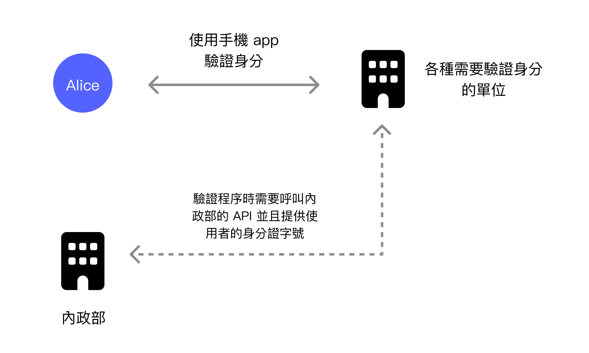
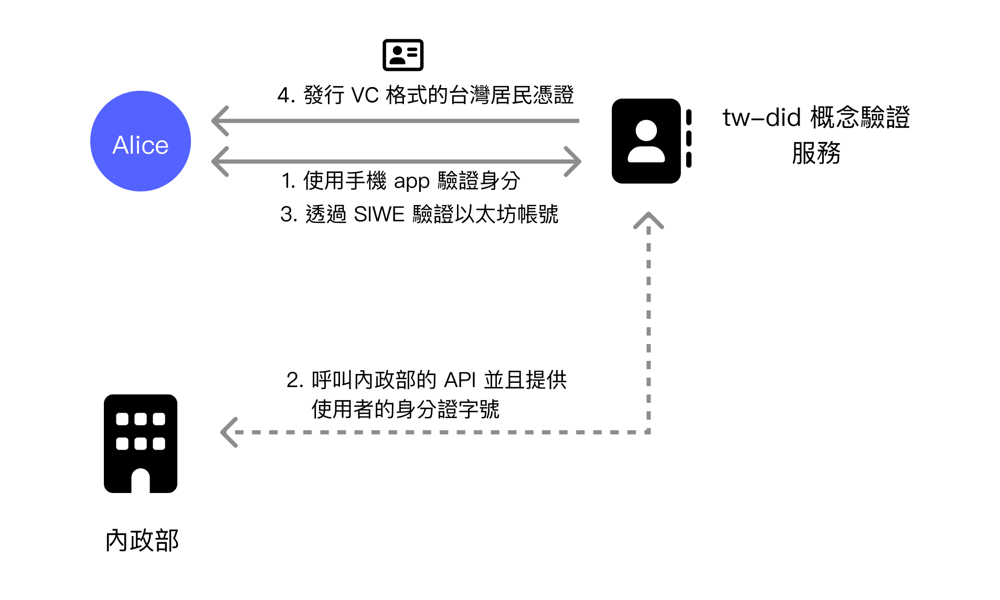
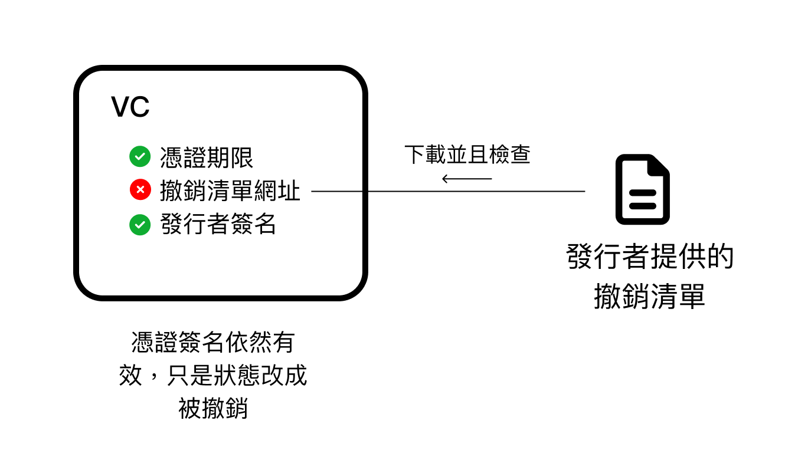
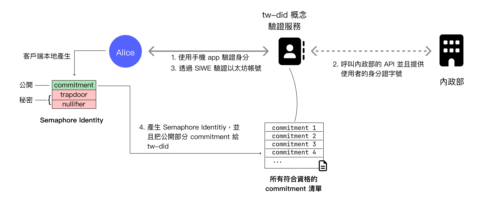
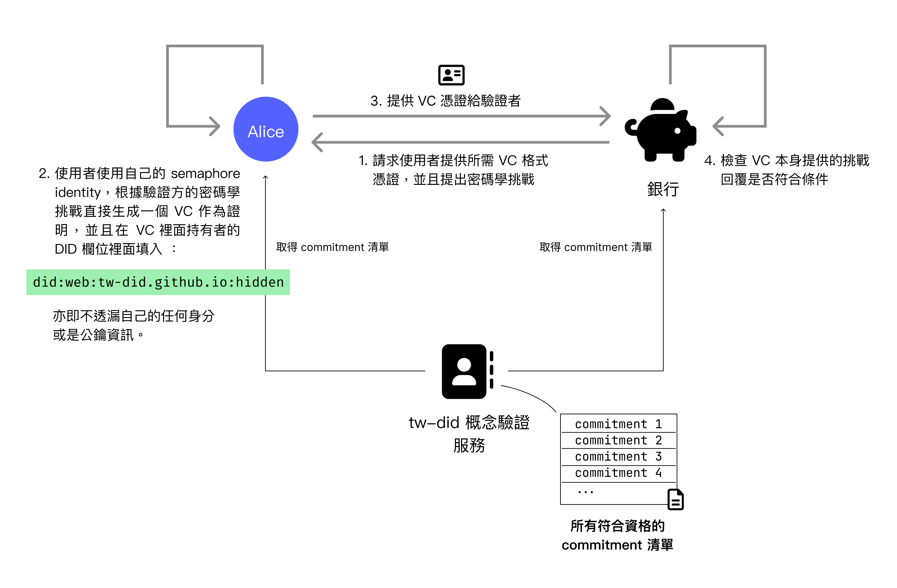
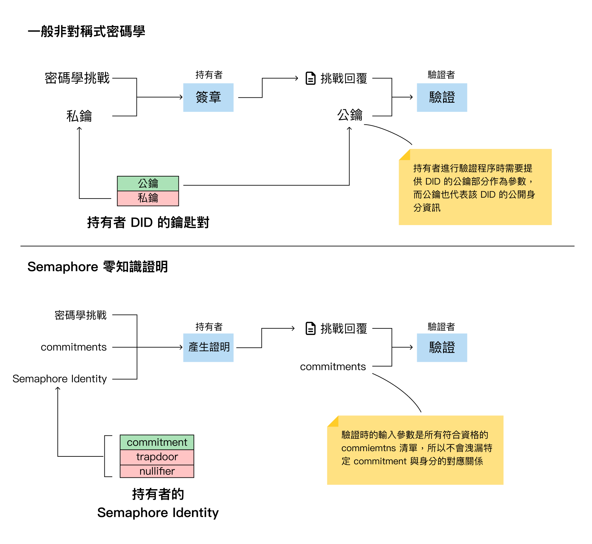

W3C DIDsシリーズの記事では、最初の記事「[Facebookの不当なアカウント停止から見るデジタルアイデンティティの問題とDID解決策](https://yurenju.blog/posts/2023-08-21_fb-ban-and-did-solution/)」で、現在一般的に使用されているデジタルアイデンティティがGoogleやFacebookなどの大企業に掌握されており、彼らがユーザーの許可や同意なしにデジタルアイデンティティを削除できることを指摘しました。第二の記事「[W3C DIDs：権力構造を解体するデジタルアイデンティティ標準](https://yurenju.blog/posts/2024-01-01_w3c-dids-redefining-identity-authority/)」では、W3C DIDs標準を出発点として、DIDsとVC標準を通じてデジタルアイデンティティの自律性とプライバシーの問題をどのように解決するかをより深く掘り下げました。第三の記事「[Semaphore：プライバシーを強化するアイデンティティソリューション](https://yurenju.blog/posts/2024-02-02_semaphore/)」では、Semaphoreのような最先端技術が**匿名かつ検証可能な**開発キットをどのように提供するかをより深く理解しました。

本記事では、これらの情報を統合して、私が昨年下半期に開発したプロジェクトについて説明します。

Ethereum FoundationのPhiniからの招待に感謝します。私は2023年下半期に財団のGrant Programを受け、複数の協力者と共に台湾のモバイル自然人憑証、W3C DIDs/VC、Semaphoreゼロ知識証明フレームワークを統合した実験的プロジェクト[tw-did](https://github.com/moda-gov-tw/tw-did)を開発し、集中型デジタルアイデンティティソリューションが現在抱える自律性とプライバシーの問題を改善しました。

このプロジェクトは現在、数位発展部に移管されています。このプロジェクトの協力構造はやや複雑ですので、詳細については後続の[短文](https://yurenju.blog/posts/2024-02-08_tw-did-additional-info/)で補足します。

まず、これまで言及していなかった**モバイル自然人憑証**について紹介します。

## モバイル自然人憑証

台湾で納税申告を行う際、最も便利な方法はオンライン納税申告を直接利用することです。その身分確認方法の一つが**自然人憑証**です。自然人憑証はチップカードで、セキュアチップに秘密鍵が保存されており、カードリーダーを通じて署名と検証を行い、台湾住民のデジタル証明書として機能します。

カードをまだ持っていない住民は、戸政事務所で直接申請する必要があります。役所が実体カードを発行した後、このチップカードを使って他の公的機関のサービス、例えばオンライン納税申告サービスを利用できます。

自然人憑証は安全ですが、実体カードの欠点は、使用するためにチップカードリーダーが必要なことです。このチップカードはNFC非接触読み取りにも対応していますが、ほとんどの場合、挿入式カードリーダーを使用する必要があります。コンピューターで使用する場合は追加のカードリーダーが必要であり、スマートフォンでの使用も困難です。

**モバイル自然人憑証**は、このような不便さを解決するために開発されました。**モバイル自然人憑証**は**自然人憑証**の拡張ソリューションです。モバイル自然人憑証アプリをダウンロード後、Android端末はNFCを通じて自然人憑証カードの情報を読み取り、この実体カードをスマートフォンと紐付けることができます。以降は、スマートフォンアプリを自然人憑証カードとして直接使用できます。

検証時には、指紋や顔認証などの生体認証で保護され、ロック解除後にセキュアハードウェア内の秘密鍵を使用して署名と身分確認を行います。

モバイル自然人憑証は実体チップカードの不便さを解決し、スマートフォンだけで台湾住民としての身分を検証できます。利便性を目標とするならば、確かに大きな問題を解決しました。さらに、生体認証デバイスを使用し、パスワードを記憶する必要がなく、スマートフォンのセキュア領域に秘密鍵を保存するため、セキュリティも十分です。指紋や顔認証データがスマートフォンから離れないことと合わせて、全体的にバランスの取れたソリューションと言えます。

もちろん、モバイル自然人憑証も集中型の身分確認ソリューションであり、以前の記事で述べた現行の身分確認ソリューションの主な問題である**自律性**と**プライバシー性**の観点からこのソリューションを検討できます。

その前に説明すべきことは、ユーザーがモバイル自然人憑証を使用して機関で台湾住民としての身分を検証する際、内政部のAPIを使用して検証手続きを行うということです。

### 自律性

モバイル自然人憑証は非対称暗号を使用して身分確認を行いますが、このサービスの発行者は検証手続きにも参加しています。これは、政府が特定の台湾住民をブロックしたい場合、検証手続きでAPIを呼び出す際にブラックリストを通じて検証サービスの提供を拒否できることを意味します。

極端な例を挙げると、外国のクレジットカード会社が台湾住民のクレジットカード申請をサポートし、モバイル自然人憑証を検証方法として統合したとします。台湾が将来全体主義国家になり、以前に発行したすべての台湾住民憑証を取り消した場合、この外国のクレジットカード会社が元の台湾住民の申請を受け入れようとしても、政府はブラックリストを通じて、政府が好まない人物が検証を通過できないようにすることが容易にできます。

### プライバシー性

これは自律性の問題と根源が同じです。発行者が検証プロセスに参加しているため、ユーザーが検証を行うたびに政府が知ることになります。これは以前は大きな問題ではありませんでした。なぜなら、モバイル自然人憑証は政府機関のみが検証手続きに使用できたため、一般市民は政府機関が同じく政府機関へのログイン行動を追跡することを受け入れられたからです。

しかし、2023年下半期以降、[公告](https://fido.moi.gov.tw/pt/main/news_detail/16)によると、モバイル自然人憑証の適用範囲が**非公務機関**にまで拡大されました。この時点でプライバシーの問題はより慎重に考慮する必要があります。将来、オンラインバンキングのログインなどのサービスがモバイル自然人憑証サービスを通じて身分を検証する際、政府は各ユーザーがログイン行動を行う際のデジタルフットプリントを記録でき、これによりデジタルフットプリントの収集が民間企業にまで拡大されます。

上記の論点は政府を悪く想像しているように見えますが、実際にはそうではありません。Blocktrend（區塊勢）のポッドキャストの[あるエピソードでHsu Ming-En（許明恩）とDouNi（豆泥）の対談](https://blocktrend.substack.com/p/ep235)でも、新しい技術が適切なガイダンスなしに導入されると、技術が必ずしも普遍的に認められた価値観に向かって進むとは限らないと述べられています。政府が持つ権力は非常に大きいため、技術の方向性を適切に導かないと、容易に方向性が誤ってしまいます。

フレームワークとメカニズムを設計する機会があるときは、できるだけ早く技術フレームワークを良い方向に進むように設計すべきです。**自律性とプライバシー優先**に設計できるのであれば、その方向に進むべきです。

## TW-DID実験プロジェクト

モバイル自然人憑証について説明したので、ようやくこのプロジェクトを紹介できます。[tw-did](https://github.com/moda-gov-tw/tw-did)は実験的プロジェクトで、モバイル自然人憑証、W3C DIDs/VC標準、Semaphoreゼロ知識証明フレームワークを統合し、プロジェクトの成果から未来の姿を垣間見るとともに、現在の不足点を検証します。

前述のモバイル自然人憑証に依然として存在する自律性とプライバシー性の問題について、tw-didはモバイル自然人憑証を統合することで、台湾住民の資格憑証を連携してW3C VC形式の憑証に変換し、この2つの問題を解決できます。さらにSemaphoreを通じてプライバシー性をさらに前進させ、検証手続き時に完全にデジタルアイデンティティを開示する必要がないようにします。

次に、**W3C DIDs/VCの統合**と**Semaphoreの統合**の2つの部分に分けて説明します。

### W3C DIDs/VC統合

tw-didはウェブサービスを提供しています。このサービスはまずモバイル自然人憑証を通じてログインし、ユーザーの台湾住民としての身分を検証します。次にユーザーのDID身分識別を検証します。この2つの情報が両方とも検証に成功すると、**検証可能クレデンシャル**（Verifiable Credential, VC）形式の憑証をこのユーザーに発行し、ユーザーが台湾住民であることを証明する必要がある他のウェブサイトでこの憑証を使用できるようにします。

「[W3C DIDs：権力構造を解体するデジタルアイデンティティ標準](https://yurenju.blog/posts/2024-01-01_w3c-dids-redefining-identity-authority/)」で紹介したように、**発行者**も**保有者**も異なるDID Methodを採用できますが、実験環境をシンプルにするため、tw-didプロジェクトではすべてイーサリアムブロックチェーンのDID Method `did:ethr`とイーサリアムアカウントをDID身分識別として採用しました。DID身分を検証する際には、イーサリアムの一般的な検証方法であるSign-In with Ethereum（SIWE）を使用し、MetaMaskのメッセージ署名を通じてユーザーが実際にそのアカウントを所有していることを検証し、そのDIDの秘密鍵を所有していることを証明します。

モバイル自然人サービスを通じて保有者が台湾住民であり、そのDID識別を所有していることを確認した後、発行者としてのtw-didはVC形式の憑証をユーザーに発行できます。発行時、tw-didは発行者DIDを使用してその憑証に署名し、保有者が憑証をダウンロードして保管できるようにします。全体的な発行フローは以下の通りです。

発行フローのステップ2では依然として内政部APIを呼び出し、ユーザーの身分証番号を提供していますが、これは保有者の身分を開示する唯一のAPI呼び出しであり、検証フローではどの保有者が検証を行っているかは開示されません。

銀行がW3C DIDs/VC標準の検証フローをサポートしていると仮定すると、ユーザーはこの憑証を提示して、自分が確かに台湾国民であることを証明できます。フロー図は以下の通りです。

銀行などの検証機関がユーザーに特定のVC形式の憑証の提供を要求する際、暗号学的チャレンジを一緒に提出します。ユーザーがこのリクエストを受け取ると、自分のDIDに対応する秘密鍵を使用して暗号学的チャレンジに対する応答を行い、元のVC憑証、チャレンジ、チャレンジ応答（つまり署名）をすべて**検証可能プレゼンテーション文書**（Verifiable Presentation, VP）にパッケージ化して銀行に返信します。

銀行は次に、VP形式の憑証の各項目の内容が正しいかどうかをチェックし、さらに発行者に取り消しリストを要求します。**特定の憑証**が取り消されているかどうかをAPIで問い合わせるのではなく、取り消しリスト全体を一度に取得し、検証者が自らリストからその憑証の取り消し情報を見つけます。これにより、発行者はどの保有者が現在検証を行っているかを知ることができませんが、取り消されているかどうかは確認できます。

最後に、内政部のAPIは呼び出されません。これは内政部が検証フローに参加しないことを意味します。

検証が成功し、銀行がユーザーが台湾住民であることを確認した後、銀行のサービスを使い始めることができます。同様に、このアーキテクチャ下でのデジタルアイデンティティの自律性とプライバシー性を検証しましょう。

#### 自律性

銀行がVP形式の憑証を通じてユーザーの身分を検証する際、VP文書内の元のVC憑証には既に発行者の署名が含まれています。銀行は公開情報を直接利用して発行者の署名を検証でき、発行者の参加は不要であるため、検証フローを阻止することもできません。

発行者は憑証を取り消しとしてマークできますが、それでもこの憑証の発行者署名は有効です。なぜなら、署名の結果は**否認不可能**だからです。これは、憑証が取り消されても、検証者は依然としてこの状況の憑証を採用するかどうかを自ら決定できることを意味します。

上図の状態のように、VCの各状態は個別に検証されます。有効期限の検証は発行者署名の検証に影響せず、憑証が取り消されても発行者署名の検証には影響しません。

前述の極端な例を挙げると、台湾が将来全体主義国家になり、元の住民身分をすべて取り消した場合、検証者がユーザーの取り消された憑証を受け取った際、依然としてそのような憑証を証明として採用するかどうかを検討でき、すべての権力を発行者に委ねることはありません。

発行者が全検証フローに参加する場合と比較すると、W3C DIDs/VC仕様のフローはより高いデジタルアイデンティティの自律性を持っています。

#### プライバシー性

これも発行者が検証フローに参加しているかどうかに関連しています。ユーザーが銀行でVC形式の憑証を提示する際、発行者は知ることも追跡することもできません。これにより検証フロー中のプライバシー性が保護されます。

通常のW3C DIDs/VCアーキテクチャ下では自律性とプライバシーが既に保護されています。次に、Semaphore統合がどのようなメリットをもたらすかを見てみましょう。

### Semaphore統合

Semaphore統合は通常のW3C DIDs標準検証手続きと比較して、**DID識別を開示しない**場合でも**資格の検証**の目的を達成できます。

tw-did実験プロジェクトの場合、通常のVC憑証内には保有者のDID識別文字列（イーサリアムアカウントアドレスを含む）が記録され、そこから公開鍵情報を解析してこのVC憑証が正しいかどうかを検証できます。

しかし、これはユーザーのイーサリアムアカウントアドレスが開示されることも意味します。

Semaphore統合では、DID識別を完全に提供する必要なく、台湾住民の資格があることを証明できます。モバイル自然人憑証の例に適用すると、ユーザーはイーサリアムアドレスを開示することなく台湾住民としての身分を検証できることを意味します。

しかし、前の記事で述べたように、SemaphoreはW3C DIDsのような標準ではなく開発キットです。そのため、tw-did実験プロジェクトで行った作業は、SemaphoreをW3C DIDs/VC標準に統合しようと試みることでした。より良いアプローチは、例えば`did:semaphore`のような新しいDID Methodを確立し、各種相互作用方法を制定することですが、時間と実装の難易度を考慮して、まず`did:web`を使用してsemaphore検証方法をパッケージ化し、実験的評価案としました。

Semaphore統合の発行フローでは、ユーザーがモバイル自然人憑証サービスを通じて台湾住民としての身分を確認した後、ユーザーはクライアント側でSemaphore Identityを生成します。この身分識別は公開部分と秘密部分で構成されます。

- **公開**：Commitment、非対称暗号の公開鍵部分と同様の機能
- **秘密**：TrapdoorとNullifier、非対称暗号の秘密鍵部分と同様の機能

公開されたcommitmentはtw-didに提供され、Semaphore Groupに追加され、台湾住民資格の証明として機能します。tw-didに登録されたすべてのcommitmentsリストは誰でも取得でき、公開データです。

Semaphore検証プロセスでは、銀行などの検証者が暗号学的チャレンジを発行し、台湾住民資格を持つSemaphore Identityのみが正しいチャレンジ応答を生成できます。

ここには2つのステップがあります：**証明の生成**と**検証**。証明の生成は保有者のクライアントで実行され、検証は検証者のサービスで行われます。

保有者が**証明を生成**する際、暗号学的チャレンジ、自分のSemaphore Identity、資格を満たすすべてのcommitmentリストが必要であり、そのうちcommitmentリストはtw-didに要求する必要があります。この3つの入力パラメータがあれば、対応する証明を生成できます。

検証者が**検証**する際は、2つの入力パラメータが必要です。1つ目は保有者が提出した証明、2つ目もcommitmentsリストです。この2つのパラメータがあれば証明を検証できます。

通常の非対称暗号とSemaphoreゼロ知識証明の証明検証フローを比較してみましょう。

通常の非対称暗号は秘密鍵を使用して署名し、検証者は対応する公開鍵を取得して検証する必要があります。公開鍵はDIDの鍵ペアを表すため、DID身分情報は一定程度露出します。一方、Semaphoreの検証フローでは特定の身分に対応する特定のcommitmentを提供する必要はなく、資格を満たすすべてのcommitmentsリストのみが必要です。これにより、身分を開示せずに検証を行うことができます。

これは通常のW3C DIDs/VCと比較してプライバシー性がさらに強化されており、検証時には相手が資格を満たしていることしか分からず、具体的に誰であるかは分かりません。通常のVC憑証には必ず公開鍵情報が含まれているため、例えばイーサリアムアカウントを検証者に知られたくない場合、この高度なSemaphoreゼロ知識証明を通じて強化されたプライバシー保護を達成できます。

ただし、Semaphore統合は非常に実験的な統合であるため、開発においていくつかの近道を取っており、現在この試作品のデジタルアイデンティティ自律性は通常のVCほど良くありません。しかし、これは明確に改善方法が分かっている問題であり、これについては後述の**レビューと考察**セクションで議論します。

## デモ動画

今回の試みとして、各マイルストーンのリリース時にデモ動画を添付しました。今振り返ると非常に興味深く、8月から10月までのプロジェクトの変化がこれほど大きいとは思いませんでした😎

各マイルストーンの紹介と動画はこちらで見ることができます：https://github.com/moda-gov-tw/tw-did/releases

ここではMilestone 6の動画を引用します：


<video width=100% controls>
    <source src="tw-did-select-credentials.mp4" type="video/mp4">
    Your browser does not support the video tag.
</video>


ここには2つのタブがあります。Webタブは発行者、SampleVerifierタブは検証者です。

Webタブでは、まずモバイル自然人憑証サービスを通じてユーザーの身分を検証します。このサービス連携では、ユーザーが既にインストールしている**モバイル自然人憑証アプリ**を通じて通知が送信されるか、ユーザーがQRコードをスキャンしてログイン手続きを行うこともできます。

ログイン完了後、Sign-In With Ethereumを通じて署名方式でユーザーが実際にイーサリアムアカウントを所有しているかどうかを検証し、最後のステップではSemaphore身分識別を生成し、そのcommitmentをtw-didのデータベースに登録します。

これで発行手続きの準備作業が完了しました。

最後に、ユーザーは2種類の異なるVC憑証をダウンロードできます。1つ目は保有者のイーサリアムアカウントアドレスに発行されるVC憑証、もう1つは保有者のSemaphore Identityに発行されるVC憑証で、ファイル名はそれぞれ`vc-ethereum.json`と`vc-semaphore.json`です。

次は検証手続きのサンプルページSampleVerifierです。このページは開発とデバッグを目的としているため、やや簡素です。検証ウェブサイトは上記で発行された2種類の、それぞれイーサリアムとSemaphore用の憑証を検証できます。

イーサリアム憑証の検証部分では、まずユーザーにイーサリアムアドレスをDIDとして発行されたVC憑証を選択させます。ユーザーはファイル選択機能を直接使用して`vc-ethereum.json`を選択して検証するか、「Select on DID」を押して発行ウェブサイトで必要なイーサリアム憑証を選択できます。選択後、解析作業が開始され、**検証**を押すとMetaMaskで署名し、VP文書を生成して保有者の資格を確認します。

Semaphore憑証の検証部分では、**Semaphore Challenge and verify**を押すと検証ウェブサイトがリアルタイムで暗号学的チャレンジを生成し、保有者はクライアント側で証明を生成してVC形式の憑証にパッケージ化し、検証ウェブサイトに返送して検証手続きを行います。

## レビューと考察

GitHubのコミット記録を見ると、8月初めに最初のcommitを行い、10月末にプロジェクトを完成させました。このプロジェクトについて知る前は、DIDに関する理解は非常に浅かったため、研究も開発も非常に急ぎの状況下で完成させました。

そのため、研究と実装には不足点があることは避けられず、多くは学びながら進めました。一部の知識はプロジェクト終了後にようやくより良い方法を知ったため、ここに記して将来の開発者の参考にします。

このプロジェクトの最も重要な目標はいくつかあります：

- この試作品は未来のシナリオの想像を提供し、将来の正式環境でどのようなことができるかの理解を助けるか？
- これらのメカニズムが統合された際、デジタルアイデンティティの自律性とプライバシー性は保護されているか？
- 開発過程で正式環境の参考となる問題に遭遇したか？

### 試作品は未来のシナリオの想像を提供するか

この実験で統合したのはモバイル自然人憑証であり、発行された憑証は別の検証サービスによってこのユーザーが台湾住民であるかどうかを確認できます。

将来、この台湾住民の憑証は多くのサービスで身分検証の審査資料として使用されることが想像できます。例えば、銀行口座の開設や、ECサイトが売り手が台湾住民であるかどうかを審査する際などです。

しかし、試作品であるため、現段階では当然ながら検証単位がこの憑証を信頼することはありません。将来の正式環境の憑証は、内政部や数位発展部などのより正式な機関が発行する必要があり、検証機関のこの憑証への信頼度を高めることができます。さらに正式な場面で使用するには法的根拠が必要になる可能性もあります。

憑証の保管面では、将来複数の異なる憑証を保管する必要がある場合、この目的を達成するためのVC Walletアプリが必要になるでしょう。

### デジタルアイデンティティの自律性とプライバシー性

前述したように、集中型デジタルアイデンティティには自律性とプライバシー性が欠けており、モバイル自然人憑証サービスにも同じ問題があります。検証機関（特に非公務機関）がモバイル自然人憑証を検証手段として採用した場合、自律性とプライバシー性の両方に懸念があります。例えば、先ほどの例のように、銀行口座を開設する際、政府が検証手続きを直接ブロックして特定のユーザーが口座を開設できないようにする自律性の懸念、同時に政府はユーザーがどの銀行で口座を開設したかを知ることができるプライバシーの懸念があります。

モバイル自然人憑証と連携してVC憑証を発行した後、検証時に発行者が参加する必要がない特性により、デジタルアイデンティティの自律性とプライバシー性が保護されます。

自律性の面では、発行者が検証手続きに参加しない（取り消しリストを除く）ため、検証手続きをブロックして人のデジタルアイデンティティを抹消することができません。取り消し機能を通じて憑証を取り消しとしてマークしても、発行者がこのデジタル憑証に署名し、承認したことを否定することはできません。

プライバシー性の面でも同様に、発行者が検証手続きに参加しないため、発行者はどのユーザーが検証手続きを行っているかを知ることができません。

もちろん、研究と開発では多くの問題に遭遇しました。以下でいくつかの関連経験を共有します。

### 開発キット

まず、このプロジェクトで使用したのは[Veramo](https://veramo.io/)というTypeScriptの開発キットです。このプロジェクトを開発した経験から見ると、Veramoは非常に柔軟で、使用するのも難しくありません。今回の開発では、新しい署名検証方法`Semaphore2023`を実装しました。プロセスはやや複雑でしたが、最終的には完成しました。

ただし、これらはまだ比較的新しい開発キットであり、W3C DIDs/VC関連の開発者はReactやVueなどの人気フレームワークほど多くの関心を集めていないため、ドキュメントはそれほど充実していません。そのため、組み込み機能以外の機能を開発する際は、ソースコードを読みながら進める必要があります。

プロジェクトの時間が比較的タイトだったため、最初にキットを選択する際にあまり深く研究しませんでした。その後、SpruceIDがRustで実装した[SpruceKit](https://www.sprucekit.dev/)やCeramicが実装した別のTypeScriptライブラリ[ceramicnetwork/js-did](https://github.com/ceramicnetwork/js-did)など、いくつかの異なる開発キットを見つけました。これらは試す価値のある選択肢のようです。特にjs-didは[WebAuthnをdid:keyに統合する機能](https://github.com/ceramicnetwork/js-did/tree/main/packages/key-webauthn)があるようで、より深く研究する価値があります。

### Walletの欠如

実装時には、発行者が発行した憑証を保管する適切なVC Walletが見つかりませんでした。もともとは迅速にWalletを実装する予定でしたが、時間の関係で完成しませんでした。GitHubで、フロントエンドインターフェースだけが書かれ、ロジックはまだ実装されていない[walletアプリ](https://github.com/tw-did/tw-did/tree/main/apps/wallet)を見つけることができます。最終的に、検証手続きの憑証選択機能を発行者のウェブサイトに組み込みました。これは実際には発行者が検証手続きに参加しないという原則に反しますが、実装時に適切なVC Walletが見つからなかったことを考慮すると、これは受け入れ可能な実験的手法と言えます。

当初は適切なものが見つかりませんでしたが、プロジェクト終了後にMicrosoftが通常二要素認証に使用しているMicrosoft AuthenticatorがVCの保管機能をサポートしていることを発見しました。詳細については[この記事](https://learn.microsoft.com/en-us/entra/verified-id/using-authenticator)を参照してください。

もっと早くMicrosoft Authenticatorにこの機能があることを発見していれば、彼らの統合方法を参考にして、憑証をMS Authenticatorアプリに保管できるようにしたでしょう。

### 交換プロトコルの欠如

当初W3Cのドキュメントを読んだ際、憑証の交換方法が規定されていませんでした。そのため、**発行者が保有者に憑証を発行**することと**保有者が検証者にVPを提示**することの両方が定義されていませんでした。定義がないため、最も直感的な方法は憑証ファイルを生成してユーザーにダウンロードさせることであり、検証者も同様にウェブページのネイティブファイル選択機能を通じてVCを提出し、ユーザーに署名させた後にVPに変換させることでした。

Microsoft Authenticatorを研究している際に、アプリが使用している交換プロトコルが別の組織OpenIDが制定した標準`openid-vc`と`openid-vp`であることも発見しました。

当初の実装は依然として実験の目的を達成していましたが、実際に正式な製品を実装する際には、OpenIDが制定した標準を採用することを検討でき、MicrosoftのMicrosoft Authenticatorを憑証を保管するVC Walletとして使用できます。

### Semaphoreはプライバシー性を向上させるが、実装の詳細には改善が必要

Semaphore統合を通じて確かにプライバシー性が大幅に向上しましたが、実験であるため、実装の詳細には多くの改善が必要です。

例えば、`did:web`というDID Methodを使用し、その中に新しい検証タイプ`Semaphore2023`をパッケージ化しました。ここは実際にはVeramoを通じて新しい検証タイプを拡張し、同時にGitHub Pages上で匿名のDID身分識別[did:web:tw-did.github.io:hidden](https://tw-did.github.io/hidden/did.json)を確立しました。ここでより良い方法は、新しいDID Method `did:semaphore`を追加し、匿名身分識別をネイティブサポートすることかもしれません。

同時に、他のキットが`Semaphore2023`というこの特殊な検証タイプをサポートしない問題にも遭遇します。例えば、前述のMS Authenticatorは、私たちが独自に定義したこの検証タイプを使用できません。全体の仕様をよく考え、[DID Specification Registries](https://www.w3.org/TR/did-spec-registries/#did-methods)に登録して普及させることがより適切でしょう。

また、検証手続きの実装は自律性の原則に違反しており、発行者に公開情報であるcommitmentsリストを要求しました。公開情報を要求するため、プライバシー性に問題は生じません。しかし、発行者は依然としてcommitmentsを提供しないことを選択して、すべての人が自分の身分を検証することをブロックできます。

この問題はSemaphoreのオンチェーンバージョンを使用することで解決できます。オンチェーンバージョンを使用すると、スマートコントラクトと直接相互作用して多くのことを達成でき、発行者にcommitmentsリストを要求する必要もありません。これにより自律性の問題を解決できます。もちろん、発行メカニズムでブロックチェーンを使用する必要がある場合、取引手数料の支出問題など、他のブロックチェーン特有の問題も派生します。

要するに、SemaphoreをW3C DIDsに統合する実装の詳細にはまだ多くの改善すべき点があり、より成熟した方法を見つけるにはさらに多くの反復と議論が必要かもしれません。

## 結論

全体的に見て、この実験プロジェクトは素晴らしいと思います。重要なシナリオである**台湾住民身分の検証**を通じて未来の姿を垣間見ることができ、この問題に関心を持つ人々（つまり、この記事をここまで読んでくれたあなた方）に、より自律性とプライバシー性を持つデジタルアイデンティティについて、より具体的な輪郭を提供しました。同時に、実装部分も十分に進んだため、将来の正式環境で遭遇する可能性のある障害を理解できました。

一方で、ゼロ知識証明を通じて**匿名かつ資格検証可能**なレベルを実現したい場合、現在必要な技術が備わっているかどうかをより深く探求しました。また、このような高度なプライバシーを備えた技術が私たちにとってどれほど重要か、また他の負の影響があるかどうかを考える刺激にもなりました。

もちろん、私にとっても素晴らしい探求でした。私自身、以前はDIDをそれほど理解していませんでしたが、このプロジェクトで初めて本当に深く理解することができました。

今年の私の計画は小規模なサービスやアプリの独立開発であり、DIDやブロックチェーンとは関係ありませんが、以前の開発経験が少しでも役立つことを願っています。そのため、DIDというテーマについて誰かと議論や交流したい場合は、私に連絡してください。このテーマに少し時間を割くつもりで、プロジェクトを開発する時間はありませんが、既存の経験や見解を交流することは問題ありません。[メールでのご連絡をお待ちしています](mailto:spry.flag8191@fastmail.com)！
