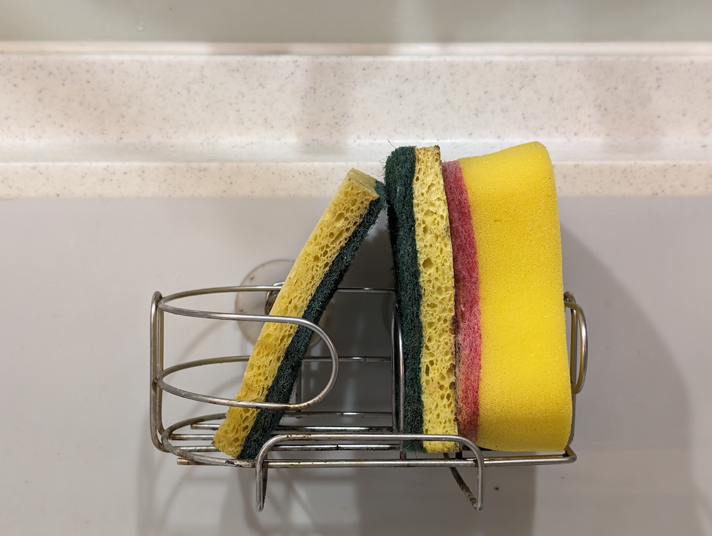

"He can't even tell apart three sponges!" she exclaimed, and everyone at the table burst into laughter.

We have three sponges by our kitchen sink, each with a specific purpose: one for non-greasy cups, one for greasy dishes, and one for cleaning the sink itself. In the beginning, all three were different styles, so I could easily remember which sponge served which function.

Until one day, one style ran out. Two different functions ended up sharing the same style of sponge, and from that point on, I constantly grabbed the greasy-dish sponge to wash my coffee cups.

No matter how much code I've written or how many talks I've given, I still can't keep track of which sponge is which.

This kind of playful teasing happens all the time in our household, and I don't really mind it. But even after more than ten years together, we still regularly upset each other, and there are many times we need to sit down and have a real conversation about how to interact more smoothly. The boundaries between people are fluid—sometimes we discover particularly vulnerable places in each other that need care, and sometimes we realize that old ways of relating no longer work and need to change. Relating to another person is like dancing together: you're constantly moving forward and back, searching for the right distance.

I feel like the education I received was too focused on binary thinking—things were either right or wrong. In my teens and twenties, I believed everything had fixed rules, and my job was to convince others. Some expert said this was right, so if we just followed that process, we'd become the best people, build the best products, be the best software engineers.

That was a kind of growing pain. It taught me many things, but it also came with being too harsh on myself and others. I defined what a good software engineer should be, studied how to write automated tests that could validate every branch repeatedly, and at the same time questioned and tried to convince others what was right, criticized things I disapproved of, and blamed work styles that didn't meet my standards.

Looking back, I've been navigating the workplace for quite a while now. Those best practices I once pursued don't necessarily apply anymore. What I've learned from these years is the importance of context. Before something reaches its final result, what it went through matters too. Why did they take that shortcut? Why did they handle this in a more complex way?

Understanding context brings more empathy. When you understand how things evolved to their current state, they don't seem so strange anymore, and you don't insist so firmly that things must be done a certain way.

Human relationships are the same. Even with someone you've been with for over a decade, you can still cross boundaries. And those boundary lines, when you zoom out, aren't perfectly uniform either. Every situation has its context, every negative thing can look better from another angle, and everyone's boundaries are constantly shifting. The boundaries between you and one person look different from those between you and another.

Our physical world might have unified operating rules, but when you consider how complex the world is, and expand to human relationships and boundaries, there are countless variables—there's no universal rule for how people should get along.

When that's the case, just have a little more empathy.

Relating to others is like dancing together. When you lose the rhythm and step on their foot, stick out your tongue, blink apologetically, gently support them, and get back into step. That's all it takes.
