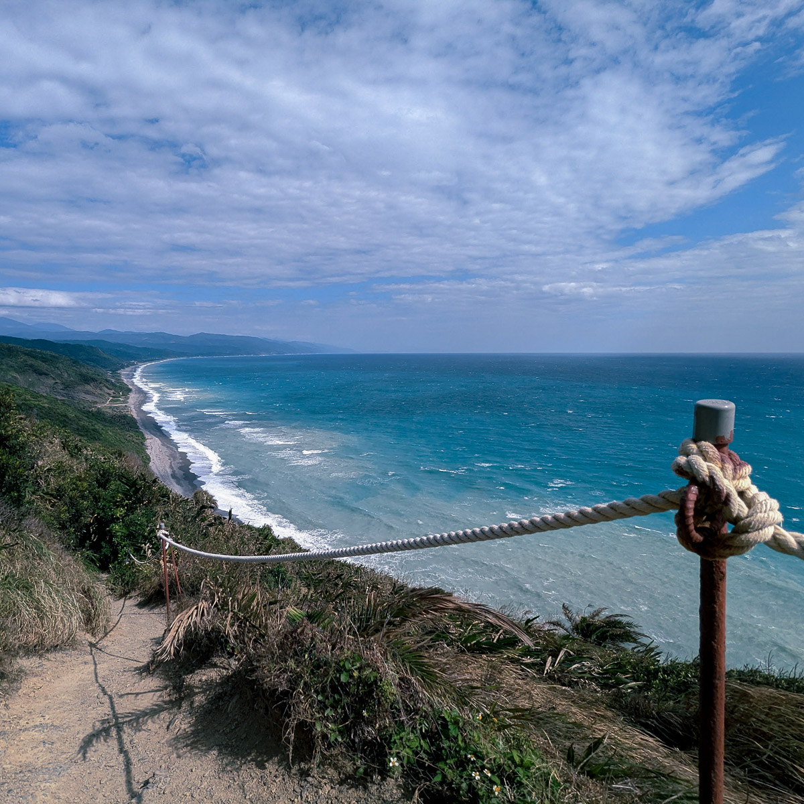

We are far too stingy with letting ourselves zone out.

This world encourages busyness far too much. We shower, brush our teeth, put on headphones to listen to music after leaving home, scroll through Facebook and YouTube, arrive at the office to inventory yesterday's unfinished work, reply to emails, attend meetings, juggle fragmented tasks—even when traveling, we plan every detail of our itinerary, leaving no blank spaces.

Of these activities, only showering prevents us from multitasking like an octopus, yet it's during showers that I can sort through things—those work challenges I don't yet know how to solve, the thoughtful convenience store clerk I met today. Sometimes my thoughts drift so far that I can combine completely unrelated things together.

For instance, why do we want to create information structures that require no trust in a society where we depend on trust everywhere? I think of the A.T. Field from *Neon Genesis Evangelion*—like manners or values, it's the boundary between people, the dividing line that shapes the distinction between ourselves and others. The coastline that seems to clearly separate mountain and sea, when magnified, is just waves, white foam, and fine sand.

Instead of only filling ourselves up, why not find time to empty ourselves out? Shower, drink coffee alone, take a walk, zone out. Such divergent thinking comes with no expectations, but perhaps it will bring answers.
