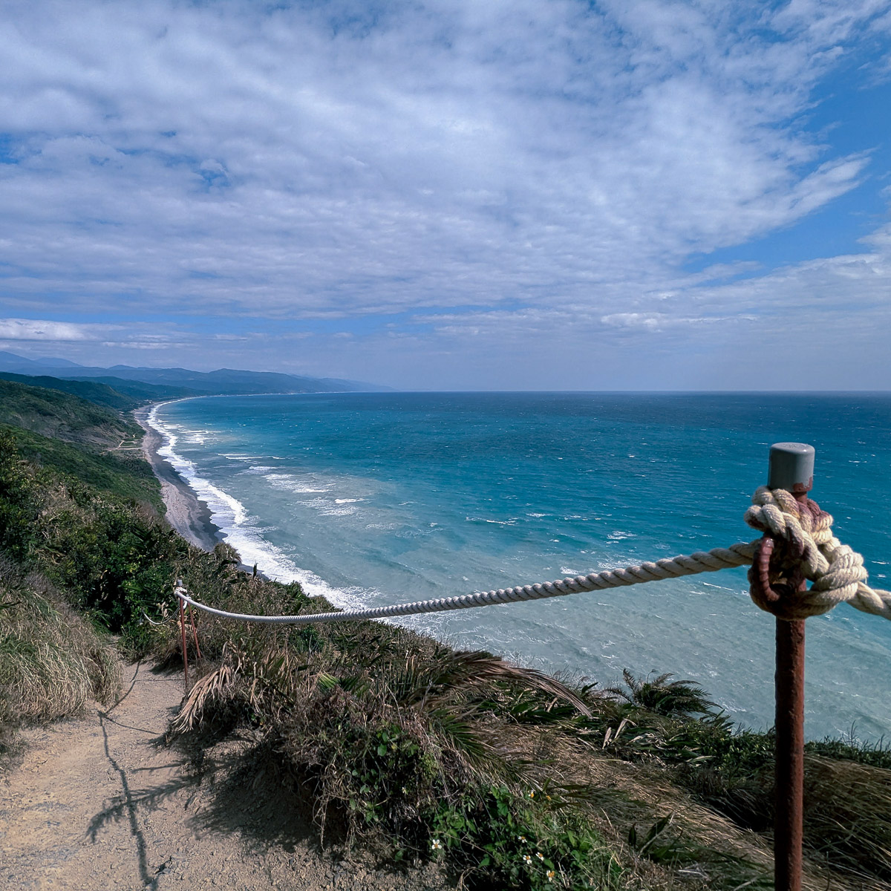

私たちは、ぼんやりすることにあまりにもケチだ。

この世界は忙しい生活を奨励しすぎている。シャワーを浴び、歯を磨き、外出してイヤホンで音楽を聴き、FacebookやYouTubeを見て、会社に着いたら昨日終わらなかった仕事を棚卸しし、メールに返信し、会議をし、四分五裂の仕事をこなす。旅行するときでさえ、細かく行程を計画し、余白を残さない。

この中でシャワーだけは、タコのように一度に多くのことをすることはできないけれど、シャワーを浴びているときはいつも物事を整理できる。まだ解決方法がわからない仕事の難題、今日出会った親切なコンビニの店員、時には思考が遠くまで漂って、まったく関係のないことを組み合わせることもある。

たとえば、至る所で信頼に依存して生活している社会なのに、なぜ信頼を必要としない情報構造を作ろうとするのか。『新世紀エヴァンゲリオン』のA.T.フィールドを思い出す。それは礼儀や価値観と同じで、人と人との境界であり、自分と他人を区別する分水嶺でもある。山と海を明確に分けているように見える海岸線も、拡大してみれば波しぶき、白い泡、細かい砂だ。

自分を満たすこと以外にも、自分を空っぽにする時間を見つけてはどうだろう。シャワーを浴びる、一人でコーヒーを飲む、散歩する、ぼんやりする。そんな拡散的な思考には期待はないけれど、もしかしたら答えが見つかるかもしれない。
