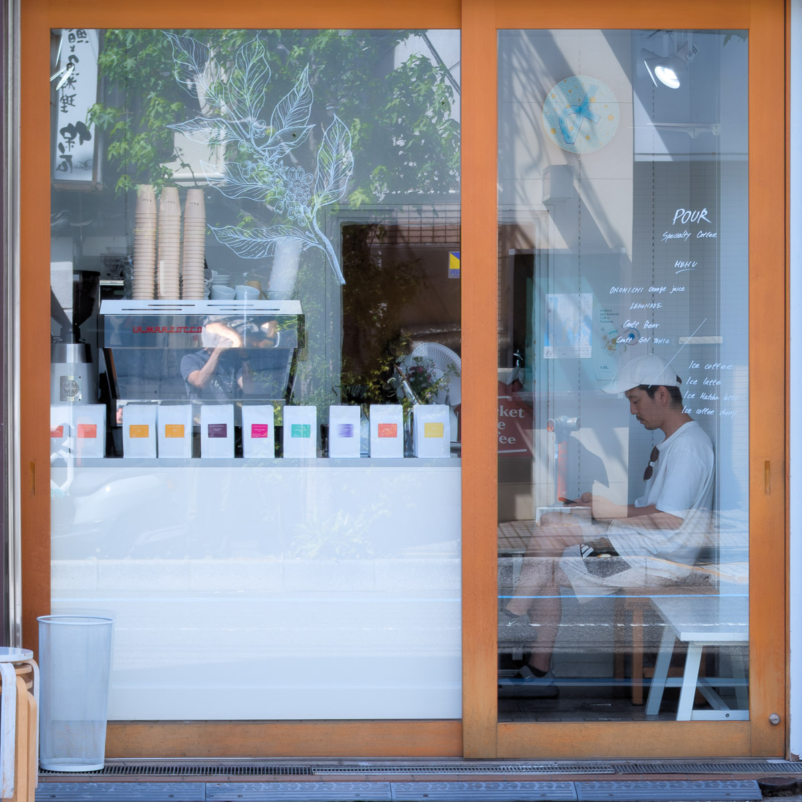
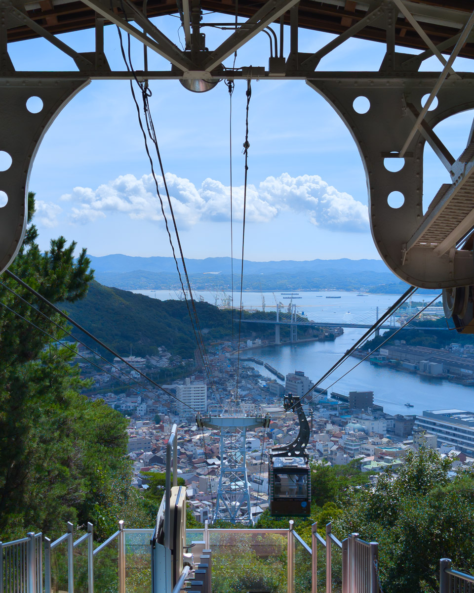
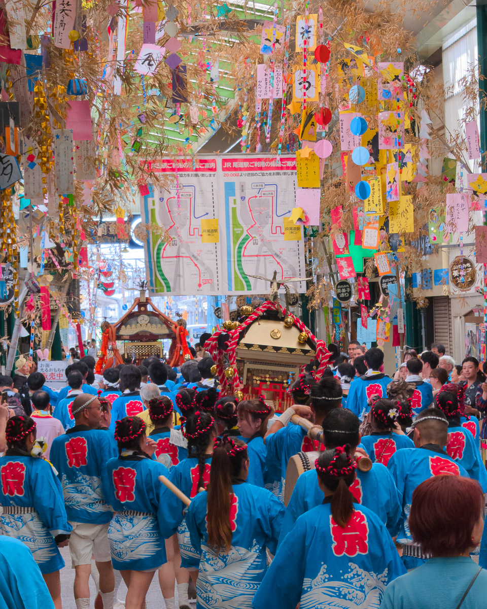
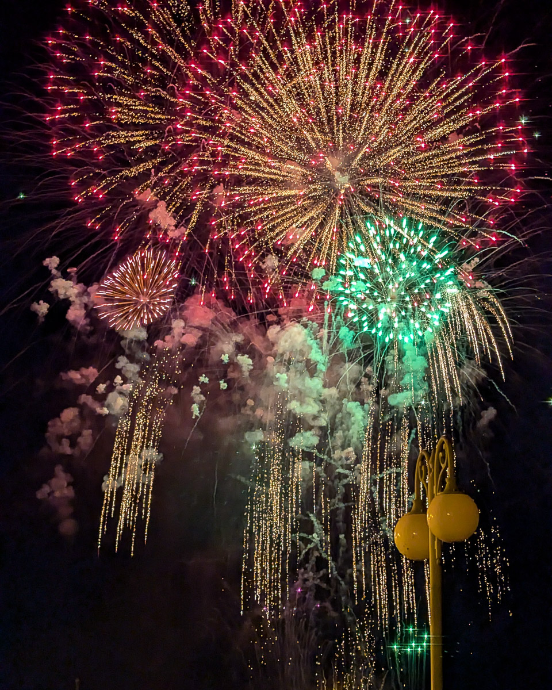

"I saw you walk past the café thirty minutes ago," the owner said with a smile, wiping down the counter.

Before hearing these words, I had spent the previous week working at a co-working space in Okayama, and only caught a train to Onomichi on Friday for a small trip within my journey. On that sweltering summer afternoon, as I searched for a restaurant, I passed by this café and caught the scent of what promised to be a good coffee shop. Naturally, after lunch, I made my way there.

Sliding open the large wooden-framed glass door, I entered the small, exquisite café with four seats arranged shoulder to shoulder. At the entrance, coffee beans in pure white packages—distinguished by different colors marking their origins—were neatly displayed, adorning the space in the most unobtrusive way. Sitting inside felt peculiar: the openness from the large windows offset the narrowness of having only four seats and a counter area. Yet this arrangement of sitting side by side and face to face, much like *Alone Together*, made conversation an essential element of the café.

The owner's English was quite good, and the customer next to me seemed to be a regular. The owner introduced him as another owner who sold draft beer in Onomichi. Tomorrow evening, during the fireworks festival, they would set up together in front of the café to sell draft beer and food. Understanding only a few Japanese words, I couldn't follow much of their conversation—most of it translated by the café owner. But from their warm, friendly tone, I could sense they were close friends. This atmosphere of visiting each other's shops and supporting one another when needed felt fascinating. Sitting nearby, trying to catch the few Japanese words I understood floating in the air (like "hanabi" for fireworks), I too felt a sense of participation in the preparations for the local festival.

Fireworks festivals are the brilliant sparks inevitably encountered when visiting Japan in summer. The shoulder-to-shoulder crowds aren't exactly my preference, but the enthusiasm of the food stalls and everyone dressed in yukata create a summer atmosphere worth experiencing—one of the reasons I returned to Onomichi. However, since I planned to take the ropeway up to Senkoji Temple on the mountain tomorrow to watch the fireworks, quite a distance from this seaside café, I wasn't sure I'd have a chance to come back for that draft beer. In any case, after a brief chat, I left.

"I'll come again tomorrow," I told the owner before leaving. Finding a café that suits you during travel is difficult. When such a café occasionally appears, it feels as precious as discovering an oasis in the desert.

To me, Japan is a place both familiar and distant. The impeccable service makes me feel warm and at home, yet from various aspects of society, I can sense that people maintain a certain distance from one another. This is especially true for someone like me who has just started learning Japanese. Solo travel amplifies this feeling further. The barriers of language and interpersonal relationships make the loneliness of travel feel like searching for the boundaries of oneself.

It sounds lonely, but I actually enjoy this feeling. Still, when a café like this appears during my journey—one that offers a chance to break through these barriers—it makes me happy. I love those moments in solo travel when just the right amount of connection unexpectedly emerges.

The next day, while the morning temperature was still pleasant for walking, I returned to the same café for coffee.

"Can I talk to you?" the customer next to me asked in simple English. He turned out to be an emergency room doctor. It was his day off, and he had just returned to Onomichi from watching fireworks in Osaka. He told me the Osaka fireworks festival was extremely crowded and warned that Onomichi's would be just as packed. Like me, he had stopped by the café in the morning to fill his thermos with energy (coffee) before heading to help at his father-in-law's clinic. We were alike—both wanting to start the day with a good cup of coffee.

This café felt like a gathering place for locals. Besides travelers like myself, regulars continuously dropped by. I loved these moments during travel when you meet different people and can share life's small moments together in the same time and space.

After the doctor left, the owner told me he was studying English and actively looking for opportunities to practice conversation. I mentioned that as someone who had just started learning Japanese a few weeks ago, I truly understood the difficulty of learning a new language. The owner had a quality that made casual conversation flow easily, and before I knew it, we had gone from discussing language learning to the importance of "failure" in life. I shared my experiences working at various startups, and he mentioned his previous coffee roasting business. I was surprised we could discuss such deep topics in English. Through this exchange, I felt myself gradually building a deeper connection with Onomichi and its people, evolving from just another tourist.

Before leaving the café, the owner said he had reserved a few spots along the embankment near the café where you could see the fireworks. If I couldn't find a suitable place at Senkoji Temple on the mountain, I was welcome to watch from his reserved spot. I was touched. To him, I was just a customer he had met twice, yet he was willing to save a spot for me. I cherished this opportunity to build connections with locals.

That evening, amid crowds comparable to those watching Taipei 101's New Year's fireworks, I spotted the café owner from afar preparing dumpling dishes, along with the draft beer owner I'd met the day before. I waved to them.

A book that accompanied me on this trip, *Arrival Hall*, offers a remarkably apt description of home. The author writes that home is a place with layers of safety nets, ready to catch you from any predicament, while people in foreign lands must expend enormous energy to solve even the smallest problems.

Onomichi is not my home, and naturally lacks those familiar safety nets. But after participating in Onomichi's fireworks festival this time, these connections with locals did gradually shift how I felt about this place.

The café owner selling dumplings at the fireworks festival, the regular who sells draft beer whom I met yesterday, the emergency room doctor rushing from Osaka to the clinic—through conversations and connections with these people, I seemed to gradually blend into this place, feeling the depth created by Onomichi and the people living here.

And as the fireworks bloomed in Onomichi's midsummer night sky, everyone involuntarily opened their mouths wide, gasping in wonder. As we shared this same brilliance in the same time and space, through these connections made during my journey, I gained my own sense of familiarity with Onomichi.

Like traveling alone through space and occasionally encountering another starship—at the moment when our orbits are closest, it seems through the round observation window, you can see someone on the other side, face pressed against the glass, happily waving at you.

Hello, thank you, see you next time.

