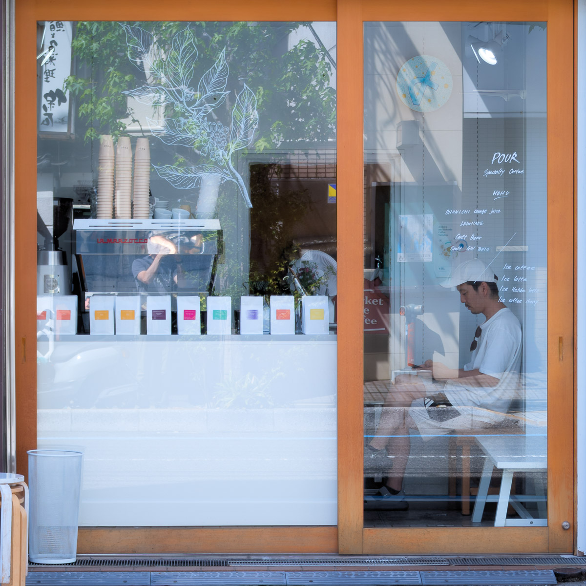
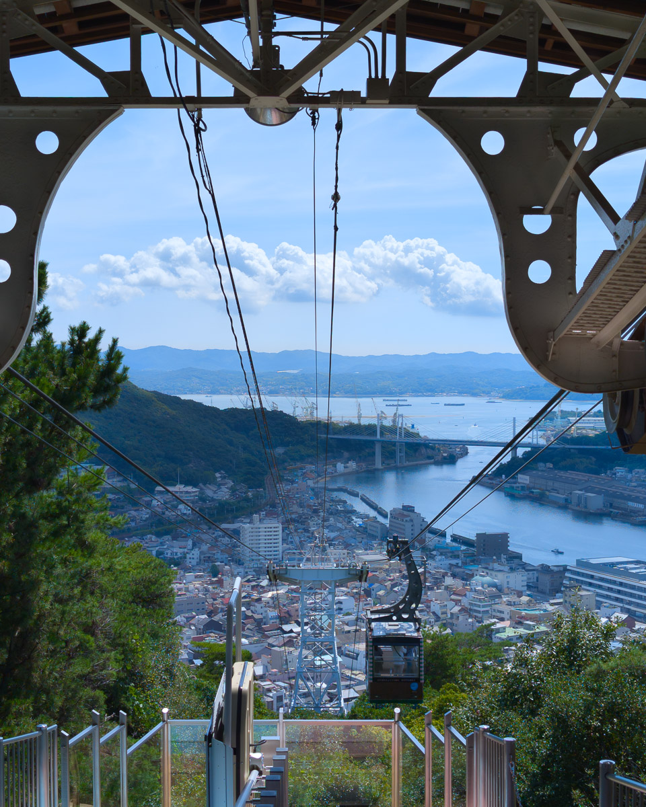
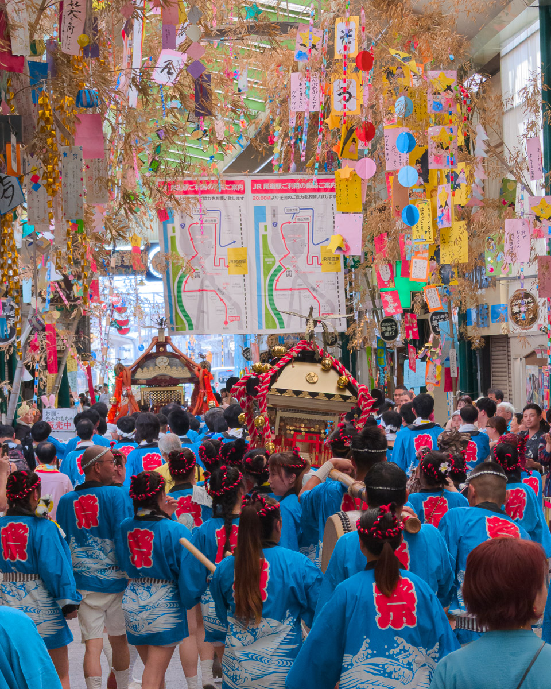

「30分前にあなたがカフェの前を通るのを見ましたよ」と、カフェのオーナーがカウンターを拭きながら笑顔で私に言った。

この言葉を聞く前の私は、前週まで岡山のコワーキングスペースで仕事をし、金曜日になってようやく電車で尾道へ、旅の中の小旅行をしに来たばかりだった。猛暑の昼時にレストランを探していた時、このカフェの前を通りかかり、いいカフェの香りを感じ取った。そして当然のように昼食を済ませた後、このカフェを訪れることにした。

大きな木製のガラス戸を引けば、小さくて洗練されたカフェの中に入れる。中には肩を寄せ合うような4つの席がある。入り口には、純白のパッケージに異なる色で産地を示したコーヒー豆が整然と並び、最も控えめな方法で店を彩っている。中に座っていると、不思議な感覚に包まれる。大きな窓から差し込む開放感が、4席とカウンターだけという狭さを打ち消している。しかし肩を並べ、向かい合うこの席の配置は、まるで「一席 / Alone Together」のように、対話もこのカフェを構成する重要な要素となっているのだ。

オーナーは英語がかなり上手で、隣の客も常連のようだった。オーナーが紹介してくれたところによると、この客は尾道で生ビールを売っている別のオーナーで、明日の花火大会の夜、二人でカフェの前で生ビールと食事を販売するという。日本語を数単語しか理解できない私には彼らの会話がよく分からず、ほとんどをカフェのオーナーが通訳してくれた。しかし、親しげに話す二人の雰囲気から、彼らが仲の良い友人だということが伝わってくる。お互いの店を訪れ合い、必要な時には助け合う、そんな関係性がとても興味深く感じられた。傍らで空中に漂う数少ない理解できる日本語(花火のHanabiなど)を必死に拾おうとする私も、まるで地元の賑やかな祭りの準備に参加しているような気分になった。

花火大会は、夏に日本を訪れれば必ず出会う華やかな光景だ。肩がぶつかり合うほどの混雑は私の好みではないが、熱気に満ちた屋台と浴衣姿の人々が作り出す夏の風情は、やはり体験する価値がある。それも私が再び尾道を訪れた理由の一つだった。ただ明日は、ロープウェイで山の上の千光寺へ行って花火を見るつもりだった。この海沿いのカフェからは少し距離があり、その時にまた生ビールを買いに来られるかどうか分からない。とにかく短い雑談の後、私は店を出た。

「また明日来ます」と、去り際にオーナーに告げた。旅行中に自分に合うカフェを見つけるのは難しい。たまにこうしたカフェに出会えた時、それは砂漠でオアシスを見つけたような貴重さがある。

私にとって日本は、親しみやすさと同時に、どこか隔たりのある場所だ。至れり尽くせりのサービスに温かさと親しみを感じる一方で、社会のさまざまな面から、人と人との間には少し距離があることも感じられる。日本語を学び始めたばかりの私には、なおさらそうだ。一人旅は、そうした感覚をさらに増幅させる。言葉と人間関係の隔たりは、旅の孤独の中で、まるで自分の境界線を探しているかのようだ。

寂しく聞こえるかもしれないが、実は私はこの感覚を楽しんでいる。しかし旅の途中でこうした隔たりを破ってくれるカフェに出会えると、やはり嬉しくなる。一人旅の中で、ふと現れるちょうどいい距離感のつながりが好きなのだ。

翌日、朝の気温がまだ心地よく散歩に適している時間帯に、私は再び同じカフェへコーヒーを買いに向かった。

「お話ししてもいいですか?」と隣の客が簡単な英語で尋ねてきた。彼は救急救命医だった。今日は休日で、大阪で花火を見てから尾道に戻ってきたばかりだという。大阪の花火大会は人がとても多くて、尾道も同じくらい混雑するだろうと教えてくれた。朝、私と同じようにカフェに立ち寄り、水筒いっぱいのエネルギー(コーヒー)を持って義父の診療所を手伝いに行くのだという。私たちは同じだった。一杯の美味しいコーヒーで一日を始めたかったのだ。

このカフェは地元の人々の交流の場のようで、私のような旅行者だけでなく、常連客が次々と訪れる。旅の途中でさまざまな人々に出会い、同じ時空間で日常の小さな出来事を分かち合える、そんな瞬間が私は好きだ。

医師が去った後、オーナーは彼が英語を勉強していて、英語で会話する機会を積極的に探しているのだと教えてくれた。私も数週間前に日本語を学び始めたばかりで、新しい言語を学ぶ難しさは本当によく分かると話した。オーナーには気軽に雑談できる雰囲気があり、気がつけば私たちは言語学習から人生における「失敗」の重要性まで話が及んでいた。私はさまざまなスタートアップでの仕事経験について触れ、彼も以前コーヒー焙煎事業を営んでいたことなどを話してくれた。英語でこれほど深い話題について話せることに驚いた。そしてこうした交流を通じて、普通の旅行者から、尾道という場所や地元の人々とより深いつながりを徐々に築いていけることを感じた。

カフェを出る前、オーナーは堤防沿いのカフェ近くに花火が見える席を何席か確保しているので、もし山の上の千光寺で適切な場所が見つからなければ、その席で花火を見てもいいと言ってくれた。少し感動した。彼にとって私はまだ2回しか会ったことのない客に過ぎないのに、席を取っておいてくれるなんて。そして私も、地元の人々とこうしたつながりを築ける機会をとても大切に思った。

その夜、台北101の年越し花火に匹敵するほどの人混みの中、遠くから餃子を準備しているカフェのオーナーと、昨日会った生ビールのオーナーの姿が見えた。手を振った。

今回の旅で私に寄り添ってくれた一冊の本『入境大廳(到着ロビー)』の中で、著者は故郷について非常に的確な表現をしている。故郷とは何重ものセーフティネットがあり、どんな困難からもあなたを受け止めてくれる場所だという。一方、異郷にいる人は小さな問題に遭遇しただけでも、それを解決するために莫大なエネルギーを費やさなければならない。

尾道は私の故郷ではなく、当然ながら親しみのあるセーフティネットがあるわけではない。しかし今回、尾道の花火大会に参加してから、地元の人々とのつながりは、確かにこの場所への感じ方を少しずつ変えていった。

花火大会で餃子を売るカフェのオーナー、昨日出会った生ビールを売るカフェの常連、大阪から戻って診療所へ急ぐ救急医。こうした人々との会話や交流を通じて、自分も徐々にこの場所に溶け込み、尾道とそこで生きる人々が作り出す奥行きを感じられるようになった。

そして花火が真夏の尾道の夜空に咲く時、すべての人が思わず口を開けて、あちこちから驚嘆の声を上げる。同じ時間と空間の中で、私たちが同じ華やかさを共有している時、旅の中でのこうしたつながりを通じて、私も尾道との間に自分なりの親しみを得たのだ。

まるで宇宙を一人で旅している時、偶然別の宇宙船に出会い、お互いの軌道が最も近づいた瞬間、丸い窓越しに、相手もガラスに顔を押し付けて嬉しそうに手を振っているのが見えるような。

こんにちは、ありがとう、またね。

