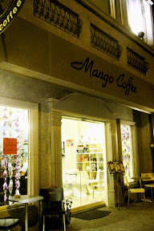
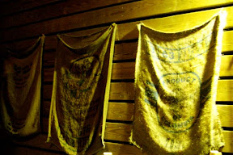

Mango Coffee，距離 Mango 女王留言給我後不知道多少日子後（我竟然還找不到那篇留言），終於造訪這間咖啡館。  
  
一個寒流即將來臨的下午，嘉義的天氣很配合的給了我一個和煦的氣溫。我帶著心裡想過好幾輪的大隻佬磨豆機、拉霸式 espresso 機、自己烘培調配的 espresso、美麗的拉花，還有許多許多的期待，跟 eris 一起從那個陽光輕輕撒在身上的午後，前往 Mango Coffee。  
  
嘉義市區、民雄、大林、斗南，陪伴著我們的是省道上不怎樣的風景，最終我們到了目的地，莿桐。這是晚上離開時拍的照片有點暗。Mango 的店面非常別緻。除了窗明几淨的玻璃窗門、石製的裝潢，旁邊還掛了幾個生豆的麻袋，看了一下產地是巴西、宏都拉斯，另外有個袋子我就看不出來了。不過我唯一認的出來的麻袋只有那米妮塔的吧（笑）。  
  
    
  
依照去義式咖啡館的慣例，我點了杯 espresso，eris 點摩卡奇諾（不過我竟然忘了照，阿阿阿～）。Mango 的 espresso 杯子我沒見過，比起以往的高了些（照片看不出來），剛上來的時候 crema 真是多到一整個誇張阿！超級濃厚的 crema 配上誘人的香氣。而 espresso 是偏酸的口味，看起來非常非常濃厚，但是喝起來卻比外表溫和（當然還是很濃），而且後段很完美，沒有一絲絲的苦尾（這我覺得蠻厲害的，拉霸機看起來就是很難控制），非常完美的 espresso！  
  
   
  
晚一些我又點了杯卡布奇諾，也是很好喝。而且就算加了鮮奶，那濃厚 crema 的味道還是可以很容易可以辨認的出來。而且這這這個豹紋的杯子，真是超妙的。  
  
  
  
Mango coffee 真的是非常值得一去的咖啡館。我們從嘉義市一路騎到莿桐，但是一喝到咖啡就覺得不虛此行了。這次去老闆娘剛好重感冒，不過還是很親切，還請我們吃甜點，而且本人比照片正！（吃了甜點嘴巴也變甜了 XD）  
  
資訊  
地址：雲林縣莿桐鄉中山路 114 號  
無線網路：應該有  
電話：05-5841987  
網站：[Mango Caf'e](http://blog.yam.com/mangocafe)