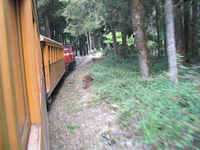

  
  
繼十二月去[奮起湖](http://yurenju.blogspot.com/search/label/%E5%A5%AE%E8%B5%B7%E6%B9%96)後，在三月的最後兩天，我們又沿著十八號省道、阿里山公路，看著沿路上慢慢消失的檳榔樹，逐漸出現的台灣桫欏，最後褪換成整片柳杉林，陽光穿過筆直樹林細縫，在機車快速的前進下就像是舊式投影機播放時一張張切換的光線。  
  
接著，阿里山森林遊樂區大門，就矗立在眼前。  
  
在旅館區的高山青 check in 後，我們先前往風景區內到處走走。兩點半我們從入口進去，然後五個小時後我們才走回住宿區。從入口、梅園、沼平車站、姊妹潭、受鎮宮、香林國小、三代木、慈雲寺最後六點時衝到神木車站，發現最後一班車早在4點半就開走了，而在天色這麼黑的狀況，我們還得走路回去。後來又走到阿里山賓館小作休息，後來發現車道上其實都有路燈，所以就慢慢走花了一個小時走回萊爾富。  
  
累垮了。不過沿路上真的非常的漂亮，櫻花比想像中的漂亮許多，配上原本景緻就很棒的沿途風景，真的很不錯。最漂亮的就是阿里山賓館附近的吉野櫻，全白的櫻花但又泛著淡淡的粉紅，沿路盛開。而晚上經過阿里山賓館時，其外的櫻花上纏繞著黃色的燈泡，一整個美阿。比起九族文化村的櫻花，這邊的漂亮太多了。而且樹齡感覺差蠻多。  
  
     
  
回到飯店後非常累。原本決定洗完澡後就趕快睡覺，沒想到一聊就聊到晚上十一點多，該死的 Discover 頻道又在播殷商的東西，搞得我一整個想看，不過真的很晚就睡了。  
  
早上三點半。飯店的 Morning call 叫醒我們。漱洗過後，我們就往火車站前進。中途買早餐的時後，看到其他也要看日出的旅客經過，我想都沒想就跟他們說，買個包子再上去看日出喔！那群旅客就笑成一團。買早餐還幫忙賣早餐就是了 XD  
  
到祝山時，因為我們坐的是第一班火車，所以人還沒那麼多。等我們坐定在解說圖上之後，人就慢慢的變多，到最後整個觀日坪上全部都是人。大概從五點半再早一點，就有一個解說員以夜市賣菜刀的說話技巧開始解說阿里山日出，非常搞笑。  
  
恩，很順利的看到日出，對阿里山日出的評語：一整個酷阿。跟大凍山感覺不太一樣，怎麼不一樣法我也說不上來。  
  
  
  
後來我們在祝山上的商店買了兩罐櫻花蜜，又喝了一碗筍湯。面對往山下的漫漫長路，經過昨天五個小時的折磨，我們已經沒有耐心再繼續走了。但有一件很重要的事情。剛剛的湯花了五十塊，我身上只剩下找回的五十塊，淋買了兩罐櫻花蜜把最後一百塊訂金付了，身上只剩下六、七十塊。  
  
而祝山坐往阿里山車站，每人要價一百塊。  
  
後來我們決定到沼平車站作區間車(五十元)，但是祝山距離沼平車站還非常非常遠阿。我們花了多久走到沼平車站，我已經沒辦法計算了，只知道我路程中走到有點睡著。愈走愈外面，超危險的 XD  
  
到沼平車站後，還好有火車可以作，原本覺得不是蒸氣火車頭蠻可惜的。沒想到…竟然是檜木車廂！一走進車廂裏面就有濃濃的檜木香氣，眼見的所有地方全部都為檜木製，精神就完全恢復了！  
  
  
  
回程的路上我看著下面步行的遊客，看到有一群人在看的時後，我們就拼命的對他們揮手。  
  
到阿里山火車站時已經是 8:40，因為早餐只供應到九點，我們急急忙忙的衝到飯店，問要在那邊吃飯，接著用衝到遊客中心旁邊的力行山莊，時間是 8:55，剛好趕上吃飯。當走了一個多小時的路後，不管是什麼都好吃阿。吃了三碗稀飯，把所有配菜全部掃完後，才回到飯店睡回籠覺。  
  
離開阿里山後，還回到了奮起湖，重溫一下幾個月前來的這個地方，吃碗愛玉跟愛玉奶凍，還不賴。  
  
  
  
更多照片請看 [Picasa 相簿](http://picasaweb.google.com/yurenju/TravelOfAlishan)