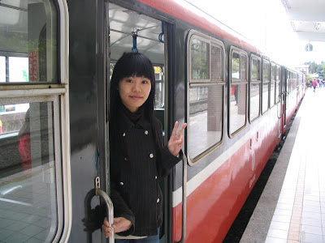

  
(這張照片可以說是 CCNA 老中青三代嗎…逃~)  
  
經過一番曲折離奇的過程，最後我們決定搭小火車上去，也稍稍改了一下行程。其實小火車還不賴，除了很難睡、要開很久、車子很晃還有該死的小孩子踢椅背以外，其他都還不錯。不過我真是要小小的抱怨一下，中途在奮起湖上來賣便當跟烤蕃薯的真的是很不人道，我口袋裡的小朋友差點就失守了。  
  
這次去阿里山是短暫有雨的天氣，說起來比跟五專同學來玩算是輕鬆一點 (那次雨還蠻持久的)。而且這次還見識到學長驚人的腳力，四月份那次我們把整個阿里山走完花了五個小時 (除塔山跟祝山外)，這次阿火在前面走的超快，眉秀也緊跟著走，我還想這兩個人是怎麼回事…。後來問阿火他說其實他走的也有點累，不過都沒聽後面的說要休息所以就繼續走，我們是看阿火走那麼快都不吭聲我們就跟著走，結果出來的時候才四點多，天都沒黑勒…。所以第一天我們就走完三代木→香林國小→姐妹潭→沼平公園這段。但是這邊一張相片都沒有，因為大家都很有默契的把相機忘在民宿裡面 XD  
  
晚餐則去吃了外圍的一間忘記名字的餐廳，位置在郵局跟力行山莊的斜對面。這間餐廳比起內圍那幾家價格都相同的餐廳還便宜，而且就這兩天吃的兩頓來說，這間餐廳是好吃多了。如果還有機會去阿里山，我想還是會去吃這間吧。比起上次過來，這次住宿區又多了幾個東西。第一個是新阿里山車站蓋好囉！不過沒圖…。而遊客服務中心對面又多開了 7-11 要跟萊爾富硬拼，還有連星巴克咖啡也上來阿里山了。  
  
  
(starbucks, 死大胖子咖啡館)  
  
星巴克建築外表是像廟一樣，真是不搭得很詭異。附帶一提，這次住的新順利民宿晚上還送我們燒仙草耶！雖然都沒有料…。另外新順利並沒有附早餐，這倒是我忘記 check 了。  
  
第二天記得帶相機了！因為下雨的關係我們沒去看日出，不過早上還是去巨木棧道走走。除了古木參天以外，意外的看到早開的櫻花。雖然季節還不到，但開起來還是蠻漂亮的。照片這隻狗超活潑的，到處跑來跑去的搶鏡頭。小藍傘那張是在一個我之前沒走過的吊橋拍的。  
  
     
  
到這邊我們阿里山就逛的差不多囉。  
  
  
(謝謝光臨~ 下次再來~~)  
  
接下來我們坐小巴到奮起湖去，路上風景美的司機就停下來讓我們照幾張。路途中看到幾次雲海，可惜相機跟技術都不好，實景還是比照片美多了。  
  
  
  
奮起湖拍拍照也是少不了的。這次剛好拍到台鐵新開從阿里山到奮起湖的區間車，還蠻幸運的。  
  
  
  
最後到天長地久橋之後，阿里山之旅就到一個段落啦。下山之後吃個體育館壽司，旅程就畫下句點囉。下次大家碰頭，大概就是社團初二聚會了，這次應該會比去年更多人吧？  
  
[照片放在 Picasa 裡面](http://picasaweb.google.com/yurenju/CCNA)。