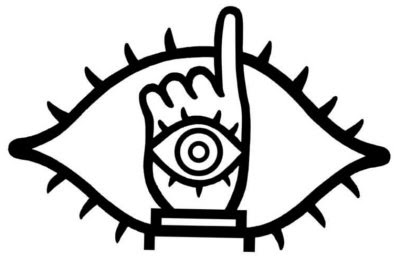

其一。好久沒去的爐鍋咖啡，沒想到當兵完第一次去就是公休。還好和藹可親的老闆跟店員小姐還是讓我進去買了 Mac Baren  (Cherry)。厲害的是老闆還說的出來我第一次去爐鍋時坐的位置跟做什麼事情。這是我第三次去爐鍋，老闆的記憶力好的驚人。  
  
其二，好久沒去的 TOSSUG 聚會，跟『我不當教授好多年~』的葉教授聊了很多 app engine 的小專案，感覺不賴。  
  
其三，我又去了爐鍋，這次還超級巧的碰到阿怪 (真是個常在爐鍋出沒的人)。答應了他下禮拜的 lightening talk 又食言了，真是對對對…不起…。這次買了 Yirgacheffe，至今連一杯都還沒有沖，真是恨恨恨恨恨~ 因為我星期四開心的把咖啡豆帶到公司，開心了到了下午，才不開心的發現磨豆機其實是放在家裡的，恨~。所以那天我又跟『喜ㄏㄢ兒，喜ㄏㄨㄢ你咖啡館』買了熱卡布奇諾不加肉桂。『先生，你要的是**熱卡布奇諾不加肉桂**嗎！？』店員喜歡很驚訝的這樣問我。不過最近比較不驚訝了。  
  
其四，星期五公司的家庭日到金山泡溫泉。車上玩的驚爆骰子，額頭都被彈到變成驚訝傻子了。啤酒很好喝。  
  
其五！  

  

**讓我們把這個標誌搶回來！**

  
  
橫跨20世紀、21世紀最熱血的漫畫 + 電影《二十世紀少年》！因為太多電影都把漫畫/小說拍爛，所以這部並沒有很期待的去看，但是真的是很熱血，而且選角都選得超像的！有看過漫畫的一定要去看！  
  
最後收到王榆鈞的回信很開心，不過因為正在尋找一個不會掉包裹的地址，所以暫時還沒回信…。但是還是很開心 :D  
  
以上碎碎念完畢。