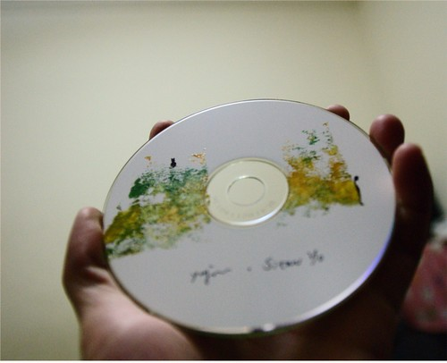

  
  
跟 Yujun 訂的 Demo CD 終於來了。這個跟我 ID 很像的 Yujun (榆鈞) 真的很有緣。自從去板橋誠品聽了他的演出後就很喜歡他的音樂，後來 email 跟他訂 CD 時，沒想到他還對我這個聽眾有印象。  
  
後來去簡單生活節的時候，又遇到了她！還順便請她別忘了我訂的 CD。  
  
而今天終於來了，而且看到封面的字跡真是超感動的，我的名字好久沒被寫的這麼漂亮了  
  
  
  
音樂當然也很棒，我很喜歡頹圮花園荒涼的故事感。  
  
喜歡的朋友可以到 [Sitar Yo 的 Myspace](http://www.myspace.com/sitaryo) 試聽。