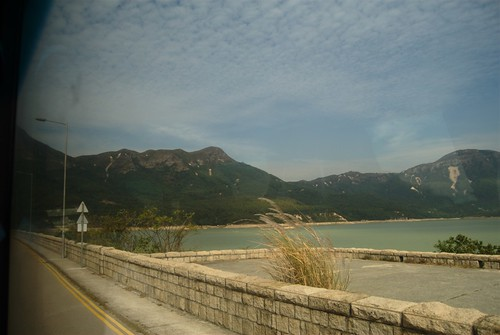
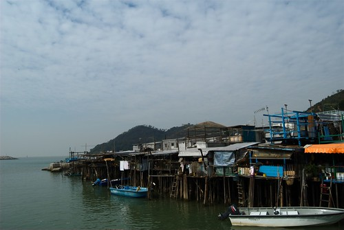
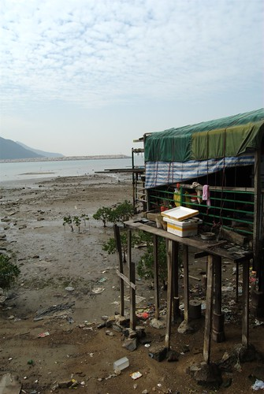
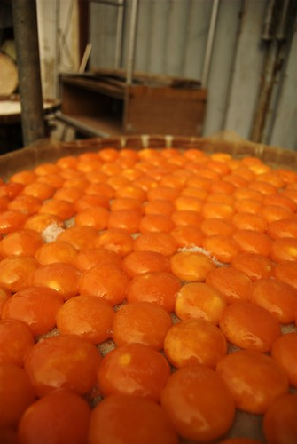
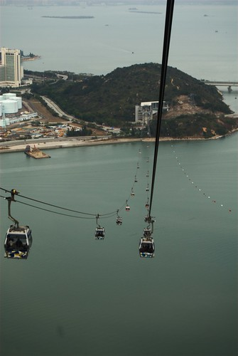
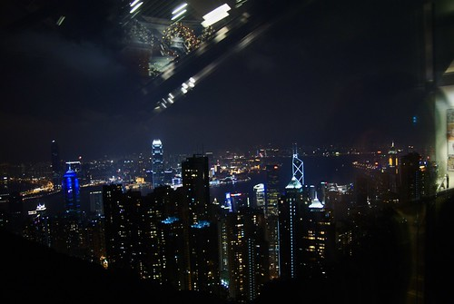

一大早，我們又從銅鑼灣出發，準備繼續探索香港。  
  
  
早上的香港總是靜的可以。  
  
今天的主要行程是大嶼島的大澳。因為是離島的關係，我們坐了一陣子的車，經過了青衣到東涌站。  
  
  
輝哥連轉車都在睡  
  
到東涌站之後緊接著又坐小巴到大澳。這一路上我都沒清醒著阿…。套一句中國導遊跟我們說的話，旅遊就是花錢買罪受阿。  
  
  
  
最後，我們到了一個最不像香港的地方 - 大澳。在這你看不到香港著名的高樓大廈，也找不到萬頭鑽洞的人群。只有漁港、微風、大海。這邊散落的建築，有許多像是直接架高在沙洲甚至海上的鐵寮。  
  
  
  
  
  
路上也有阿罵正在曬著蛋黃。  
  
  
  
也有台胞…  
  
  
  
我們從房子之間的小徑走出去，外面就是大海。我想這應該不是一個遊客該來的地方。不過我們在這個地方還是獲得了一刻平靜。  
  
  
  
很多很多的平靜…。  
  
  
  
在大澳逛完之後，我們又去了昂坪大佛。聽說這邊是無間道的拍攝地點之一，不過我倒是對哪個場景沒印象了。  
  
  
  
後來就是刺激的昂坪纜車。昂坪纜車搭乘要 70 港，但是絕對值得。  
  
首先，他很高  
  
  
而且還要翻山越嶺  
  
  
  
還要過海！  
  
  
昂坪纜車真的很棒，如果去香港的朋友一定要去坐坐。  
  
所以，最後我們回到了東涌，繼續坐了很久的車回到中環。接下來我們去了另外一個很有名的景點：[半山自動手扶梯](http://en.wikipedia.org/wiki/Central-Mid-Levels_escalator)，這是金氏世界紀錄中最長的室外電動手扶梯。我只能說香港人太屌了。這個手扶梯位於一個山坡上，如果沒有這個手扶梯要上山的人花的力氣可多了。而手扶梯兩旁有非常多可以品嚐紅酒的店家，感覺起來還蠻有氣氛的。  
  
  
  
不過…我們坐過頭了 XD  
  
我們作半山自動手扶梯，超過了太平山覽車站。後來剛好有兩個義大利人也找不到太平山，所以跟他們合搭了的士(Taxi)直接殺上去太平山。太平山…就是看夜景，跟從維多利亞港有點微妙的不同，不過都很不錯就是了，但是太冷了…。  
  
  
因為我很怕冷，而且又沒帶腳架（我也還沒有腳架 XD)，所以這張是從室內拍的。  
  
  
  
後來我們就坐非常傾斜的太平山纜車回到中環了。而晚上在中環，當然要去一下遠近馳名的蘭桂坊（但是我之前沒聽過啦，呵呵）。這邊感覺起來氣氛就一整個輕鬆，非常多外國人來這邊喝酒跟釣妹/凱子。  
  
  
  
然後今天就結束了。這應該是最有收穫的一天吧。大澳 + 昂坪纜車是這次香港最有料的行程。