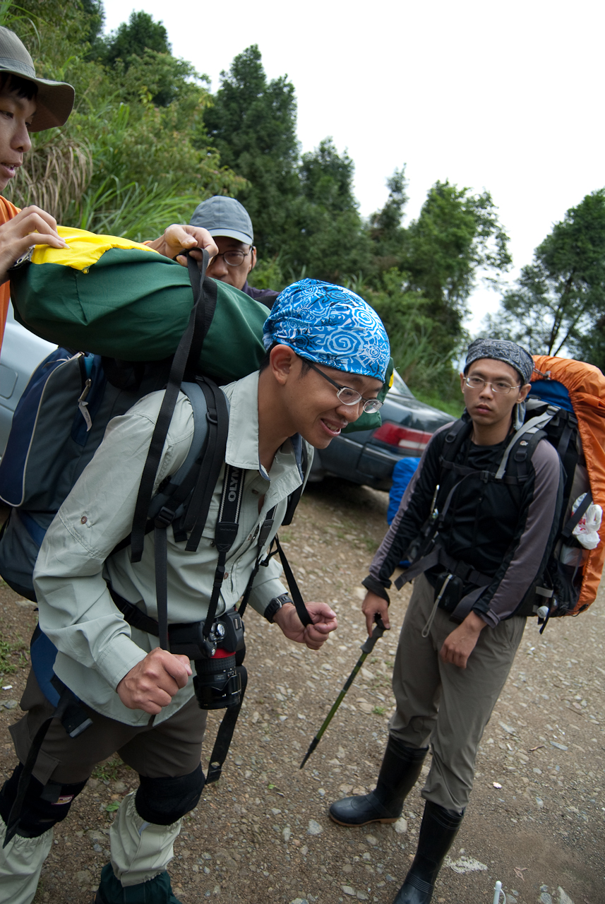
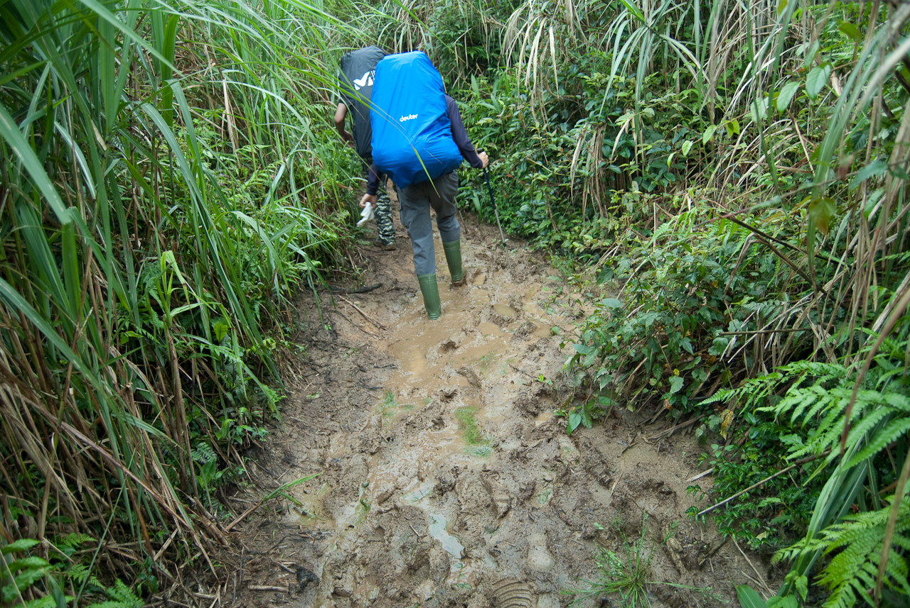
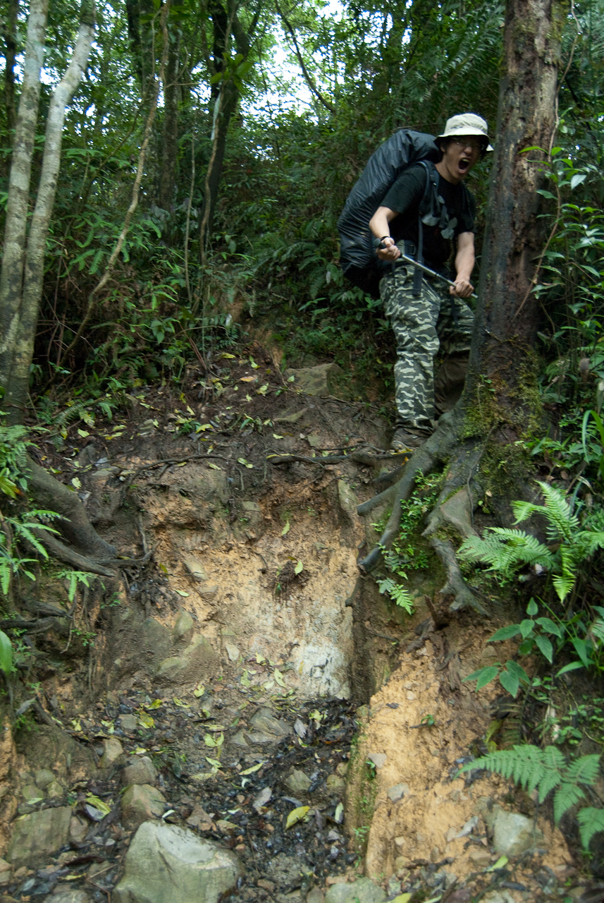

  
在較大的地圖上查看[松蘿湖+拉拉山](http://maps.google.com.tw/maps/ms?ie=UTF8&hl=zh-TW&t=p&brcurrent=3,0x3442ae741e686aa5:0xcf503259afe25a05&msa=0&msid=102940795217138094975.00046b2130e088a63a180&ll=24.684145,121.550417&spn=0.037434,0.068665&z=14&source=embed)  
  
背上山的裝備有乾糧、食物、睡袋、衣物、雨衣（下來的時候多背一個帳篷支架），身上裝備有護膝、護踝、登山杖、帽子、雨鞋，當然還有相機跟 GPS Logger。上松蘿湖與鞋跟登山杖是一定要的。  
  
  
  
  
因為往松蘿湖的路上非常多泥寧路  
  
  
  
也非常多有落差、需要登山杖輔助的地方  
  
  
  
如果你背著重裝，出現這種路也會有點難過。蹲下去起身要花點力氣，多來個幾次就沒力了。  
  
  
而且裝備背了幾個小時候，感覺就會變得異常的沈重…  
  
  
  
所以裝備齊一點還是比較保險。