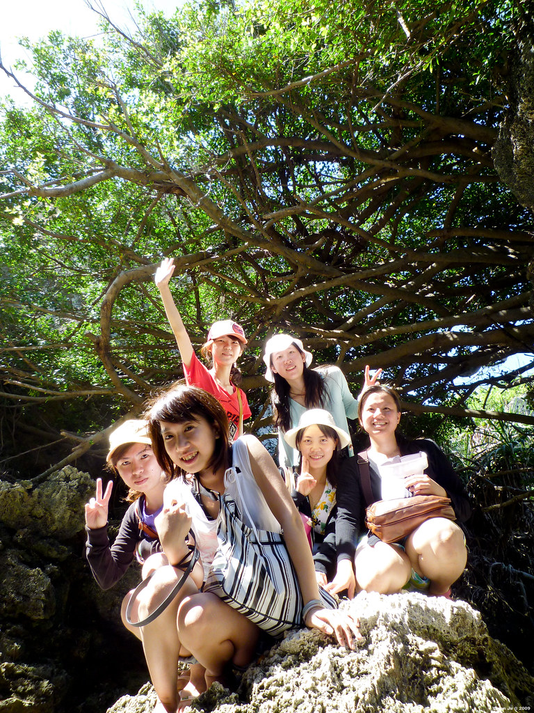

  
在較大的地圖上查看[2009 小琉球](http://maps.google.com.tw/maps/ms?ie=UTF8&hl=zh-TW&t=h&brcurrent=3,0x3467f634b665ffff:0x4fc406d3d0227bdf&msa=0&msid=102940795217138094975.00046d84ccd1515e1cc63&ll=22.339914,120.369301&spn=0.038107,0.068665&z=14&source=embed)  
  
從小琉球回來囉。  
  
原本以為這次會因為颱風的關係影響到這次行程，沒想到天氣出乎意料的好！而且還蠻有趣的。這次去的成員是 Chialin 跟他的一群高中同學們。  
  
  
  
  
這次比較不一樣的地方就是去了潮間帶，我以前來小琉球從來沒去過潮間帶，看到蠻多莫名其妙的生物…當然也有緯來日本台常出現的馬糞海膽啦…不過在琉球保育區的東西是不能吃也不能帶走的。  
  
  
  
  
這次真的還蠻開心的，而且小琉球就在東港對面而已，看來改天有空還可以去玩一下啦。  
  
  
  
這次照片放在[這裡](http://www.flickr.com/photos/yurenju/sets/72157620678953082/)。