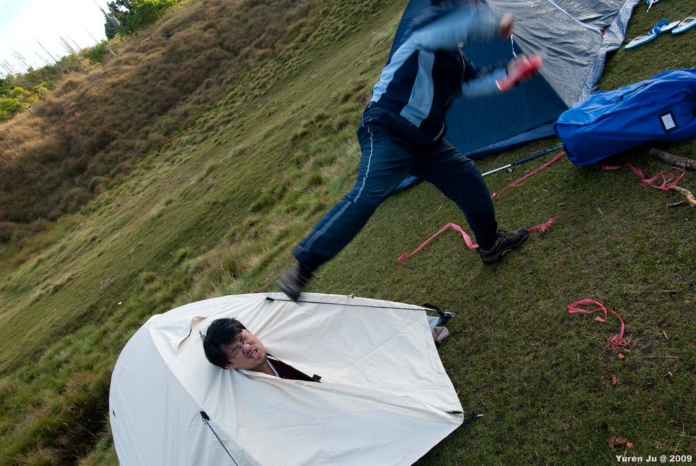

隨著夜色降臨加羅湖，這個沒有任何人工光源的地方，逐漸的沉睡了。  
  
  
不過對這邊的生物來說，夜晚才是開始活動的時候吧 :)  
  
這次我們大概也在七、八點的時候就睡了。不過因為 kyozi 晚上十二點起來，我們也稍微起來晃了一下。沒想到十二點的時候完全感覺睡飽了，沒什麼疲憊的感覺。 不過稍微逛了一下湖邊後，我又窩進帳篷裡面睡了。  
  
下一次出帳篷就是凌晨四點半了，感謝 kyozi 很早起來的叫醒我們。天剛微微亮起時，整個湖畔飄滿了霧氣。  
  
  
隨著時間的推進，霧也慢慢的從我們身邊淡去。  
  
  
這個時候跟我一起出來拍照的是 Znikang, Chialin 跟 Kyozi。  
  
  
再過一段時間後，大家也陸續的醒來了。本團最後一個醒來的是輝哥，叫他的時候他還在賴床！給你個飛踢  
  
  
後來天亮了之後，景色也發生點變化，陽光照耀後就不同了 :)  
