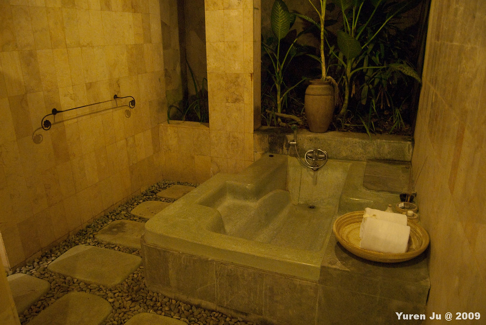
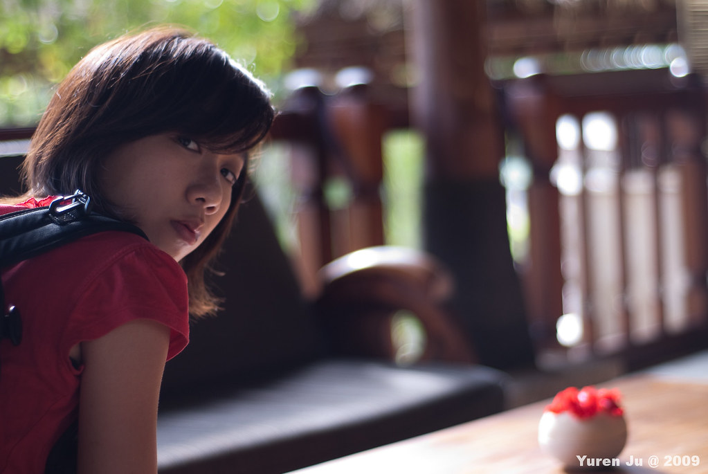
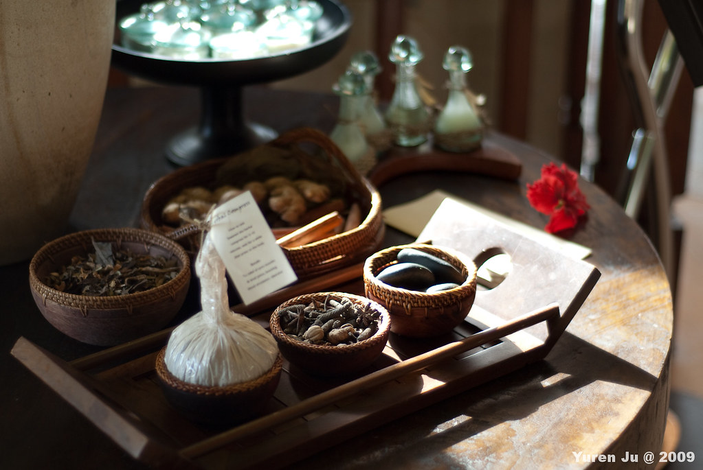
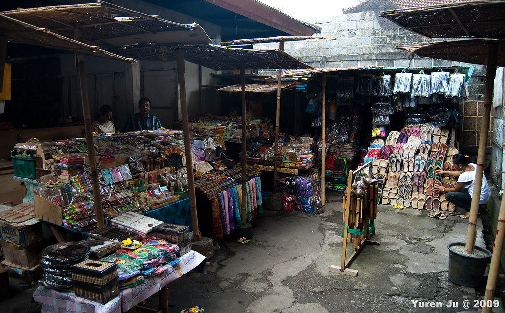
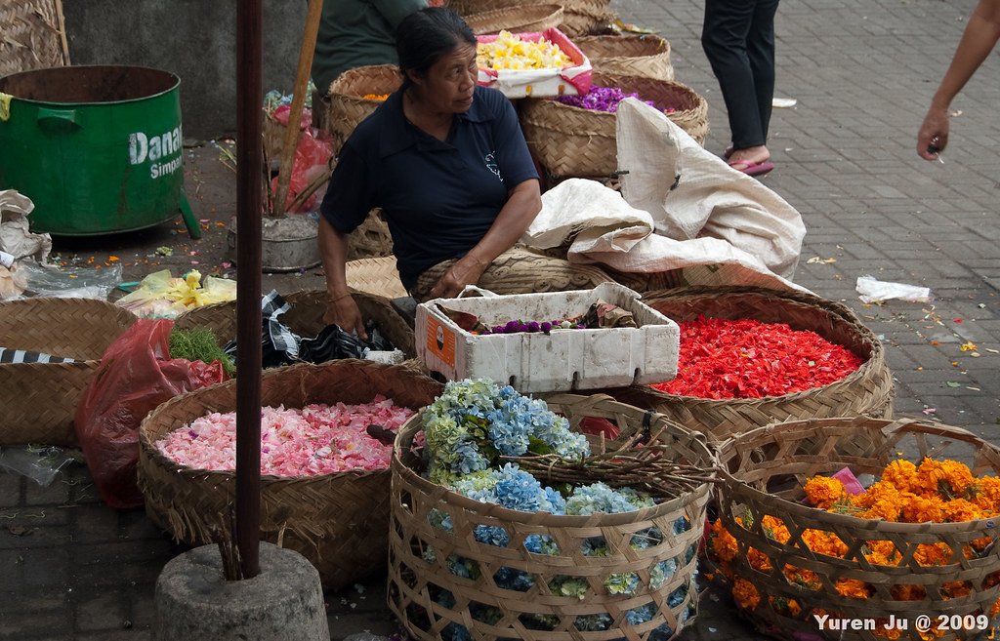

在峇里島的最後一天，我們狠下心來住了一天 185 美金的 Villa! 我們到的那天晚上，服務生就開著像高爾夫球車的車子載我們到住的地方。  
  
  
  
  
  
我們住的地方最外面先有個木門  
  
  
  
走下一個樓梯後  
  
  
  
就是我們住的 Villa 啦！  
  
  
  
裡面有私人游泳池（不過我們沒機會下去游，只有撩撩水而已）  
  
  
  
裡面的房間超大，而且又超有氣氛  
  
  
  
浴室的浴缸看起來是整顆石頭弄的。一整個就很讚  
  
  
  
隔天早上起來，我跟 Chialin 就到了 Villa 附設的餐廳吃早餐，我想這是這幾天吃過最好的早餐。  
  
  
  
吃完早餐後，我們搭著接駁車到了 Ubud 市區 。在這之前我們就在 Villa 的大廳等候。  
  
  
  
  
  
到 Ubud 之後我們就沿途買東西跟殺價。但很可惜的，我們走到了最後才發現 Ubud 皇宮旁邊的 Ubud 市場賣得東西很便宜（當然有些東西的品質也下降了），裡面也充滿著峇里島的日常生活氣氛。  
  
簡陋的店面擺著各式各樣的峇里島風味商品  
  
  
  
東西非常多，又便宜（殺價過後）  
  
  
  
路邊也有賣花的。  
  
  
  
剛收到款開心的勒。  
  
  
  
然後，我們就回程了。峇里島實在太有趣了，我相信我還會再次造訪這個島嶼。去看那些更遠的點，買更多東西，殺更多的價。