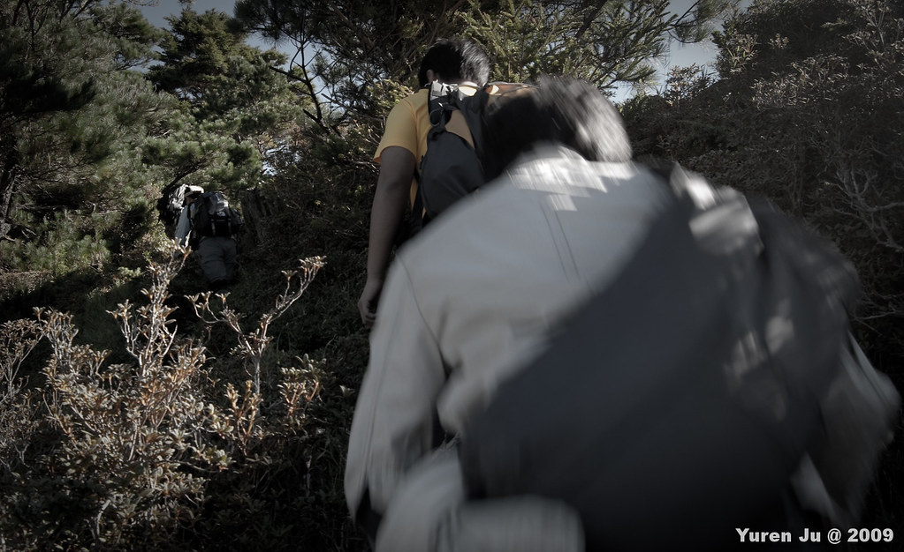
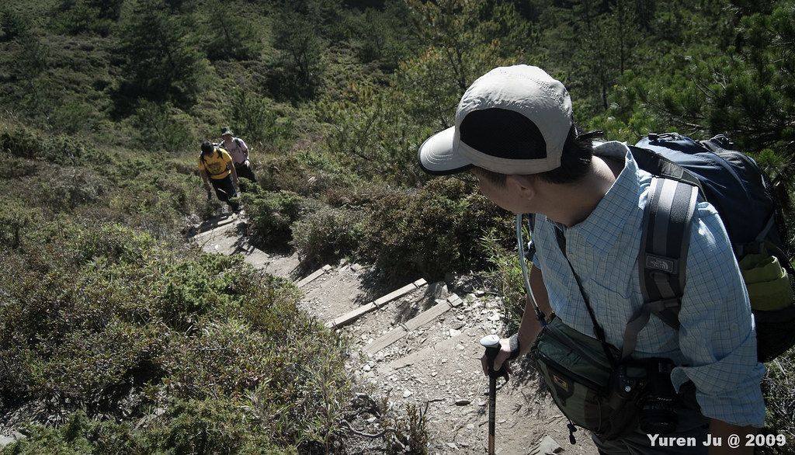
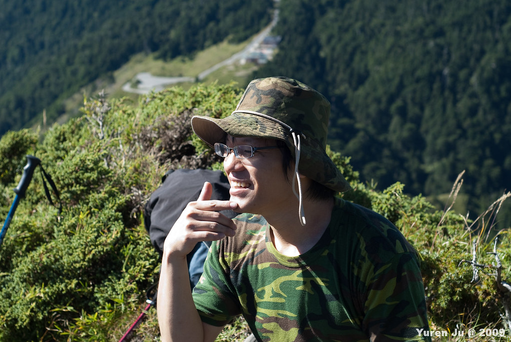
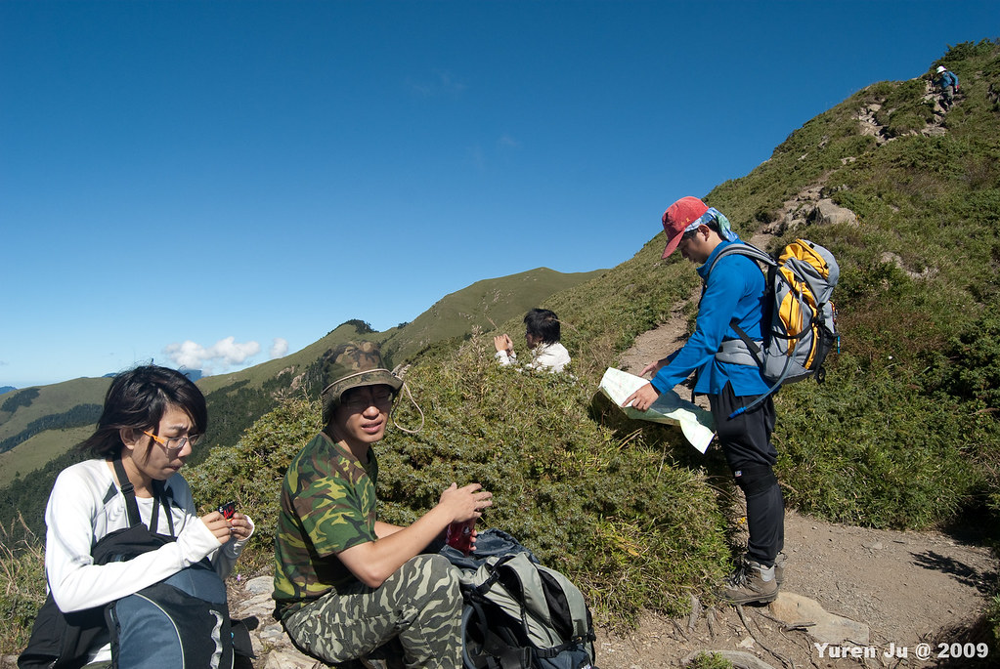
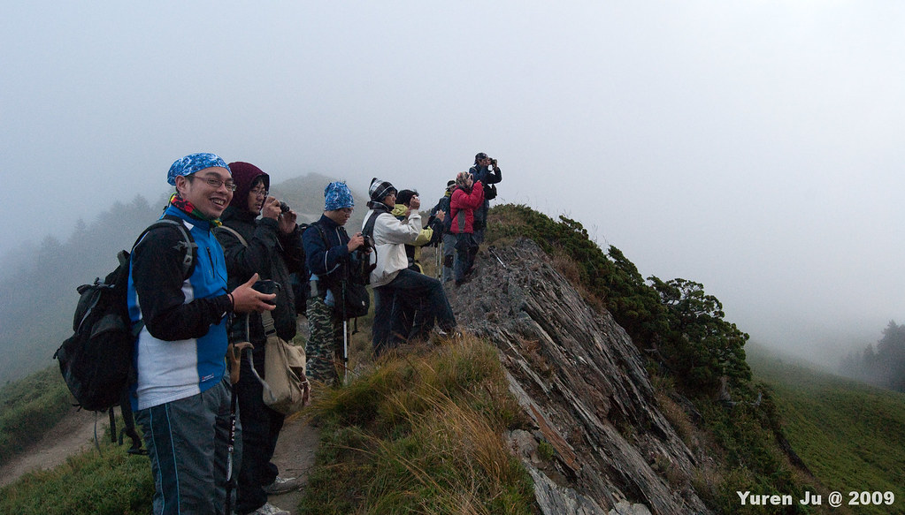

這個活動本名是《一片蛋糕合歡山》，不過爬完之後我只能說這片蛋糕超大一片的，吃到大家都噎到了。  
  
禮拜五我們約八點從捷運芝山站出發，一路開到了合歡山旁的大禹嶺。感謝開車的人，他們是這次最累的人，爬山前、爬山後都還要載著我們移動，我想應該是超累的。  
  
凌晨約一點到民宿後，我們參考登山地圖的資訊寫著八個小時可以來回合歡山北峰、西峰，考慮到拍照及腳程因素，我們預估十個小時應該可以來回合歡山北峰、西峰，所以排在七點開始登山，五點下山。估計完畢後，大夥就睡了，活動名稱讓我們聯想到，這只是個輕裝登山的散步行程…。  
  
隔日七點半，我們開始從北峰登山口開始爬山。  
  
  
  
很幸運的天氣超～好～，我們剛上去就不停的讚嘆合歡山的美妙阿～  
  
  
  
  
  
  
  
不過好景不常，首先是登山路徑並不是我們所想像的一片蛋糕。  
  
  
  
二來高原反應也不停的困擾著我們。合歡山並不比加羅湖難爬，但是海拔三千的威力，可以讓我們在緩坡的時候就氣喘吁吁。更是困擾著本次活動的靈魂人物  
  
  
  
我說的當然是輝哥。  
  
不過天氣依然好到我們一路上都可以聽到快門聲。  
  
  
  
輝哥在這次仍然負責神聖的墊底任務。  
  
  
  
Grissom 跟 river 負責夾殺輝哥  
  
階梯也可以迅速奪走氧氣。  
  
  
  
Kyozi 本次還是一樣海盜造型  
  
  
  
Payton 依然還是我們的登山嚮導。  
  
  
  
Znikang 本次還是一樣擔任班長的角色  
  
  
  
Chialin 負責旁白：『我把你揍扁～～～』  
  
  
  
小銘負責操作 110IS 拍了四百多張照片（比我還多！）  
  
  
  
到了北峰之後，發現進度有點 lag 了，稍坐休息後，又繼續往西峰走。這個時候 Payton 就先上路了。  
  
  
  
合歡山很多美景。  
  
  
  
也很多陡坡  
  
  
  
蜿蜒的路讓我們吃足了苦頭  
  
  
  
有些地方箭竹長得跟人一樣高  
  
  
  
這是我們取水的地方，這次帶了濾水器，濾出來的水真的很乾淨，錢花下去總是值得的。我們到水源地後就沒有繼續往西峰前進。主要因為大家狀況不太好，而且如果去了西峰回程的時間會被擠壓到。所以我們在水源地用餐後就折返回來了。  
  
  
  
Hiking.  
  
  
  
三劍客  
  
  
  
奇怪的角度  
  
  
  
累了累了  
  
  
  
攤了  
  
  
  
啪擦  
  
  
  
回程中我們都走在霧裡。到了北峰後，逐漸起了大霧。後來我們就一直走在霧裡面。天氣很冷，只要一吹風就會感到陣陣涼意。  
  
  
  
星期日我們一早就去石門山準備看日出囉。不過殘念的是去的時候起了大霧，就沒看到日出了。不過大家還是很嗨啦。  
  
  
  
讓讓！  
  
  
  
回程的時候太陽曇花一下的出來，大家都死命的拿相機出來拍。這個時候我倒是選擇了拍大家  
  
  
  
接下來我們到合歡山莊吃個泡麵。沒想到這邊已經不對外開放營業了。  
  
  
  
本次的合歡山登山之旅就結束囉。  
  
  
  
\[update\] 這是這次登山的地形圖，基本上我們都沿著陵線走，不過我們走到的水源處距離西峰還有一大段，殘念。  
  
  
根據 GPS 的時間紀錄，我們：  
  

*   7:35 上山
*   9:30 到達北峰
*   12:00 到達水源地
*   13:10 離開水源地
*   16:05 到達北峰
*   17:55 回到登山口

根據地圖估算的時間，我們大約是地圖標示時間的兩倍。