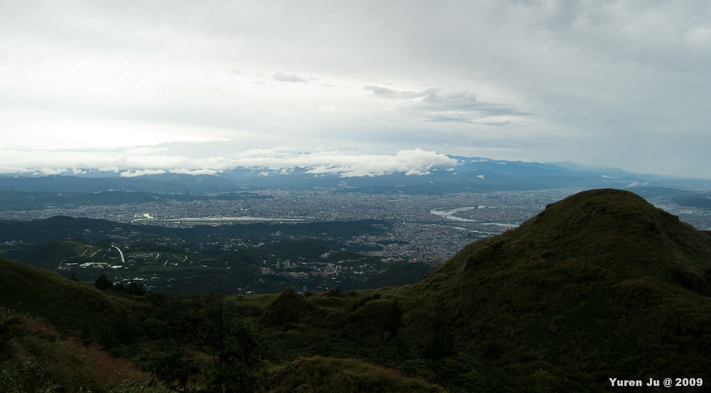
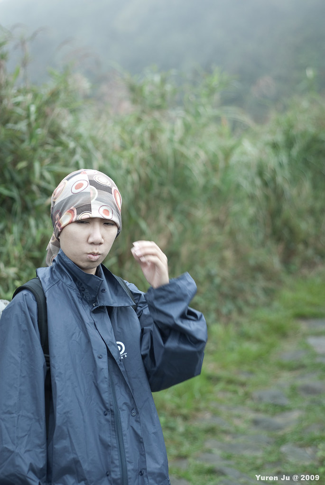

  
  
今天跟 Chialin 他姐還有他男友一起去陽明山 hiking。不過今天天氣就有些不妙，一早就開始陰天，等到上陽明山後狀況更是不佳。不過既然都來了小油坑我們還是捏著就上去了。  
  
  
  
  
  
基本上這趟 Hiking 之旅應該是輕鬆愉快的，不過風雨交加的折磨卻讓我們的體力快速的消耗，更何況我們大約有一半的路程都是撐傘走的。  
  
  
  
不過還是看到很漂亮的風景了。瞭望台北的感覺真的是不錯 :)  
  
  
  
不過這次的照片大多都是在拍成員囉  
  
  
  
這次一起來的大哥拿的相機也是 N 牌的，中途跟他借了超廣角，不過雨勢實在蠻大的，用沒多久就還他了。（不過前面那個人在幹嘛…）  
  
  
  
不知道在找什麼東西。  
  
  
瞄。  
  
  
Thinking  
  
  
指甲好像裂開了，正在簡單的先處理一下  
  
  
索隆你的刀勒  
  
  
攻頂後上面風雨實在太大，我們就急急忙忙的下來。最後就去淡水吃個飯，逛逛街。  
  
  
這張好像壹週刊狗仔的拍照風格阿…  
  
  
End!  
