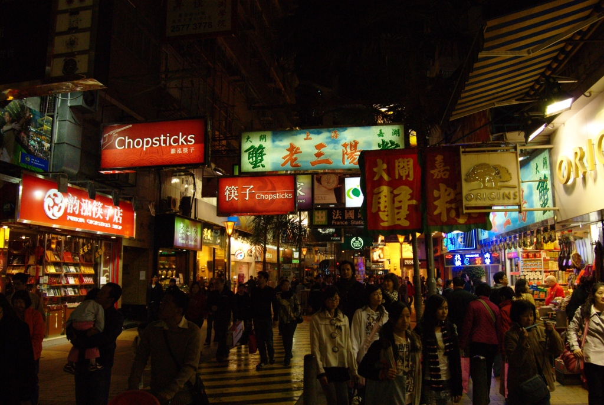
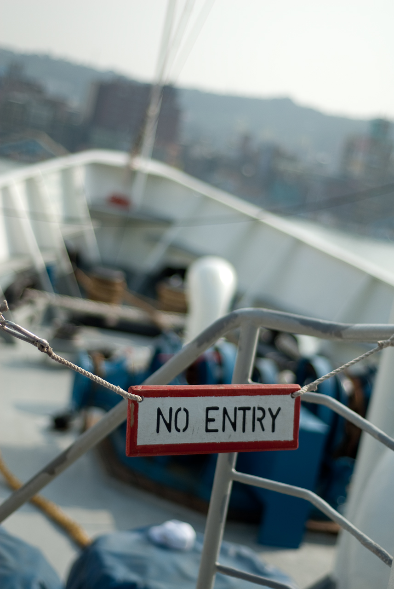

2009 年是個很棒的一年。從新年出發到香港開始，好像人生被按了某個啟動按鈕，開始今年連續不斷的旅行。每次從旅程回來後，最有趣的事情就是整理照片。看著一張張的照片，當時的回憶就像被放大一樣，總是可以沉浸其中一陣子。  
  
而今年有幾個新舊朋友也一起去旅行。跟這些朋友在一起真的很快樂。雖然說大家個性都天差地遠，不過這樣有差異的組合反而常發生讓人啼笑皆非的歡樂。我不得先提一下[灰哥](http://www.facebook.com/kunhui)。灰哥通常在旅程中提供了很多歡樂的笑點。雖然他摔的很慘，不過我還是得說香港跑步機事件真的讓我回味再回味阿。  
  
1月份新年，我們去了香港。我剛入手了人生的第1台單眼相機，也是第一次自助旅行。第1天為了找 hostel 就迷失在繁華的銅鑼灣。在這裡我們全攻略了所有香港交通工具，跟香港老伯同桌吃了飲茶，看著路旁簡陋理髮廳師傅拉小提琴。  
  
  
  
  
  
農曆新年，我跟 chialin 在落山風很大的墾丁玩了幾天。我們像小孩子一樣的在白色沙灘築城堡，把砂粒留在鞋底，把藍天白雲帶回濕冷的台北。  
  
  
  
2月份的某個週末，同事 [Payton](http://www.facebook.com/payton.chou) 帶著我們去台北市的健行步道相思林步道。這次行程是開啟登山之路的一個小按鈕。Payton 淺淺的讓我們了解到登山/健行的小樂趣。  
  
  
  
勞動節假期我們去了金門。[Taiten](http://www.facebook.com/profile.php?id=1278342630) 罕見的跟我們出來玩。我們在金門坑道中穿梭，看了許些滄桑的金門洋房，並且在著名景點跳著 Matt Harding 古怪舞蹈。  
  
  
  
五月份，即將除役的忠僕號最後一次造訪台灣。趴趴走固定班底們一起上去逛逛。  
  
  
  
端午節連續假期，我跟了 Payton 的團，到了宜蘭松蘿湖登山露營。這次的旅程敲開了我的登山旅行之路。山野之中的美景與感動，經歷過一次後就很難忘懷。當寒冷從袖口不停滲入時，那碗熱騰騰的冬瓜茶真的是溫暖了身心。感謝這次一起登山前輩的照顧，讓我這個第一次登山的嫩咖學到了很多。  
  
  
  
6月的某個週末，我們和 chialin 的高中好友們一起到小琉球玩。這次的旅行除了 Chialin 以外，其他跟以前都不一樣。不過還是挺有趣的。潮間帶真是讓我見識了小琉球豐富的生態系，也感謝我老爸老媽招待各位朋友們 :)。  
  
  
  
7月份的某個週末，我失心瘋的又規劃了一次登山旅行，這次把海拔拉高到 2000 公尺左右。加羅湖這趟旅程一起來的有老朋友 [Merck](http://www.facebook.com/merckhung)，還有新朋友 [Grissom](http://www.facebook.com/grissom.woo)，當然也包含了固定成員們。加羅湖稍微比松蘿湖輕鬆了些，不過重裝露營還是非常的辛苦。當然山上的風景還是讓我再次深深的感動，能夠跟一群好友們一起出來玩更是歡樂。這時我不得不再次感謝灰哥熱情的演出，執意要背西瓜的橋段實在太歡樂了。  
  
  
(這張照片是借用 kyozi 的)  
  
8月底時因為 Chialin 換工作，我們就趁著工作之間的空檔飛到峇里島去玩。這次的行程排的很倉促，而到峇里島後則是玩的很輕鬆。在文化全然不同的國度旅行有很多驚喜。這邊的廟宇值得一看，而便宜的物價也很值得好好的殺個價。  
  
  
  
9月時，為了往後的高山登山做準備，我又開了另外一個登山活動，『一片蛋糕合歡山』。但事實證明我們太小看這座號稱最簡單的台灣百岳了。這次的旅程很累，而且並沒有依照預定行程到合歡山西峰。也讓我了解到自己對於行程的掌控程度還不夠 (下次一定要非常謹慎的設 check point)。這次新登場的登山成員有 River 跟小銘，小銘常常在台北市內活動出現，登山活動倒是第一次。而 River 在網路上認識了很久，這次才是第一次真正的見面。那天的天氣好到爆炸，讓我們第一次的高山登山活動，雖然大家都有些高原反應，不過都還是既開心又累炸的玩。可惜第2天天氣不怎麼樣，沒看到日出。  
  
  
  
9月份的時候，Chialin 二姐跟準姊夫到了台北玩，所以我們也『招待』他們到陽明山上走走。那天下了點雨，不過因為已經上陽明山了，所以我們還是攻頂了七星山。雖然雨中爬山有點瘋狂有點累，不過還是不錯的小活動。  
  
  
  
十月！三年一科的東港迎王又到了。我跟3年前的伙伴 kyozi 與 znikang 還有新加入的成員小銘、灰哥，再加上 Chialin 的高中同學兔兔、康姐一起到東港看迎王祭典。這次我先請了一天的特休早上回去拍照。很開心這次拍到不少自己喜歡的照片。  
  
")  
  
十一月是個很哀傷的月份，因為我們都沒有出去玩。十二月感謝大家的成全~ 向天池健行變成了我跟 Chialin 兩個人的深山約會 XD  
不過向天池真的蠻漂亮的。我從沒想到經過那個彌漫霧氣的小丘後，會是一片開闊的向天池火山口。  
  
  
  
這邊只放了有照片紀錄的活動。這段時間我們還看了幾齣戲、看了幾場小型音樂表演，還有數不清的小活動實在是懶得翻出來了…。  
  
2010 年，我跟 Chialin 準備到宜蘭悠閒的度過新年，也是我們新的開始。感謝一起跟我們出來玩的朋友，沒你們在路上很吵的打嘴炮，這些旅行就不會那麼有趣了。希望 2010 年我們也可以一起繼續出去玩！