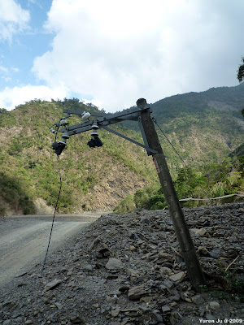
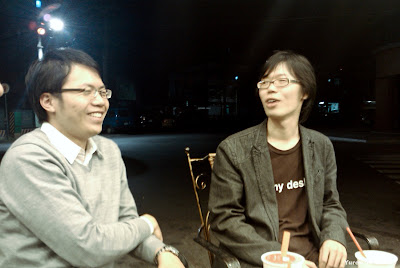

這次過年原本沒排什麼活動，想說在家裡宅宅的過。不過沒想到還是去了一些地方。  
  
大年初一吃完午餐後，我就很無聊的騎車到來義去。對於來義的印象停留在國一去夏令營的記憶，是個空氣清新的山邊聚落。不過愈騎到裏面愈感到不對勁。直到從來義往舊來義的路我破爛的摩托車無法前進後才折返。上網查資料才發現莫拉克風災重創了來義，到現在還沒恢復。  
  
真是令人感嘆阿。  
  

  

  
晚上國中二、三年級的班長跑來我家找人，關於國中的回憶就這樣倒了出來。我們先殺到大西洋冰城找另外一個同學，再把其他幾個同學找來，後來又跑去 85 度 C 續攤到兩點多。出現的有 Eric, 佳佳、予芬、Sean、Eason, 勝凱、勝凱他妹 (其實我不太確定…)  
  

  
  
不過我的記憶真的模糊了阿，很多人都記不住了，哈。  
  
  
  
大年初二在外婆家吃飯，喝了不少台啤阿。大舅這種喝法其實有點難過，乾個幾次杯就覺得好漲阿，我酒量其實也不怎麼樣。  
  
大年初三跑去台南小吃之旅。感謝 Chialin, 康姐, 小杜, 兔兔，從市區吃到了安平，吃了：[ORO coffee，國華街的碗糕、鴨肉麵線。中正路的雞蛋糕、棺材板，安平的英國藍、炸餛飩、蚵仔煎、最後是東門圓環的鱔魚意麵](http://picasaweb.google.com/yurenju/2010TainanChineseNewYear)。中間還去了樹屋一下～感謝招待！  
  

  
  
大年初四是 CCNA 社團的老人聚會，雖然說倒社了，不過每年過年都還是會大家聚在一起聯絡一下感情，我也可以趁機跟 kkbox 的員工傾訴一下老顧客的心聲（感謝 Eric 每次都聽我抱怨 XD），下面這張是借用董哥的照片，我都顧著吃所以沒有拍照 :P  
  

  
  
社團聚會完後，我、Rex 跟 Hychen 又殺到巨蛋站的卡布里咖啡館參加 COSCUP 聚會 + 銷售組會議。這次第一次看到 Kevin 跟蝦蝦！還有很多熟面孔像是 Lloyd, IJS 還有一大群 KaLUG 的朋友 XD  
  

  
  
大年初五跟 Chialin 在高雄吃飯跟隨便亂逛～去了好幾年沒去的 La Strada Cafe。也去了美麗島站看看。  
  

  
  
大年初六回來台北國後，去了 Znikang 那沱人的喝酒團，不過主角沒出現！酒倒是喝了些，喝了小米酒、威士忌、Vodka、琴酒。種類混很多，不過倒是沒有醉。輝哥偷睡覺還被發現…。  
  
這次過年就是這樣啦，大家新年快樂！