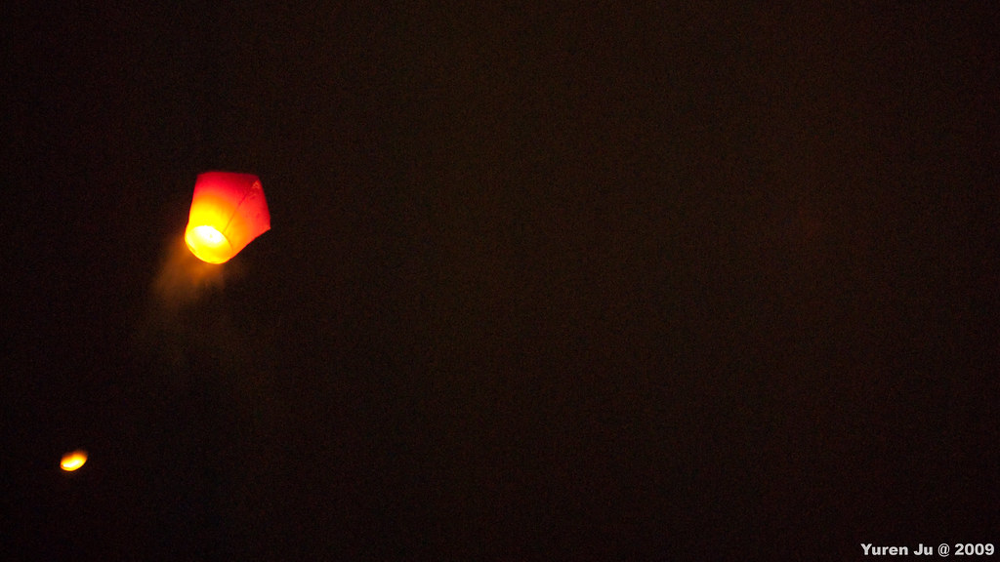

這個週末搭上放天燈的最後一次機會，我們到了平溪去放天燈。感謝 Kyozi 開車，我們早上就搭著 Kyozi 的車，先到博愛路丟要修理的鏡頭，再一路向東開到平溪去。因為 Kyozi 已經覺醒了，所以輝哥一路上看起來有點暈…。  
  
我們把車停在菁桐附近，逛菁桐老街順便吃個小吃當中餐。吃了雞卷後輝哥他們又吃了山豬肉串跟彈珠汽水。這幾天我拉肚子所以吃的很少…。後來輝哥又去買冰來吃。  
  
  
  
  
  
菁桐老街掛了一些願望風鈴，上面寫滿了願望。  
  
  
  
小朋友以後會當一輩子的紅牌設計師喔。  
  
後來我們在菁桐礦坑遺跡跟菁桐國小走走，還不小心踩到狗屎… (Shit!)。接下來就沿著鐵路走到了平溪站。走在鐵道上的人真的超多的，顯然沒有人在理警告標誌。  
  
  
  
最後因為要去十分人太多，放天燈又太早，我們在菁桐跟平溪中間的香提咖啡館休息順便等志康跟 Vicky 到。這是咖啡館養的紅面番鴨，看起來挺好吃的。  
  
  
  
經過漫長的嘴炮跟等待，看著咖啡館外面的天燈放過兩、三輪後，我們就出發覓食順便準備去放天燈。  
  
  
休士頓: We have a problem.  
  
吃飽喝足後，我們就進去會場放天燈囉。我們大概早去了三波，所以我們在旁邊看了好幾次放天燈。看到天燈升空的感覺真的很奇妙。每次都覺得很壯觀。  
  
  
(Facebook 看不到 Youtube 影片請看 [http://www.youtube.com/watch?v=xAQI2QIYjNU](http://www.youtube.com/watch?v=xAQI2QIYjNU) )  
  
過了幾十分鐘後輪到了我們。寫願望的時候其實我也沒細想，就在天燈上寫了『開心快樂』。希望今年可以很開心的過。看著天燈從黯淡、點燃到充滿熱氣，接著我們手上的天燈就頭也不回的往上飛去。和著其他人的願望，一起飛進夜空。結束後則是滿足的心情又帶點感傷。  
  
  
  
歸途的時候我一個不小心睡著，醒來的時候已經在建國橋上了。這次的活動真的很好玩，我實在沒辦法形容看天燈跟放天燈怎麼會這麼有趣。感謝這次一起來的朋友 Chialin, Kyozi, 小羊, 輝哥，還有下午才來的 Znikang 跟 Vicky。我們的願望一起升空了，讓我們一起達成吧。