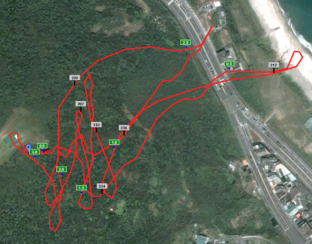
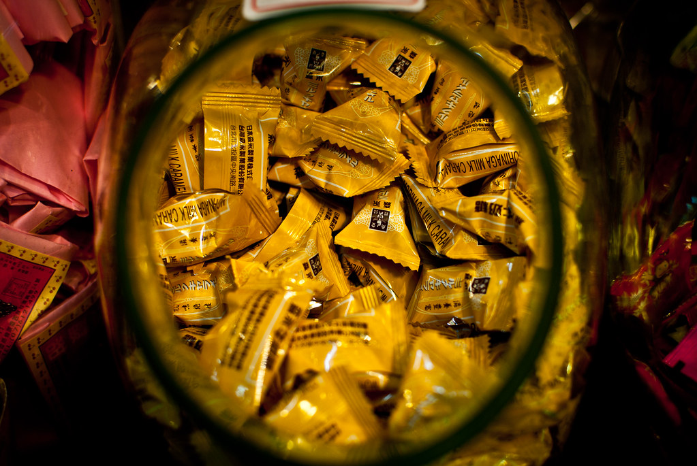

昨天一個涼爽的天氣，Chialin 開了飛行傘的團，Chialin 的同事們、我、輝哥、Kyozi、Znikang 就準備去萬里玩飛行傘囉。  
  
早上因為很多的陰錯陽差，Chialin, Znikang 還有 Chialin 同事們早早就坐客運去萬里，而 Kyozi、我跟輝哥則是約在明德站。所以早上很悠閒地起床、上網、吃早餐才出發。不過今天 Kyozi 意外的早到，只好把禁斷的大亨堡早餐帶上他的車吃，原本是想說他會遲到一點，我就可以在捷運站吃完早餐 XD  
  
等我們到金山後，打電話才知道 Chialin 他們已經到萬里準備要飛了。所以她就把手機留在地面打開 latitude 讓我們知道位置。到飛行傘基地的時候他們就都已經飛下去囉，只剩我們三個待飛了。  
  

  
  
著裝完畢。其實這次是有教練帶的雙人傘，所以裝備方面都由教練準備好。我們只有帶安全帽跟安全固定裝置而已。教練也沒有交待太多需要注意的事項（其實需要注意的也不多，操控都是由教練主導）  
  
不過這個時候可以帶我們飛行的教練數量還不夠，我們就在飛行傘基地晃了一下，這時候還有人在玩超大的遙控飛機呢。  
  

  
  
等到 Chialin 他們上來後，就準備換我們飛囉！基本上就是等教練整理完飛行傘的線，扣上連接器後，等到教練喊跑，我們就飛上去囉！  
  
腳底下就是省道二號阿，這種感覺超奇妙的 XD  
  
  
  
我飛的時候運氣非常好，教練帶著我飛往海跟陸地的邊緣，又飛回來。  
  

  
綠標是公里數，白標是高度。根據手機的 GPS 紀錄：  
  

*   高度區間：184-237 公尺
*   平均時速：16.17 km/h
*   最高時速：51.3 km/h (超快！)
*   移動時間：12min 10sec
*   移動距離：3.28 km

在天空飛行的感覺真的超棒的。偶爾也體會一下當鳥的心情阿 XD  
  

  
剛好有跟 Kyozi 很接近的時候拍的，一整個人飛在空中阿。

  

  

飛了一陣後，我就在原本起飛的地方降落了。過沒多久輝哥跟 Kyozi 也降落了。

  

   

  

飛完之後，聽 Znikang, Chialin 還有他們同事抱怨才知道他們飛行的時候並沒有像我們在空中盤旋，而是直接滑翔到沙灘上降落。看 Chialin 攝影的時間是三分鐘左右。所以其實玩飛行傘也是要很看風的，差個幾分鐘可能會差很多。  
  
跟大家討論後覺得要去九份走走（我從來沒去過九份！！）。中間停了一下黃金瀑布，感覺起來還蠻神奇的一個景點。整個瀑布的河床都是黃色的，Znikang 講說是有重金屬的關係。而且這邊怎麼有假文藝青年阿！（踢飛）  
  
  
  

  
九份那邊蠻多貓的，而且都不怎麼怕人。  
  
  
  
福。  
  
  
  
還有一間店賣很多小時候常看到的糖果。  
  
  
  
後來我們坐在國小前面吃完芋圓後，Chialin 的同事們就先跟我們 Say goodbye 了。我們最後到了間咖啡館坐一下，玩 Chialin 買的小玩意，就是那種很臭的泡泡 XD  
  
小根吸管玩不過癮，Znikang 又換了根大的吸管，真的超搞笑的 XD  
  
(Facebook 會看不到 Youtube, 請看[原文](http://yurenju.blogspot.com/2010/04/blog-post_18.html))  
  
  
後來我也補了上次 Znikang 辦的 Facebook 自拍影片活動『捏爆』的影片…隔壁桌一定覺得我們瘋了。  
  

  
這次萬里飛行傘 + 九份的活動就這樣結束啦。  
  
對於飛行傘的結論是其實沒有那麼可怕。覺得飛行傘給我的感覺並不是刺激或是可怕，而是新奇、有趣。那種飛在空中的感覺真的不可言喻。不過我覺得這活動也太貴了：每人一千大洋，當然或許教練素質跟設備有差異，價格會有差別（有聽 Znikang 說他有看到 600 的）。  
  
不過我覺得這真的是很值得試一次活動。什麼有趣的事情都有體驗過才不會後悔阿 XD