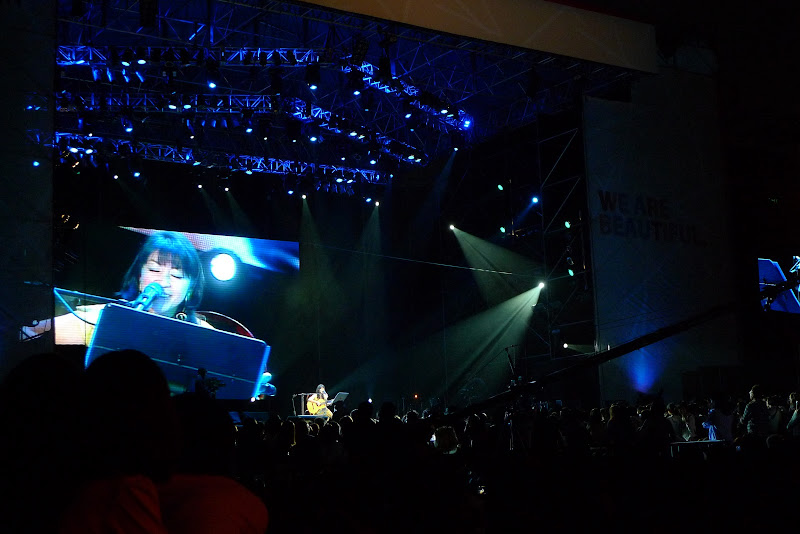

  
  
[踏破鐵鞋到宜蘭](http://yurenju.blogspot.com/2010/12/blog-post.html)的隔一天，因為沒注意到行程的原因，馬上就接了簡單生活節。這也導致我一半的時間都跟行屍走肉沒兩樣，一個週末跑兩個活動實在太累了。  
  
  
中午去的時候因為人整個滿出來，所以錯過了 Tizzy Bac 的前幾首歌，還好到的時候還是聽了三、四首，果然 Tizzy Bac 還是最棒的。  
  
  
  
聽完 Tizzy Bac 之後，就逛到魏如萱的天空舞台聽了好幾首。之前聽他的專輯就有好幾首覺得不錯，剛好都有聽到。  
  
  
  
然後中間開始呈現恍惚狀態，所以我們就跑去攤位逛街了。  
  
  
  
然後快到小野麗莎的時候才跑回來佔位置。小野麗莎好強阿，一個人拿了吉他就這樣唱了。更可怕的是他的聲音也太穩定了，跟放 CD 沒兩樣。還唱了兩首中文歌夜來香還有張學友的祝福。雖然國語不太標準，不過還是很棒。  
  
  
  
後來走到路上又遇到 Skaraoke。這團我蠻喜歡的，不過 Chialin 覺得還好。  
  
  
  
接下來是奇哥！！好久沒聽他的音樂，不過他還是很棒阿！  
  
  
  
然後最後就以張懸結尾了。張懸 + 陳昇真的很棒，不過前面的人擋太大了，害我聽的不夠盡興。  
  
  
  
然後在要散場的時候遇到 Aaron 跟 Roger，真是很巧阿 XD 最後發現陳珊妮跟伍佰在 Green House 就放棄了，那邊一直處於大排長龍的狀態。  
  
雖然有夠累，不過還是度過了一個充滿音樂的週末囉。